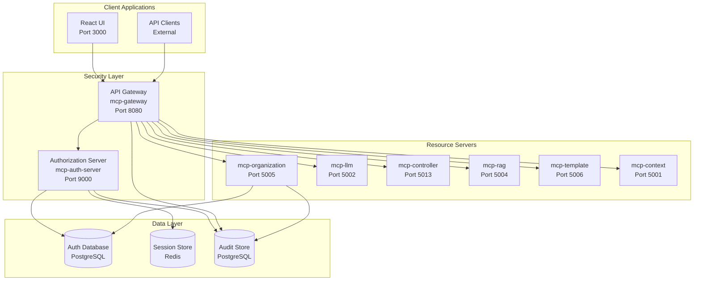
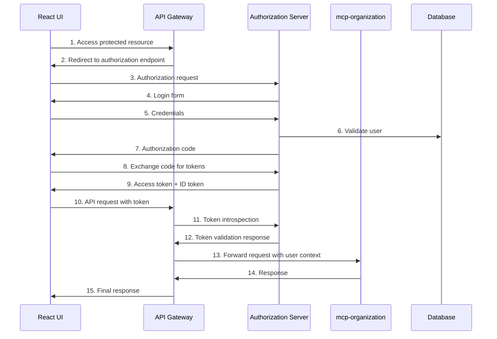

# Design Document

## Overview

This design modernizes the authentication and authorization system for the Zamaz Debate MCP Services using Spring Security 6.x, Spring Authorization Server, and industry best practices for 2025. The solution replaces the current custom JWT implementation with a standards-compliant OAuth2/OIDC authorization server, implements fine-grained RBAC with attribute-based access control, and provides proper multi-tenant security isolation.

## Architecture

### High-Level Security Architecture



### OAuth2/OIDC Flow Architecture



## Components and Interfaces

### 1. Authorization Server (MCP-auth-server)

**Purpose**: Centralized OAuth2/OIDC authorization server providing token issuance, validation, and user management.

**Key Components**:

- `AuthorizationServerApplication.java` - Main Spring Boot application
- `AuthorizationServerConfig.java` - OAuth2 authorization server configuration
- `SecurityConfig.java` - Security configuration for the auth server
- `UserDetailsServiceImpl.java` - Custom user details service
- `CustomAuthenticationProvider.java` - Multi-factor authentication support
- `TokenCustomizer.java` - JWT token customization with claims
- `ClientRegistrationService.java` - OAuth2 client management

**Configuration**:

```yaml
spring:
  security:
    oauth2:
      authorizationserver:
        client:
          mcp-ui:
            registration:
              client-id: mcp-ui-client
              client-secret: "{noop}ui-secret"
              client-authentication-methods:
                - client_secret_basic
              authorization-grant-types:
                - authorization_code
                - refresh_token
              redirect-uris:
                - http://localhost:3000/callback
              scopes:
                - openid
                - profile
                - email
                - debates:read
                - debates:write
                - organizations:read
                - organizations:write
          mcp-api:
            registration:
              client-id: mcp-api-client
              client-secret: "{noop}api-secret"
              client-authentication-methods:
                - client_secret_basic
              authorization-grant-types:
                - client_credentials
              scopes:
                - api:read
                - api:write
        issuer: http://localhost:9000
```

### 2. Enhanced Security Configuration (MCP-security)

**Purpose**: Shared security components and configurations for all microservices.

**Key Classes**:

```java
@Configuration
@EnableWebSecurity
@EnableMethodSecurity(prePostEnabled = true)
public class ResourceServerConfig {
    
    @Bean
    public SecurityFilterChain filterChain(HttpSecurity http) throws Exception {
        http
            .oauth2ResourceServer(oauth2 -> oauth2
                .jwt(jwt -> jwt
                    .decoder(jwtDecoder())
                    .jwtAuthenticationConverter(jwtAuthenticationConverter())
                )
            )
            .authorizeHttpRequests(authz -> authz
                .requestMatchers("/actuator/health").permitAll()
                .requestMatchers("/api/v1/auth/**").permitAll()
                .anyRequest().authenticated()
            )
            .sessionManagement(session -> session
                .sessionCreationPolicy(SessionCreationPolicy.STATELESS)
            );
        
        return http.build();
    }
    
    @Bean
    public JwtDecoder jwtDecoder() {
        return JwtDecoders.fromIssuerLocation("http://localhost:9000");
    }
    
    @Bean
    public JwtAuthenticationConverter jwtAuthenticationConverter() {
        JwtGrantedAuthoritiesConverter authoritiesConverter = 
            new JwtGrantedAuthoritiesConverter();
        authoritiesConverter.setAuthorityPrefix("SCOPE_");
        authoritiesConverter.setAuthoritiesClaimName("scope");
        
        JwtAuthenticationConverter converter = new JwtAuthenticationConverter();
        converter.setJwtGrantedAuthoritiesConverter(authoritiesConverter);
        converter.setPrincipalClaimName("sub");
        
        return converter;
    }
}
```

### 3. Fine-Grained RBAC System

**Enhanced Permission Model**:

```java
@Entity
@Table(name = "permissions")
public class Permission {
    @Id
    private String id;
    
    @Column(nullable = false)
    private String resource; // e.g., "debate", "organization", "user"
    
    @Column(nullable = false)
    private String action; // e.g., "create", "read", "update", "delete"
    
    @Column
    private String resourceId; // specific resource ID for instance-level permissions
    
    @Column
    private String condition; // SpEL expression for conditional permissions
    
    @Column
    private String organizationId; // tenant isolation
    
    // Methods for permission evaluation
    public boolean matches(String resource, String action, String resourceId, String organizationId) {
        return this.resource.equals(resource) && 
               this.action.equals(action) &&
               (this.resourceId == null || this.resourceId.equals(resourceId)) &&
               (this.organizationId == null || this.organizationId.equals(organizationId));
    }
}

@Entity
@Table(name = "roles")
public class Role {
    @Id
    private String id;
    
    @Column(nullable = false)
    private String name;
    
    @Column
    private String organizationId; // tenant-specific roles
    
    @ManyToMany(fetch = FetchType.LAZY)
    @JoinTable(
        name = "role_permissions",
        joinColumns = @JoinColumn(name = "role_id"),
        inverseJoinColumns = @JoinColumn(name = "permission_id")
    )
    private Set<Permission> permissions = new HashSet<>();
    
    @ManyToMany(fetch = FetchType.LAZY)
    @JoinTable(
        name = "role_hierarchy",
        joinColumns = @JoinColumn(name = "parent_role_id"),
        inverseJoinColumns = @JoinColumn(name = "child_role_id")
    )
    private Set<Role> childRoles = new HashSet<>();
}
```

### 4. Multi-Tenant Security Context

**Tenant-Aware Security Context**:

```java
@Component
public class TenantSecurityContext {
    
    private static final ThreadLocal<String> currentTenant = new ThreadLocal<>();
    
    public static void setCurrentTenant(String tenantId) {
        currentTenant.set(tenantId);
    }
    
    public static String getCurrentTenant() {
        return currentTenant.get();
    }
    
    public static void clear() {
        currentTenant.remove();
    }
}

@Component
public class TenantFilter implements Filter {
    
    @Override
    public void doFilter(ServletRequest request, ServletResponse response, 
                        FilterChain chain) throws IOException, ServletException {
        
        HttpServletRequest httpRequest = (HttpServletRequest) request;
        
        // Extract tenant from JWT token or header
        String tenantId = extractTenantId(httpRequest);
        
        if (tenantId != null) {
            TenantSecurityContext.setCurrentTenant(tenantId);
        }
        
        try {
            chain.doFilter(request, response);
        } finally {
            TenantSecurityContext.clear();
        }
    }
    
    private String extractTenantId(HttpServletRequest request) {
        // Extract from JWT claims or X-Organization-ID header
        String orgHeader = request.getHeader("X-Organization-ID");
        if (orgHeader != null) {
            return orgHeader;
        }
        
        // Extract from JWT token
        String authHeader = request.getHeader("Authorization");
        if (authHeader != null && authHeader.startsWith("Bearer ")) {
            // Parse JWT and extract organization claim
            return parseOrganizationFromJWT(authHeader.substring(7));
        }
        
        return null;
    }
}
```

### 5. Advanced Authorization Expressions

**Custom Security Expressions**:

```java
@Component("securityExpressions")
public class CustomSecurityExpressions {
    
    @Autowired
    private PermissionService permissionService;
    
    public boolean hasPermission(String resource, String action) {
        Authentication auth = SecurityContextHolder.getContext().getAuthentication();
        String userId = auth.getName();
        String organizationId = TenantSecurityContext.getCurrentTenant();
        
        return permissionService.hasPermission(userId, organizationId, resource, action, null);
    }
    
    public boolean hasPermissionOnResource(String resource, String action, String resourceId) {
        Authentication auth = SecurityContextHolder.getContext().getAuthentication();
        String userId = auth.getName();
        String organizationId = TenantSecurityContext.getCurrentTenant();
        
        return permissionService.hasPermission(userId, organizationId, resource, action, resourceId);
    }
    
    public boolean isOwnerOrHasPermission(String resource, String action, String resourceId) {
        Authentication auth = SecurityContextHolder.getContext().getAuthentication();
        String userId = auth.getName();
        String organizationId = TenantSecurityContext.getCurrentTenant();
        
        // Check if user owns the resource
        if (permissionService.isResourceOwner(userId, resource, resourceId)) {
            return true;
        }
        
        // Check if user has explicit permission
        return permissionService.hasPermission(userId, organizationId, resource, action, resourceId);
    }
    
    public boolean isSameOrganization(String targetUserId) {
        String currentOrg = TenantSecurityContext.getCurrentTenant();
        return permissionService.isUserInOrganization(targetUserId, currentOrg);
    }
}
```

## Data Models

### Enhanced User Model

```java
@Entity
@Table(name = "users")
public class User {
    @Id
    @GeneratedValue(strategy = GenerationType.UUID)
    private UUID id;
    
    @Column(nullable = false, unique = true)
    private String email;
    
    @Column(name = "password_hash")
    private String passwordHash;
    
    @Column(name = "first_name")
    private String firstName;
    
    @Column(name = "last_name")
    private String lastName;
    
    @Column(name = "email_verified")
    private Boolean emailVerified = false;
    
    @Column(name = "mfa_enabled")
    private Boolean mfaEnabled = false;
    
    @Column(name = "mfa_secret")
    private String mfaSecret;
    
    @Column(name = "account_locked")
    private Boolean accountLocked = false;
    
    @Column(name = "failed_login_attempts")
    private Integer failedLoginAttempts = 0;
    
    @Column(name = "last_login_at")
    private LocalDateTime lastLoginAt;
    
    @Column(name = "password_changed_at")
    private LocalDateTime passwordChangedAt;
    
    @Column(name = "created_at")
    private LocalDateTime createdAt;
    
    @Column(name = "updated_at")
    private LocalDateTime updatedAt;
    
    @OneToMany(mappedBy = "user", cascade = CascadeType.ALL, fetch = FetchType.LAZY)
    private Set<UserRole> userRoles = new HashSet<>();
    
    @OneToMany(mappedBy = "user", cascade = CascadeType.ALL, fetch = FetchType.LAZY)
    private Set<UserPermission> userPermissions = new HashSet<>();
}

@Entity
@Table(name = "user_roles")
public class UserRole {
    @Id
    @GeneratedValue(strategy = GenerationType.UUID)
    private UUID id;
    
    @ManyToOne(fetch = FetchType.LAZY)
    @JoinColumn(name = "user_id")
    private User user;
    
    @ManyToOne(fetch = FetchType.LAZY)
    @JoinColumn(name = "role_id")
    private Role role;
    
    @Column(name = "organization_id")
    private String organizationId;
    
    @Column(name = "granted_at")
    private LocalDateTime grantedAt;
    
    @Column(name = "granted_by")
    private String grantedBy;
    
    @Column(name = "expires_at")
    private LocalDateTime expiresAt;
}
```

### Security Audit Model

```java
@Entity
@Table(name = "security_audit_log")
public class SecurityAuditLog {
    @Id
    @GeneratedValue(strategy = GenerationType.UUID)
    private UUID id;
    
    @Column(name = "event_type", nullable = false)
    @Enumerated(EnumType.STRING)
    private SecurityEventType eventType;
    
    @Column(name = "user_id")
    private String userId;
    
    @Column(name = "organization_id")
    private String organizationId;
    
    @Column(name = "resource_type")
    private String resourceType;
    
    @Column(name = "resource_id")
    private String resourceId;
    
    @Column(name = "action")
    private String action;
    
    @Column(name = "outcome")
    @Enumerated(EnumType.STRING)
    private AuditOutcome outcome;
    
    @Column(name = "ip_address")
    private String ipAddress;
    
    @Column(name = "user_agent")
    private String userAgent;
    
    @Column(name = "session_id")
    private String sessionId;
    
    @Column(name = "details", columnDefinition = "jsonb")
    private String details;
    
    @Column(name = "risk_level")
    @Enumerated(EnumType.STRING)
    private RiskLevel riskLevel;
    
    @Column(name = "timestamp", nullable = false)
    private LocalDateTime timestamp;
    
    public enum SecurityEventType {
        LOGIN_SUCCESS, LOGIN_FAILURE, LOGOUT,
        PERMISSION_GRANTED, PERMISSION_DENIED,
        ROLE_ASSIGNED, ROLE_REMOVED,
        MFA_ENABLED, MFA_DISABLED,
        PASSWORD_CHANGED, ACCOUNT_LOCKED,
        TOKEN_ISSUED, TOKEN_REVOKED,
        SUSPICIOUS_ACTIVITY
    }
    
    public enum AuditOutcome {
        SUCCESS, FAILURE, BLOCKED
    }
    
    public enum RiskLevel {
        LOW, MEDIUM, HIGH, CRITICAL
    }
}
```

## Error Handling

### Security Exception Handling

```java
@ControllerAdvice
public class SecurityExceptionHandler {
    
    @ExceptionHandler(AccessDeniedException.class)
    public ResponseEntity<ErrorResponse> handleAccessDenied(
            AccessDeniedException ex, HttpServletRequest request) {
        
        // Log security violation
        auditLogger.logSecurityViolation(ex, request);
        
        return ResponseEntity.status(HttpStatus.FORBIDDEN)
            .body(ErrorResponse.builder()
                .error("access_denied")
                .message("Insufficient permissions")
                .timestamp(Instant.now())
                .path(request.getRequestURI())
                .build());
    }
    
    @ExceptionHandler(JwtException.class)
    public ResponseEntity<ErrorResponse> handleJwtException(
            JwtException ex, HttpServletRequest request) {
        
        return ResponseEntity.status(HttpStatus.UNAUTHORIZED)
            .body(ErrorResponse.builder()
                .error("invalid_token")
                .message("Token validation failed")
                .timestamp(Instant.now())
                .path(request.getRequestURI())
                .build());
    }
    
    @ExceptionHandler(MultiTenantSecurityException.class)
    public ResponseEntity<ErrorResponse> handleTenantViolation(
            MultiTenantSecurityException ex, HttpServletRequest request) {
        
        // Log potential security breach
        auditLogger.logCriticalSecurityEvent(ex, request);
        
        return ResponseEntity.status(HttpStatus.FORBIDDEN)
            .body(ErrorResponse.builder()
                .error("tenant_violation")
                .message("Cross-tenant access denied")
                .timestamp(Instant.now())
                .path(request.getRequestURI())
                .build());
    }
}
```

## Testing Strategy

### Security Integration Tests

```java
@SpringBootTest
@AutoConfigureTestDatabase
@Testcontainers
class SecurityIntegrationTest {
    
    @Container
    static PostgreSQLContainer<?> postgres = new PostgreSQLContainer<>("postgres:15")
            .withDatabaseName("auth_test")
            .withUsername("test")
            .withPassword("test");
    
    @Autowired
    private TestRestTemplate restTemplate;
    
    @Autowired
    private JwtEncoder jwtEncoder;
    
    @Test
    void shouldEnforceOrganizationIsolation() {
        // Create users in different organizations
        String org1Token = createTokenForOrganization("org1", "user1");
        String org2Token = createTokenForOrganization("org2", "user2");
        
        // User from org1 should not access org2 resources
        HttpHeaders headers = new HttpHeaders();
        headers.setBearerAuth(org1Token);
        headers.set("X-Organization-ID", "org2");
        
        ResponseEntity<String> response = restTemplate.exchange(
            "/api/v1/organizations/org2/debates",
            HttpMethod.GET,
            new HttpEntity<>(headers),
            String.class
        );
        
        assertThat(response.getStatusCode()).isEqualTo(HttpStatus.FORBIDDEN);
    }
    
    @Test
    void shouldEnforceResourceLevelPermissions() {
        String token = createTokenWithPermissions("debate:123:read");
        
        HttpHeaders headers = new HttpHeaders();
        headers.setBearerAuth(token);
        
        // Should allow access to debate 123
        ResponseEntity<String> allowedResponse = restTemplate.exchange(
            "/api/v1/debates/123",
            HttpMethod.GET,
            new HttpEntity<>(headers),
            String.class
        );
        
        assertThat(allowedResponse.getStatusCode()).isEqualTo(HttpStatus.OK);
        
        // Should deny access to debate 456
        ResponseEntity<String> deniedResponse = restTemplate.exchange(
            "/api/v1/debates/456",
            HttpMethod.GET,
            new HttpEntity<>(headers),
            String.class
        );
        
        assertThat(deniedResponse.getStatusCode()).isEqualTo(HttpStatus.FORBIDDEN);
    }
}
```

## Security Considerations

### Token Security

- Use RS256 for JWT signing in production
- Implement proper token rotation and revocation
- Store refresh tokens securely with encryption
- Implement token binding to prevent token theft

### Multi-Factor Authentication

- Support TOTP (Time-based One-Time Password)
- Implement backup codes for account recovery
- Support hardware security keys (WebAuthn)
- Progressive MFA based on risk assessment

### Password Security

- Implement NIST 800-63B password guidelines
- Use Argon2id for password hashing
- Implement password breach detection
- Support passkeys and passwordless authentication

### Session Management

- Implement secure session handling
- Use SameSite cookies with proper attributes
- Implement session fixation protection
- Support concurrent session limits

## Deployment Strategy

### Docker Configuration

```dockerfile
# mcp-auth-server/Dockerfile
FROM openjdk:21-jre-slim

COPY target/mcp-auth-server-*.jar app.jar

EXPOSE 9000

ENTRYPOINT ["java", "-jar", "/app.jar"]
```

### Kubernetes Security

```yaml
apiVersion: apps/v1
kind: Deployment
metadata:
  name: mcp-auth-server
spec:
  replicas: 2
  selector:
    matchLabels:
      app: mcp-auth-server
  template:
    metadata:
      labels:
        app: mcp-auth-server
    spec:
      securityContext:
        runAsNonRoot: true
        runAsUser: 1000
        fsGroup: 1000
      containers:
      - name: mcp-auth-server
        image: zamaz/mcp-auth-server:latest
        ports:
        - containerPort: 9000
        env:
        - name: SPRING_PROFILES_ACTIVE
          value: "kubernetes"
        - name: JWT_SIGNING_KEY
          valueFrom:
            secretKeyRef:
              name: auth-secrets
              key: jwt-signing-key
        securityContext:
          allowPrivilegeEscalation: false
          readOnlyRootFilesystem: true
          capabilities:
            drop:
            - ALL
        resources:
          requests:
            memory: "512Mi"
            cpu: "250m"
          limits:
            memory: "1Gi"
            cpu: "500m"
        livenessProbe:
          httpGet:
            path: /actuator/health
            port: 9000
          initialDelaySeconds: 60
          periodSeconds: 30
        readinessProbe:
          httpGet:
            path: /actuator/health/readiness
            port: 9000
          initialDelaySeconds: 30
          periodSeconds: 10
```
