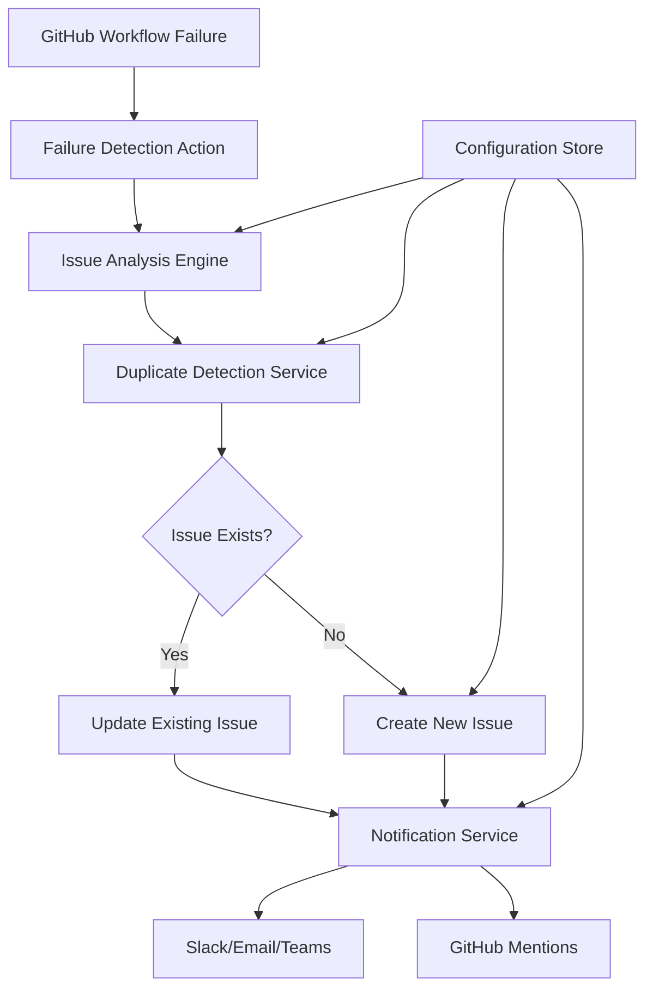

# Design Document

## Overview

The Automated Workflow Issue Creation system is a reusable GitHub Actions-based solution that monitors workflow failures across all CI/CD pipelines and automatically creates detailed GitHub issues for failed workflows. The system is designed to be workflow-agnostic, allowing it to be easily integrated into any existing or new GitHub Actions workflow with minimal configuration.

## Architecture

### High-Level Architecture



### Component Architecture

The system consists of several reusable components that can be integrated into any workflow:

1. **Failure Detection Action** - A composite GitHub Action that captures failure context
2. **Issue Management Service** - Handles issue creation, updates, and duplicate detection
3. **Template Engine** - Generates issue content based on workflow type and failure patterns
4. **Notification Service** - Sends alerts to configured channels
5. **Configuration Manager** - Manages workflow-specific settings and templates

## Components and Interfaces

### 1. Failure Detection Action (`failure-detector`)

**Location**: `.github/actions/failure-detector/action.yml`

```yaml
name: 'Workflow Failure Detector'
description: 'Detects workflow failures and prepares issue creation data'
inputs:
  workflow-name:
    description: 'Name of the workflow'
    required: true
  failure-context:
    description: 'Additional context about the failure'
    required: false
    default: 'auto-detect'
  severity:
    description: 'Failure severity (critical, high, medium, low)'
    required: false
    default: 'medium'
  assignees:
    description: 'Comma-separated list of GitHub usernames to assign'
    required: false
  labels:
    description: 'Comma-separated list of labels to apply'
    required: false
    default: 'workflow-failure,bug'
outputs:
  issue-data:
    description: 'JSON data for issue creation'
  should-create-issue:
    description: 'Boolean indicating if issue should be created'
```

### 2. Issue Management Service

**Location**: `.github/scripts/issue-manager.js`

Core functions:
- `analyzeFailure(workflowData)` - Analyzes failure context and generates issue data
- `checkDuplicateIssue(workflowName, failureType)` - Searches for existing issues
- `createWorkflowIssue(issueData)` - Creates new GitHub issue
- `updateExistingIssue(issueNumber, updateData)` - Updates existing issue with new failure info
- `generateIssueTemplate(workflowType, failureData)` - Creates issue content from templates

### 3. Template Engine

**Location**: `.github/templates/workflow-issues/`

Template structure:
```
.github/templates/workflow-issues/
├── default.md                 # Default issue template
├── ci-cd.md                  # CI/CD pipeline failures
├── security.md               # Security scan failures
├── linting.md                # Code quality failures
├── deployment.md             # Deployment failures
└── custom/                   # Custom workflow templates
    ├── {workflow-name}.md
    └── {workflow-type}.md
```

### 4. Configuration Manager

**Location**: `.github/config/workflow-issue-config.yml`

```yaml
# Global configuration
global:
  enabled: true
  default_assignees: ["team-lead", "devops-team"]
  default_labels: ["workflow-failure", "bug"]
  notification_channels:
    slack: "#ci-cd-alerts"
    email: ["team@company.com"]

# Workflow-specific configurations
workflows:
  "CI/CD Pipeline":
    severity: critical
    assignees: ["backend-team", "devops-team"]
    labels: ["ci-cd", "critical", "workflow-failure"]
    template: "ci-cd"
    escalation_threshold: 3
    
  "Code Quality":
    severity: medium
    assignees: ["code-quality-team"]
    labels: ["code-quality", "workflow-failure"]
    template: "linting"
    
  "Security Scanning":
    severity: high
    assignees: ["security-team", "team-lead"]
    labels: ["security", "workflow-failure"]
    template: "security"
    notification_channels:
      slack: "#security-alerts"
```

### 5. Reusable Workflow

**Location**: `.github/workflows/workflow-failure-handler.yml`

```yaml
name: Workflow Failure Handler

on:
  workflow_call:
    inputs:
      workflow-name:
        required: true
        type: string
      failure-context:
        required: false
        type: string
        default: 'auto-detect'
      severity:
        required: false
        type: string
        default: 'medium'
    secrets:
      GITHUB_TOKEN:
        required: true
      SLACK_WEBHOOK:
        required: false
```

## Data Models

### Workflow Failure Data Structure

```typescript
interface WorkflowFailureData {
  workflow: {
    name: string;
    id: string;
    runId: string;
    runNumber: number;
    url: string;
    triggeredBy: string;
    branch: string;
    commit: {
      sha: string;
      message: string;
      author: string;
    };
  };
  failure: {
    timestamp: string;
    jobs: FailedJob[];
    severity: 'critical' | 'high' | 'medium' | 'low';
    category: string;
    errorPatterns: string[];
  };
  context: {
    pullRequest?: {
      number: number;
      title: string;
      author: string;
    };
    environment?: string;
    previousFailures: number;
  };
}

interface FailedJob {
  name: string;
  id: string;
  conclusion: string;
  steps: FailedStep[];
  logs: string;
}

interface FailedStep {
  name: string;
  conclusion: string;
  errorMessage: string;
  logUrl: string;
}
```

### Issue Template Data Structure

```typescript
interface IssueTemplateData {
  title: string;
  body: string;
  labels: string[];
  assignees: string[];
  milestone?: string;
  priority: 'critical' | 'high' | 'medium' | 'low';
  metadata: {
    workflowName: string;
    failureType: string;
    createdAt: string;
    lastUpdated: string;
  };
}
```

## Error Handling

### Failure Detection Resilience

1. **Action Failure Handling**: The failure detector action itself must be resilient and never cause additional workflow failures
2. **API Rate Limiting**: Implement exponential backoff for GitHub API calls
3. **Network Failures**: Retry logic for network-related failures
4. **Malformed Data**: Graceful handling of unexpected workflow data structures

### Error Recovery Strategies

```javascript
// Example error handling in issue-manager.js
async function createWorkflowIssue(issueData) {
  const maxRetries = 3;
  let attempt = 0;
  
  while (attempt < maxRetries) {
    try {
      const response = await github.rest.issues.create(issueData);
      return response.data;
    } catch (error) {
      attempt++;
      
      if (error.status === 403) {
        // Rate limit exceeded
        await sleep(60000); // Wait 1 minute
      } else if (error.status >= 500) {
        // Server error, retry with exponential backoff
        await sleep(Math.pow(2, attempt) * 1000);
      } else {
        // Client error, don't retry
        throw error;
      }
    }
  }
  
  throw new Error(`Failed to create issue after ${maxRetries} attempts`);
}
```

## Testing Strategy

### Unit Testing

1. **Template Engine Tests**: Verify template rendering with various failure scenarios
2. **Issue Manager Tests**: Test issue creation, updates, and duplicate detection
3. **Configuration Parser Tests**: Validate configuration loading and merging
4. **Failure Analysis Tests**: Test failure pattern recognition and categorization

### Integration Testing

1. **End-to-End Workflow Tests**: Simulate workflow failures and verify issue creation
2. **GitHub API Integration Tests**: Test API interactions with mocked responses
3. **Notification Integration Tests**: Verify Slack/email notifications
4. **Template Rendering Tests**: Test all template types with real failure data

### Test Workflow

**Location**: `.github/workflows/test-failure-handler.yml`

```yaml
name: Test Failure Handler

on:
  push:
    paths:
      - '.github/actions/failure-detector/**'
      - '.github/scripts/issue-manager.js'
      - '.github/templates/workflow-issues/**'

jobs:
  test-failure-detection:
    runs-on: ubuntu-latest
    steps:
      - uses: actions/checkout@v4
      
      - name: Test failure detector action
        uses: ./.github/actions/failure-detector
        with:
          workflow-name: "Test Workflow"
          failure-context: "test-failure"
          severity: "low"
          
      - name: Simulate workflow failure
        run: |
          # Create mock failure data
          echo '{"workflow":{"name":"Test"},"failure":{"severity":"low"}}' > failure-data.json
          
      - name: Test issue creation (dry-run)
        env:
          GITHUB_TOKEN: ${{ secrets.GITHUB_TOKEN }}
        run: |
          node .github/scripts/issue-manager.js --dry-run --input failure-data.json
```

## Implementation Phases

### Phase 1: Core Infrastructure (Week 1)
1. Create failure detector action
2. Implement basic issue manager service
3. Create default issue template
4. Set up configuration system

### Phase 2: Template System (Week 2)
1. Implement template engine
2. Create workflow-specific templates
3. Add template customization support
4. Implement template validation

### Phase 3: Advanced Features (Week 3)
1. Add duplicate detection logic
2. Implement notification service
3. Add escalation mechanisms
4. Create configuration validation

### Phase 4: Integration & Testing (Week 4)
1. Integrate with existing workflows
2. Comprehensive testing
3. Documentation and examples
4. Performance optimization

## Usage Examples

### Basic Integration

Add to any existing workflow:

```yaml
name: My Workflow

on: [push, pull_request]

jobs:
  my-job:
    runs-on: ubuntu-latest
    steps:
      - name: Do something
        run: echo "This might fail"
        
  # Add this job to handle failures
  handle-failure:
    if: failure()
    needs: [my-job]
    uses: ./.github/workflows/workflow-failure-handler.yml
    with:
      workflow-name: "My Workflow"
      severity: "medium"
    secrets:
      GITHUB_TOKEN: ${{ secrets.GITHUB_TOKEN }}
      SLACK_WEBHOOK: ${{ secrets.SLACK_WEBHOOK }}
```

### Advanced Configuration

```yaml
# In workflow-specific config
workflows:
  "My Custom Workflow":
    severity: high
    assignees: ["my-team"]
    labels: ["custom-workflow", "high-priority"]
    template: "custom/my-workflow"
    notification_channels:
      slack: "#my-team-alerts"
      email: ["my-team@company.com"]
    escalation_threshold: 2
    custom_fields:
      component: "backend"
      team: "platform"
```

## Security Considerations

1. **Token Permissions**: Use minimal required GitHub token permissions
2. **Secret Management**: Secure handling of webhook URLs and API tokens
3. **Input Validation**: Sanitize all user inputs and workflow data
4. **Rate Limiting**: Respect GitHub API rate limits
5. **Access Control**: Ensure only authorized workflows can trigger issue creation

## Performance Considerations

1. **Async Processing**: Use asynchronous operations for API calls
2. **Caching**: Cache configuration and template data
3. **Batch Operations**: Group multiple API calls when possible
4. **Resource Limits**: Set timeouts and resource limits for all operations
5. **Monitoring**: Track performance metrics and API usage