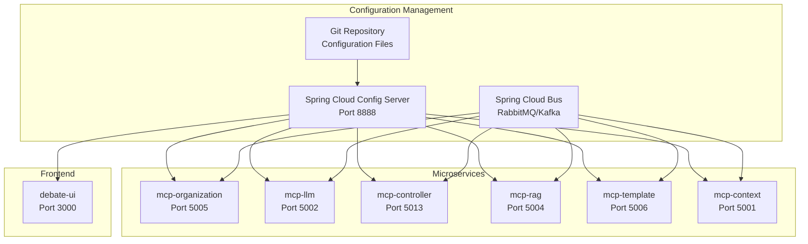

# Design Document

## Overview

This design implements a centralized configuration management system for the Zamaz Debate MCP Services using Spring Cloud Config Server. The solution provides a Git-backed configuration server that serves environment-specific configurations to all microservices, with support for encryption, dynamic refresh, and shared configuration patterns.

## Architecture

### High-Level Architecture



### Configuration Repository Structure

```
config-repo/
├── application.yml                    # Global default configuration
├── application-dev.yml               # Development environment
├── application-staging.yml           # Staging environment
├── application-prod.yml              # Production environment
├── mcp-organization.yml              # Service-specific config
├── mcp-organization-dev.yml          # Service + environment config
├── mcp-organization-staging.yml
├── mcp-organization-prod.yml
├── mcp-llm.yml
├── mcp-llm-dev.yml
├── mcp-controller.yml
├── mcp-controller-dev.yml
├── mcp-rag.yml
├── mcp-rag-dev.yml
├── mcp-template.yml
├── mcp-template-dev.yml
├── mcp-context.yml
├── mcp-context-dev.yml
└── shared/
    ├── database-common.yml           # Shared database config
    ├── security-common.yml           # Shared security config
    ├── monitoring-common.yml         # Shared monitoring config
    └── logging-common.yml            # Shared logging config
```

## Components and Interfaces

### 1. Spring Cloud Config Server (MCP-config-server)

**Purpose**: Central configuration server that serves configuration to all microservices.

**Key Components**:

- `ConfigServerApplication.java` - Main Spring Boot application
- `SecurityConfig.java` - Security configuration for the config server
- `EncryptionConfig.java` - Configuration encryption setup

**Configuration**:

```yaml
server:
  port: 8888

spring:
  cloud:
    config:
      server:
        git:
          uri: https://github.com/zamaz/mcp-config-repo
          clone-on-start: true
          force-pull: true
        encrypt:
          enabled: true
  security:
    user:
      name: config-admin
      password: ${CONFIG_SERVER_PASSWORD:admin}

encrypt:
  key: ${CONFIG_ENCRYPTION_KEY:mySecretKey}
```

### 2. Shared Configuration Library (MCP-common)

**Purpose**: Provides common configuration classes and utilities for all services.

**Key Classes**:

- `DatabaseConfigProperties.java` - Common database configuration
- `SecurityConfigProperties.java` - JWT and security settings
- `MonitoringConfigProperties.java` - Actuator and metrics configuration
- `ConfigRefreshController.java` - Manual refresh endpoint

### 3. Service Configuration Integration

**Bootstrap Configuration** (`bootstrap.yml` in each service):

```yaml
spring:
  application:
    name: mcp-organization
  cloud:
    config:
      uri: http://localhost:8888
      fail-fast: true
      retry:
        initial-interval: 1000
        max-attempts: 6
        max-interval: 2000
        multiplier: 1.1
  profiles:
    active: ${SPRING_PROFILES_ACTIVE:dev}
```

### 4. Configuration Refresh Mechanism

**Spring Cloud Bus Integration**:

- Uses RabbitMQ or Apache Kafka for broadcasting refresh events
- Webhook integration with Git repository for automatic refresh
- Manual refresh endpoints for operational control

## Data Models

### Configuration Properties Classes

```java
@ConfigurationProperties(prefix = "mcp.database")
@Data
public class DatabaseConfigProperties {
    private String url;
    private String username;
    private String password;
    private int maxPoolSize = 10;
    private int minPoolSize = 2;
    private long connectionTimeout = 30000;
    private long idleTimeout = 600000;
}

@ConfigurationProperties(prefix = "mcp.security")
@Data
public class SecurityConfigProperties {
    private Jwt jwt = new Jwt();
    private Cors cors = new Cors();
    
    @Data
    public static class Jwt {
        private String secret;
        private long expiration = 86400; // 24 hours
        private String issuer = "zamaz-mcp";
    }
    
    @Data
    public static class Cors {
        private List<String> allowedOrigins = Arrays.asList("http://localhost:3000");
        private List<String> allowedMethods = Arrays.asList("GET", "POST", "PUT", "DELETE");
        private List<String> allowedHeaders = Arrays.asList("*");
    }
}

@ConfigurationProperties(prefix = "mcp.monitoring")
@Data
public class MonitoringConfigProperties {
    private boolean enabled = true;
    private String metricsPath = "/actuator/metrics";
    private String healthPath = "/actuator/health";
    private List<String> exposedEndpoints = Arrays.asList("health", "metrics", "info");
}
```

### Environment-Specific Configuration

**Development Environment** (`application-dev.yml`):

```yaml
mcp:
  database:
    url: jdbc:postgresql://localhost:5432/mcp_dev
    username: mcp_user
    password: dev_password
    max-pool-size: 5
  
  security:
    jwt:
      secret: dev-secret-key-change-in-production
      expiration: 3600
  
  monitoring:
    enabled: true
    exposed-endpoints:
      - health
      - metrics
      - info
      - env

logging:
  level:
    com.zamaz.mcp: DEBUG
    org.springframework.cloud.config: DEBUG
```

**Production Environment** (`application-prod.yml`):

```yaml
mcp:
  database:
    url: jdbc:postgresql://${DB_HOST:localhost}:${DB_PORT:5432}/${DB_NAME:mcp_prod}
    username: ${DB_USERNAME}
    password: '{cipher}AQA...' # Encrypted password
    max-pool-size: 20
  
  security:
    jwt:
      secret: '{cipher}AQB...' # Encrypted JWT secret
      expiration: 86400
  
  monitoring:
    enabled: true
    exposed-endpoints:
      - health
      - metrics
      - info

logging:
  level:
    com.zamaz.mcp: INFO
    org.springframework.cloud.config: WARN
```

## Error Handling

### Configuration Server Unavailability

```java
@Component
public class ConfigServerHealthIndicator implements HealthIndicator {
    
    @Autowired
    private ConfigServerProperties configServerProperties;
    
    @Override
    public Health health() {
        try {
            // Check if config server is reachable
            RestTemplate restTemplate = new RestTemplate();
            ResponseEntity<String> response = restTemplate.getForEntity(
                configServerProperties.getUri() + "/actuator/health", 
                String.class
            );
            
            if (response.getStatusCode().is2xxSuccessful()) {
                return Health.up()
                    .withDetail("config-server", "Available")
                    .build();
            }
        } catch (Exception e) {
            return Health.down()
                .withDetail("config-server", "Unavailable")
                .withDetail("error", e.getMessage())
                .build();
        }
        
        return Health.down()
            .withDetail("config-server", "Unknown status")
            .build();
    }
}
```

### Configuration Validation

```java
@Component
@Validated
public class ConfigurationValidator {
    
    @EventListener
    public void handleRefreshEvent(RefreshRemoteApplicationEvent event) {
        validateConfiguration();
    }
    
    private void validateConfiguration() {
        // Validate database configuration
        validateDatabaseConfig();
        
        // Validate security configuration
        validateSecurityConfig();
        
        // Validate monitoring configuration
        validateMonitoringConfig();
    }
    
    private void validateDatabaseConfig() {
        if (StringUtils.isEmpty(databaseConfig.getUrl())) {
            throw new ConfigurationException("Database URL is required");
        }
        
        if (databaseConfig.getMaxPoolSize() <= 0) {
            throw new ConfigurationException("Database max pool size must be positive");
        }
    }
}
```

## Testing Strategy

### Configuration Server Testing

```java
@SpringBootTest(webEnvironment = SpringBootTest.WebEnvironment.RANDOM_PORT)
@TestPropertySource(properties = {
    "spring.cloud.config.server.git.uri=classpath:/config-repo"
})
class ConfigServerIntegrationTest {
    
    @Autowired
    private TestRestTemplate restTemplate;
    
    @Test
    void shouldServeApplicationConfiguration() {
        ResponseEntity<String> response = restTemplate.getForEntity(
            "/mcp-organization/dev", String.class);
        
        assertThat(response.getStatusCode()).isEqualTo(HttpStatus.OK);
        assertThat(response.getBody()).contains("mcp.database.url");
    }
    
    @Test
    void shouldServeEncryptedProperties() {
        ResponseEntity<String> response = restTemplate.getForEntity(
            "/mcp-organization/prod", String.class);
        
        assertThat(response.getStatusCode()).isEqualTo(HttpStatus.OK);
        // Verify encrypted properties are decrypted
        assertThat(response.getBody()).doesNotContain("{cipher}");
    }
}
```

### Service Configuration Testing

```java
@SpringBootTest
@TestPropertySource(properties = {
    "spring.cloud.config.enabled=false"
})
class ServiceConfigurationTest {
    
    @Autowired
    private DatabaseConfigProperties databaseConfig;
    
    @Autowired
    private SecurityConfigProperties securityConfig;
    
    @Test
    void shouldLoadDatabaseConfiguration() {
        assertThat(databaseConfig.getUrl()).isNotEmpty();
        assertThat(databaseConfig.getMaxPoolSize()).isGreaterThan(0);
    }
    
    @Test
    void shouldLoadSecurityConfiguration() {
        assertThat(securityConfig.getJwt().getSecret()).isNotEmpty();
        assertThat(securityConfig.getJwt().getExpiration()).isGreaterThan(0);
    }
}
```

### Configuration Refresh Testing

```java
@SpringBootTest
@DirtiesContext
class ConfigurationRefreshTest {
    
    @Autowired
    private RefreshEndpoint refreshEndpoint;
    
    @Autowired
    private DatabaseConfigProperties databaseConfig;
    
    @Test
    void shouldRefreshConfiguration() {
        String originalUrl = databaseConfig.getUrl();
        
        // Simulate configuration change
        System.setProperty("mcp.database.url", "jdbc:postgresql://new-host:5432/db");
        
        // Trigger refresh
        Collection<String> refreshedProperties = refreshEndpoint.refresh();
        
        assertThat(refreshedProperties).contains("mcp.database.url");
        assertThat(databaseConfig.getUrl()).isNotEqualTo(originalUrl);
    }
}
```

## Security Considerations

### Configuration Encryption

- Use Spring Cloud Config encryption for sensitive properties
- Store encryption keys securely (environment variables, vault)
- Rotate encryption keys regularly
- Use different keys for different environments

### Access Control

- Secure Config Server with authentication
- Use HTTPS for all configuration requests
- Implement IP whitelisting for Config Server access
- Audit configuration access and changes

### Git Repository Security

- Use private Git repositories for configuration
- Implement branch protection rules
- Require code reviews for configuration changes
- Use deploy keys with read-only access

## Deployment Strategy

### Docker Configuration

```dockerfile
# mcp-config-server/Dockerfile
FROM openjdk:21-jre-slim

COPY target/mcp-config-server-*.jar app.jar

EXPOSE 8888

ENTRYPOINT ["java", "-jar", "/app.jar"]
```

### Docker Compose Integration

```yaml
# docker-compose.yml
version: '3.8'

services:
  config-server:
    build: ./mcp-config-server
    ports:
      - "8888:8888"
    environment:
      - CONFIG_SERVER_PASSWORD=${CONFIG_SERVER_PASSWORD}
      - CONFIG_ENCRYPTION_KEY=${CONFIG_ENCRYPTION_KEY}
      - GIT_REPO_URI=${CONFIG_GIT_REPO_URI}
    healthcheck:
      test: ["CMD", "curl", "-f", "http://localhost:8888/actuator/health"]
      interval: 30s
      timeout: 10s
      retries: 3

  mcp-organization:
    build: ./mcp-organization
    depends_on:
      config-server:
        condition: service_healthy
    environment:
      - SPRING_CLOUD_CONFIG_URI=http://config-server:8888
      - SPRING_PROFILES_ACTIVE=${ENVIRONMENT:dev}
```

### Kubernetes Deployment

```yaml
# k8s/config-server-deployment.yaml
apiVersion: apps/v1
kind: Deployment
metadata:
  name: config-server
spec:
  replicas: 2
  selector:
    matchLabels:
      app: config-server
  template:
    metadata:
      labels:
        app: config-server
    spec:
      containers:
      - name: config-server
        image: zamaz/mcp-config-server:latest
        ports:
        - containerPort: 8888
        env:
        - name: CONFIG_SERVER_PASSWORD
          valueFrom:
            secretKeyRef:
              name: config-server-secret
              key: password
        - name: CONFIG_ENCRYPTION_KEY
          valueFrom:
            secretKeyRef:
              name: config-server-secret
              key: encryption-key
        livenessProbe:
          httpGet:
            path: /actuator/health
            port: 8888
          initialDelaySeconds: 60
          periodSeconds: 30
        readinessProbe:
          httpGet:
            path: /actuator/health
            port: 8888
          initialDelaySeconds: 30
          periodSeconds: 10
```
