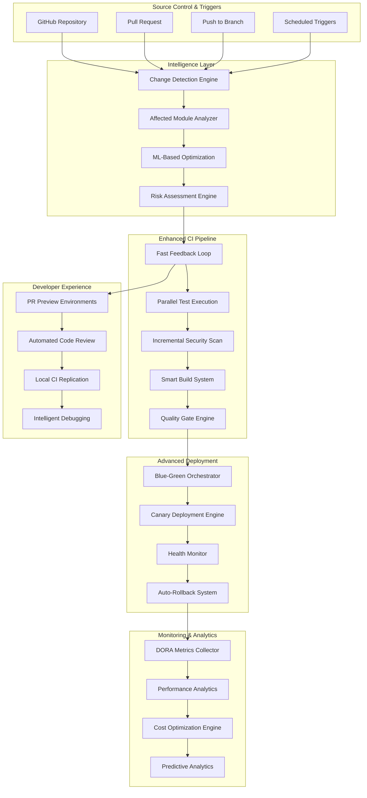
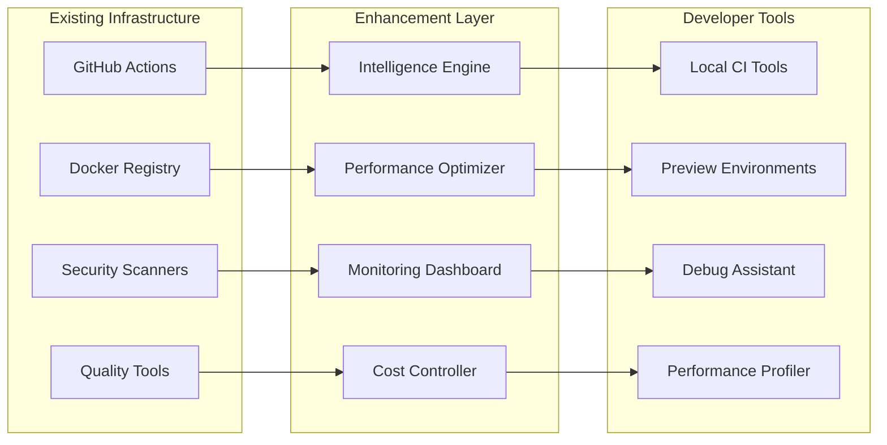

# CI/CD Enhancement Design Document

## Overview

This document outlines the design for enhancing the existing CI/CD pipeline for the Zamaz Debate MCP Services project. The design builds upon the comprehensive GitHub Actions infrastructure already in place, focusing on performance optimization, intelligent automation, and enhanced developer experience while maintaining the security-first approach and quality standards.

The enhancement introduces smart change detection, advanced caching strategies, AI-powered optimizations, comprehensive monitoring, and enhanced security with supply chain attestation to create a world-class CI/CD experience that reduces feedback time, improves reliability, optimizes costs, and ensures compliance with regulatory requirements.

## Architecture

### Enhanced CI/CD Pipeline Architecture



### System Components Integration



## Components and Interfaces

### 1. Intelligence Engine

#### Change Detection Service
```typescript
interface ChangeDetectionService {
  detectAffectedModules(changes: GitChanges): Promise<AffectedModules>;
  analyzeImpact(modules: AffectedModules): Promise<ImpactAnalysis>;
  generateTestPlan(impact: ImpactAnalysis): Promise<TestPlan>;
  optimizeBuildPlan(modules: AffectedModules): Promise<BuildPlan>;
}

interface AffectedModules {
  java: string[];
  frontend: string[];
  docker: string[];
  infrastructure: string[];
  dependencies: DependencyChange[];
}

interface ImpactAnalysis {
  riskLevel: 'low' | 'medium' | 'high';
  affectedServices: string[];
  testScope: 'unit' | 'integration' | 'full';
  securityScanScope: 'incremental' | 'full';
}
```

#### ML-Based Optimization Engine
```typescript
interface OptimizationEngine {
  predictTestFailures(testHistory: TestHistory[]): Promise<FlakeyTestPrediction>;
  optimizeResourceAllocation(workload: PipelineWorkload): Promise<ResourcePlan>;
  recommendDeploymentTiming(metrics: DeploymentMetrics): Promise<DeploymentRecommendation>;
  analyzeFailurePatterns(failures: PipelineFailure[]): Promise<FailureAnalysis>;
}

interface FlakeyTestPrediction {
  likelyFlakeyTests: string[];
  confidence: number;
  recommendedActions: string[];
}
```

### 2. Enhanced CI Pipeline Components

#### Fast Feedback Loop System
```yaml
# Enhanced GitHub Actions workflow structure
name: Enhanced Fast Feedback

on:
  pull_request:
    types: [opened, synchronize, reopened]

jobs:
  intelligence:
    name: 🧠 Pipeline Intelligence
    runs-on: ubuntu-latest
    outputs:
      affected-modules: ${{ steps.analysis.outputs.modules }}
      test-plan: ${{ steps.analysis.outputs.test-plan }}
      risk-level: ${{ steps.analysis.outputs.risk-level }}
    steps:
      - name: Analyze Changes
        id: analysis
        run: |
          # Smart change detection and impact analysis
          ./scripts/intelligence/analyze-changes.sh
  
  fast-validation:
    name: ⚡ Fast Validation
    needs: intelligence
    if: needs.intelligence.outputs.risk-level != 'high'
    strategy:
      matrix:
        validation: [lint, unit-tests, security-quick]
    runs-on: ubuntu-latest
    steps:
      - name: Run ${{ matrix.validation }}
        run: |
          ./scripts/validation/run-${{ matrix.validation }}.sh \
            --modules="${{ needs.intelligence.outputs.affected-modules }}"
```

#### Advanced Caching System
```yaml
# Multi-layer caching strategy
caching:
  maven:
    primary_key: ${{ runner.os }}-maven-${{ hashFiles('**/pom.xml', '.github/workflows/**') }}
    restore_keys: |
      ${{ runner.os }}-maven-
    paths:
      - ~/.m2/repository
      - ~/.sonar/cache
      - **/target/classes
  
  docker:
    registry_cache: true
    build_cache: type=gha,mode=max
    layer_cache: true
  
  node:
    primary_key: ${{ runner.os }}-node-${{ hashFiles('**/package-lock.json') }}
    paths:
      - ~/.npm
      - **/node_modules
      - **/.next/cache
```

### 3. Advanced Deployment System

#### Blue-Green Deployment Orchestrator
```typescript
interface BlueGreenOrchestrator {
  planDeployment(config: DeploymentConfig): Promise<DeploymentPlan>;
  executeDeployment(plan: DeploymentPlan): Promise<DeploymentResult>;
  monitorHealth(deployment: ActiveDeployment): Promise<HealthStatus>;
  triggerRollback(reason: RollbackReason): Promise<RollbackResult>;
}

interface DeploymentConfig {
  environment: 'staging' | 'production';
  strategy: 'blue-green' | 'canary' | 'rolling';
  healthChecks: HealthCheck[];
  rollbackTriggers: RollbackTrigger[];
  approvalRequired: boolean;
}

interface HealthCheck {
  endpoint: string;
  timeout: number;
  retries: number;
  expectedStatus: number;
  customValidation?: string;
}
```

#### Canary Deployment Engine
```typescript
interface CanaryDeploymentEngine {
  createCanaryDeployment(config: CanaryConfig): Promise<CanaryDeployment>;
  monitorCanaryMetrics(deployment: CanaryDeployment): Promise<CanaryMetrics>;
  promoteCanary(deployment: CanaryDeployment): Promise<PromotionResult>;
  rollbackCanary(deployment: CanaryDeployment): Promise<RollbackResult>;
}

interface CanaryConfig {
  trafficSplit: number; // Percentage of traffic to canary
  duration: number; // Duration in minutes
  successCriteria: SuccessCriteria;
  rollbackCriteria: RollbackCriteria;
}
```

### 4. Monitoring and Analytics System

#### DORA Metrics Collector
```typescript
interface DORAMetricsCollector {
  trackDeploymentFrequency(): Promise<DeploymentFrequencyMetric>;
  measureLeadTime(change: CodeChange): Promise<LeadTimeMetric>;
  calculateChangeFailureRate(): Promise<ChangeFailureRateMetric>;
  measureMTTR(incident: Incident): Promise<MTTRMetric>;
}

interface DeploymentFrequencyMetric {
  daily: number;
  weekly: number;
  monthly: number;
  trend: 'increasing' | 'decreasing' | 'stable';
}
```

#### Performance Analytics Dashboard
```typescript
interface PerformanceAnalytics {
  collectPipelineMetrics(): Promise<PipelineMetrics>;
  analyzeBuildPerformance(): Promise<BuildAnalysis>;
  trackResourceUsage(): Promise<ResourceMetrics>;
  generateOptimizationRecommendations(): Promise<OptimizationRecommendation[]>;
}

interface PipelineMetrics {
  averageBuildTime: number;
  successRate: number;
  queueTime: number;
  resourceUtilization: ResourceUtilization;
}
```

### 5. Developer Experience Components

#### Local Development Integration Tools

```typescript
interface LocalDevelopmentTools {
  replicateCI(config: CIConfig): Promise<LocalCIEnvironment>;
  validatePipelineConfig(config: PipelineConfig): Promise<ValidationResult>;
  debugPipelineFailure(failure: PipelineFailure): Promise<DebugSession>;
  setupLocalEnvironment(requirements: EnvironmentRequirements): Promise<SetupResult>;
}

interface LocalCIEnvironment {
  id: string;
  status: 'ready' | 'running' | 'failed';
  services: LocalService[];
  logs: LogStream[];
  debugPort?: number;
}

interface ValidationResult {
  valid: boolean;
  errors: ValidationError[];
  warnings: ValidationWarning[];
  suggestions: string[];
}
```

#### PR Preview Environment Manager
```typescript
interface PreviewEnvironmentManager {
  createPreviewEnvironment(pr: PullRequest): Promise<PreviewEnvironment>;
  updatePreviewEnvironment(pr: PullRequest): Promise<void>;
  destroyPreviewEnvironment(pr: PullRequest): Promise<void>;
  getPreviewStatus(pr: PullRequest): Promise<PreviewStatus>;
}

interface PreviewEnvironment {
  id: string;
  url: string;
  status: 'creating' | 'ready' | 'updating' | 'failed';
  services: PreviewService[];
  expiresAt: Date;
}
```

#### Automated Code Review Assistant
```typescript
interface CodeReviewAssistant {
  analyzeCodeChanges(pr: PullRequest): Promise<CodeAnalysis>;
  generateReviewComments(analysis: CodeAnalysis): Promise<ReviewComment[]>;
  suggestImprovements(code: CodeChange[]): Promise<Improvement[]>;
  checkBestPractices(code: CodeChange[]): Promise<BestPracticeViolation[]>;
}

interface CodeAnalysis {
  complexity: ComplexityMetrics;
  security: SecurityAnalysis;
  performance: PerformanceAnalysis;
  maintainability: MaintainabilityScore;
}
```

### 6. Audit and Compliance System

#### Comprehensive Audit Trail Manager
```typescript
interface AuditTrailManager {
  logPipelineActivity(activity: PipelineActivity): Promise<void>;
  trackDeploymentChain(deployment: DeploymentRecord): Promise<void>;
  generateComplianceReport(criteria: ComplianceCriteria): Promise<ComplianceReport>;
  searchAuditLogs(query: AuditQuery): Promise<AuditSearchResult>;
  exportAuditData(request: ExportRequest): Promise<ExportResult>;
}

interface PipelineActivity {
  id: string;
  timestamp: Date;
  actor: string;
  action: string;
  resource: string;
  environment: string;
  metadata: Record<string, any>;
  approvals?: ApprovalRecord[];
}

interface ComplianceReport {
  period: DateRange;
  deployments: DeploymentSummary[];
  securityFindings: SecurityFinding[];
  remediationStatus: RemediationStatus[];
  complianceScore: number;
  violations: ComplianceViolation[];
}
```

#### Approval Chain Management
```typescript
interface ApprovalChainManager {
  defineApprovalWorkflow(workflow: ApprovalWorkflow): Promise<void>;
  requestApproval(request: ApprovalRequest): Promise<ApprovalResponse>;
  trackApprovalStatus(deploymentId: string): Promise<ApprovalStatus>;
  enforceApprovalPolicies(deployment: Deployment): Promise<PolicyEnforcement>;
}

interface ApprovalWorkflow {
  environment: string;
  requiredApprovers: ApproverGroup[];
  conditions: ApprovalCondition[];
  timeout: number;
  escalation: EscalationPolicy;
}
```

## Data Models

### Pipeline Configuration Model
```yaml
pipeline_config:
  intelligence:
    change_detection:
      enabled: true
      algorithms: ['dependency-graph', 'file-impact', 'test-impact']
    ml_optimization:
      enabled: true
      models: ['test-prediction', 'resource-optimization', 'failure-analysis']
  
  performance:
    caching:
      maven: advanced
      docker: multi-layer
      node: intelligent
    parallelization:
      max_jobs: 10
      dependency_aware: true
  
  deployment:
    staging:
      strategy: blue-green
      auto_deploy: true
      health_checks: comprehensive
    production:
      strategy: canary
      approval_required: true
      traffic_split: 10
  
  monitoring:
    dora_metrics: enabled
    performance_tracking: enabled
    cost_optimization: enabled
    alerting: comprehensive
```

### Deployment Metadata Model
```json
{
  "deployment": {
    "id": "deploy-20250123-001",
    "timestamp": "2025-01-23T10:00:00Z",
    "environment": "production",
    "strategy": "canary",
    "version": "1.2.3",
    "commit_sha": "abc123def456",
    "deployed_by": "user@example.com",
    "approval_chain": [
      {
        "approver": "lead@example.com",
        "timestamp": "2025-01-23T09:45:00Z",
        "type": "technical_review"
      }
    ],
    "services": [
      {
        "name": "mcp-organization",
        "image": "ghcr.io/org/mcp-organization:1.2.3",
        "health_status": "healthy",
        "traffic_split": 10
      }
    ],
    "metrics": {
      "deployment_duration": "8m 32s",
      "health_check_duration": "2m 15s",
      "rollback_ready": true
    }
  }
}
```

### Analytics Data Model
```json
{
  "analytics": {
    "dora_metrics": {
      "deployment_frequency": {
        "daily": 3.2,
        "weekly": 22.4,
        "trend": "increasing"
      },
      "lead_time": {
        "average_hours": 4.5,
        "p95_hours": 8.2,
        "trend": "decreasing"
      },
      "change_failure_rate": {
        "percentage": 2.1,
        "trend": "stable"
      },
      "mttr": {
        "average_minutes": 15.3,
        "trend": "decreasing"
      }
    },
    "performance": {
      "build_time": {
        "average_minutes": 12.5,
        "p95_minutes": 18.2,
        "optimization_potential": "25%"
      },
      "test_execution": {
        "average_minutes": 8.3,
        "flaky_test_rate": "1.2%",
        "coverage": "87.5%"
      }
    },
    "cost": {
      "monthly_runner_cost": 450.32,
      "cost_per_build": 2.15,
      "optimization_savings": 125.50
    }
  }
}
```

## Error Handling

### Intelligent Failure Recovery
```typescript
interface FailureRecoverySystem {
  analyzeFailure(failure: PipelineFailure): Promise<FailureAnalysis>;
  suggestRecoveryActions(analysis: FailureAnalysis): Promise<RecoveryAction[]>;
  executeAutoRecovery(actions: RecoveryAction[]): Promise<RecoveryResult>;
  escalateToHuman(failure: PipelineFailure): Promise<void>;
}

interface FailureAnalysis {
  category: 'infrastructure' | 'code' | 'dependency' | 'configuration';
  severity: 'low' | 'medium' | 'high' | 'critical';
  rootCause: string;
  affectedComponents: string[];
  recoveryComplexity: 'automatic' | 'semi-automatic' | 'manual';
}
```

### Deployment Failure Handling
```yaml
failure_handling:
  deployment_failures:
    health_check_failure:
      action: automatic_rollback
      timeout: 300s
      notification: immediate
    
    performance_degradation:
      threshold: 50% increase in response time
      action: gradual_rollback
      monitoring_duration: 600s
    
    error_rate_spike:
      threshold: 5% error rate
      action: immediate_rollback
      notification: critical_alert
  
  build_failures:
    flaky_test_failure:
      action: retry_with_isolation
      max_retries: 3
      quarantine_threshold: 3_consecutive_failures
    
    dependency_failure:
      action: fallback_to_cached_version
      notification: dependency_team
    
    infrastructure_failure:
      action: retry_on_different_runner
      max_retries: 2
      escalation: infrastructure_team
```

## Testing Strategy

### Multi-Level Testing Approach
```yaml
testing_strategy:
  unit_tests:
    execution: parallel
    scope: affected_modules
    coverage_threshold: 80%
    performance_budget: 5_minutes
  
  integration_tests:
    execution: conditional
    trigger: affected_services
    environment: containerized
    performance_budget: 15_minutes
  
  e2e_tests:
    execution: selective
    trigger: critical_path_changes
    environment: preview
    performance_budget: 30_minutes
  
  performance_tests:
    execution: scheduled
    baseline: automated
    regression_detection: ml_powered
    budget: 45_minutes
```

### Test Optimization Engine
```typescript
interface TestOptimizationEngine {
  selectOptimalTests(changes: CodeChange[]): Promise<TestSelection>;
  predictTestDuration(tests: Test[]): Promise<DurationPrediction>;
  identifyFlakeyTests(testHistory: TestHistory[]): Promise<FlakeyTestReport>;
  optimizeTestExecution(tests: Test[]): Promise<ExecutionPlan>;
}

interface TestSelection {
  essential: Test[];
  recommended: Test[];
  optional: Test[];
  skipped: Test[];
  reasoning: string[];
}
```

## Security Integration

### Enhanced Security Pipeline
```yaml
security_enhancements:
  supply_chain:
    sbom_generation:
      format: [cyclonedx, spdx]
      signing: cosign
      attestation: in-toto
    
    dependency_verification:
      signature_check: required
      vulnerability_scan: continuous
      license_compliance: automated
    
    provenance_tracking:
      build_attestation: required
      source_verification: enabled
      artifact_signing: mandatory
  
  runtime_security:
    behavior_monitoring:
      anomaly_detection: ml_powered
      threat_intelligence: integrated
      response: automated
    
    container_security:
      runtime_protection: enabled
      network_policies: enforced
      secrets_management: vault_integrated
    
    threat_response:
      automated_quarantine: enabled
      incident_tracking: comprehensive
      security_team_alerts: immediate
```

### Security Automation
```typescript
interface SecurityAutomation {
  generateSBOM(artifact: BuildArtifact): Promise<SBOM>;
  verifySupplyChain(dependency: Dependency): Promise<VerificationResult>;
  monitorRuntimeSecurity(deployment: Deployment): Promise<SecurityStatus>;
  respondToThreat(threat: SecurityThreat): Promise<ThreatResponse>;
}

interface SBOM {
  format: 'cyclonedx' | 'spdx';
  components: Component[];
  vulnerabilities: Vulnerability[];
  signature: string;
  attestation: Attestation;
}
```

## Cost Optimization Strategy

### Resource Efficiency and Cost Management
```yaml
cost_optimization:
  runner_management:
    selection_algorithm: workload_optimized
    auto_scaling: demand_based
    resource_pooling: enabled
    idle_timeout: 5_minutes
  
  cache_optimization:
    storage_tiering: intelligent
    cleanup_policies: automated
    compression: enabled
    deduplication: enabled
  
  build_optimization:
    parallel_execution: dependency_aware
    resource_allocation: dynamic
    build_caching: multi_layer
    artifact_sharing: enabled
  
  monitoring:
    cost_tracking: real_time
    budget_alerts: automated
    optimization_recommendations: ml_powered
    usage_analytics: comprehensive
```

### Cost Control Interfaces
```typescript
interface CostOptimizationEngine {
  trackResourceUsage(pipeline: PipelineExecution): Promise<ResourceUsage>;
  optimizeRunnerAllocation(workload: Workload): Promise<OptimizationPlan>;
  generateCostReport(period: DateRange): Promise<CostReport>;
  recommendOptimizations(usage: ResourceUsage): Promise<OptimizationRecommendation[]>;
}

interface CostReport {
  totalCost: number;
  costPerBuild: number;
  resourceBreakdown: ResourceCostBreakdown;
  trends: CostTrend[];
  optimizationPotential: number;
  recommendations: string[];
}
```

## Performance Considerations

### Build Performance Optimization
```yaml
performance_optimizations:
  caching:
    strategy: multi_layer
    invalidation: smart
    compression: enabled
    distribution: global
  
  parallelization:
    job_scheduling: dependency_aware
    resource_allocation: dynamic
    load_balancing: intelligent
  
  resource_management:
    runner_selection: workload_optimized
    scaling: auto
    cost_optimization: enabled
```

### Deployment Performance
```yaml
deployment_performance:
  blue_green:
    warm_standby: enabled
    health_check_optimization: parallel
    traffic_switching: gradual
  
  canary:
    traffic_management: intelligent
    metric_collection: real_time
    decision_automation: ml_powered
  
  rollback:
    preparation: pre_computed
    execution: automated
    verification: comprehensive
```

## AI-Powered Optimization and Predictive Analytics

### Machine Learning Integration
```yaml
ml_optimization:
  test_prediction:
    flaky_test_detection:
      algorithm: ensemble_learning
      features: [execution_time, failure_rate, environment_factors]
      confidence_threshold: 0.85
    
    failure_prediction:
      model: gradient_boosting
      features: [code_complexity, test_coverage, historical_failures]
      prediction_horizon: 24_hours
  
  resource_optimization:
    workload_prediction:
      algorithm: time_series_forecasting
      features: [historical_usage, team_activity, release_cycles]
      optimization_target: cost_performance_ratio
    
    deployment_timing:
      risk_assessment: bayesian_network
      features: [change_size, affected_modules, team_velocity]
      recommendation_engine: reinforcement_learning
```

### Predictive Analytics Engine
```typescript
interface PredictiveAnalyticsEngine {
  predictTestFailures(testHistory: TestHistory[], codeChanges: CodeChange[]): Promise<FailurePrediction>;
  assessDeploymentRisk(deployment: DeploymentPlan): Promise<RiskAssessment>;
  optimizeResourceAllocation(workload: WorkloadForecast): Promise<ResourceOptimization>;
  recommendDeploymentTiming(metrics: DeploymentMetrics): Promise<TimingRecommendation>;
  analyzeFailurePatterns(failures: PipelineFailure[]): Promise<PatternAnalysis>;
}

interface FailurePrediction {
  likelyFailures: TestFailurePrediction[];
  confidence: number;
  preventiveActions: PreventiveAction[];
  riskMitigation: RiskMitigationStrategy[];
}

interface RiskAssessment {
  overallRisk: 'low' | 'medium' | 'high' | 'critical';
  riskFactors: RiskFactor[];
  mitigationStrategies: MitigationStrategy[];
  recommendedActions: string[];
  rollbackProbability: number;
}
```

## Scalability Design

### Horizontal Scaling Strategy
```yaml
scaling_strategy:
  github_actions:
    runner_pools: dynamic
    queue_management: intelligent
    resource_optimization: continuous
  
  monitoring:
    metric_collection: distributed
    data_processing: stream_based
    storage: time_series_optimized
  
  preview_environments:
    provisioning: on_demand
    resource_sharing: enabled
    cleanup: automated
```

## Integration Points

### External Service Integration
```typescript
interface ExternalIntegrations {
  github: GitHubAPIClient;
  monitoring: PrometheusClient;
  security: SecurityScannerClients;
  notification: NotificationClients;
  analytics: AnalyticsClients;
}

interface GitHubAPIClient {
  createStatus(status: CommitStatus): Promise<void>;
  createComment(comment: PRComment): Promise<void>;
  updateDeploymentStatus(deployment: DeploymentStatus): Promise<void>;
  manageEnvironments(environment: Environment): Promise<void>;
}
```

### Monitoring Integration
```yaml
monitoring_integrations:
  prometheus:
    custom_metrics: enabled
    alerting_rules: comprehensive
    dashboards: automated
  
  grafana:
    dashboard_generation: automated
    alerting: integrated
    reporting: scheduled
  
  slack:
    notifications: intelligent
    escalation: automated
    status_updates: real_time
```

## Design Rationale and Key Decisions

### Architectural Decisions

#### 1. Intelligence-First Approach
**Decision**: Implement ML-powered change detection and impact analysis as the foundation layer.
**Rationale**: This addresses requirements 4.1-4.4 and 10.1-10.5 by ensuring only necessary work is performed, reducing feedback time and resource consumption while providing predictive capabilities.

#### 2. Layered Security Integration
**Decision**: Integrate security scanning throughout the pipeline rather than as a final gate.
**Rationale**: Addresses requirements 5.1-5.5 by implementing "shift-left" security practices, enabling early detection and remediation while maintaining supply chain integrity.

#### 3. Multi-Strategy Deployment Approach
**Decision**: Support both blue-green and canary deployment strategies with intelligent selection.
**Rationale**: Addresses requirements 2.1-2.4 by providing flexibility based on change risk assessment, ensuring reliable deployments with appropriate rollback capabilities.

#### 4. Developer-Centric Experience Design
**Decision**: Prioritize local development integration and preview environments.
**Rationale**: Addresses requirements 6.1-6.2 and 8.1-8.5 by reducing context switching and enabling developers to validate changes before committing to the pipeline.

#### 5. Comprehensive Observability Strategy
**Decision**: Implement DORA metrics collection with predictive analytics.
**Rationale**: Addresses requirements 3.1-3.5 by providing actionable insights into team performance and pipeline efficiency, enabling continuous improvement.

#### 6. Cost-Aware Resource Management
**Decision**: Implement intelligent resource allocation with real-time cost tracking.
**Rationale**: Addresses requirements 7.1-7.5 by optimizing operational costs while maintaining performance, crucial for sustainable CI/CD operations.

#### 7. Audit-First Compliance Design
**Decision**: Build comprehensive audit trails into every pipeline operation.
**Rationale**: Addresses requirements 9.1-9.5 by ensuring regulatory compliance and providing complete traceability for all changes and deployments.

### Technology Choices

#### GitHub Actions as Foundation
**Choice**: Enhance existing GitHub Actions infrastructure rather than replacing it.
**Rationale**: Leverages existing investment while adding intelligence and optimization layers, minimizing disruption to current workflows.

#### TypeScript for Interface Definitions
**Choice**: Use TypeScript interfaces for all system contracts.
**Rationale**: Provides type safety and clear API contracts while being familiar to the development team working with the React frontend.

#### YAML for Configuration
**Choice**: Use YAML for pipeline and deployment configurations.
**Rationale**: Maintains consistency with existing GitHub Actions workflows while providing human-readable configuration management.

This design provides a comprehensive enhancement to your existing CI/CD pipeline, focusing on intelligent automation, performance optimization, and enhanced developer experience while maintaining the security and quality standards you've established.