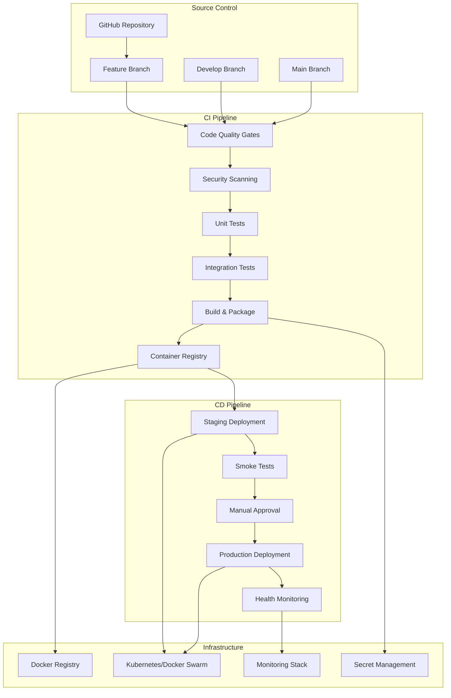

# CI/CD Pipeline Design Document

## Overview

This document outlines the design for a comprehensive Continuous Integration and Continuous Deployment (CI/CD) pipeline for the Zamaz Debate MCP Services project. The pipeline will build upon existing GitHub Actions workflows and extend them to provide full automation from code commit to production deployment.

The system consists of multiple Java Spring Boot microservices (mcp-organization, mcp-controller, mcp-llm, mcp-rag, mcp-template), a React TypeScript frontend, and supporting infrastructure. The CI/CD pipeline will provide automated testing, security scanning, building, and deployment across multiple environments.

## Architecture

### Pipeline Architecture Overview



### Multi-Environment Strategy

The pipeline supports three primary environments:

1. **Development Environment**: Local development with Docker Compose
2. **Staging Environment**: Production-like environment for testing
3. **Production Environment**: Live system serving end users

### Branching Strategy

- **Feature Branches**: Trigger CI pipeline with quality gates
- **Develop Branch**: Automatic deployment to staging environment
- **Main Branch**: Manual approval required for production deployment

## Components and Interfaces

### 1. GitHub Actions Workflows

#### Primary CI Workflow (`ci.yml`)
```yaml
# Triggers: Push to any branch, PR to main/develop
# Responsibilities:
# - Code quality checks (Checkstyle, SpotBugs, SonarQube)
# - Unit and integration tests
# - Security scanning
# - Docker image building
# - Artifact publishing
```

#### Staging Deployment Workflow (`deploy-staging.yml`)
```yaml
# Triggers: Push to develop branch
# Responsibilities:
# - Deploy to staging environment
# - Run smoke tests
# - Update deployment status
```

#### Production Deployment Workflow (`deploy-production.yml`)
```yaml
# Triggers: Manual approval after main branch CI passes
# Responsibilities:
# - Blue-green or canary deployment
# - Production health monitoring
# - Automatic rollback on failure
```

#### Security Scanning Workflow (Enhanced)
```yaml
# Extends existing security.yml
# Additional responsibilities:
# - Container image vulnerability scanning
# - Infrastructure as Code security checks
# - Compliance reporting
```

### 2. Build System Integration

#### Maven Multi-Module Build
- Parallel module building for performance
- Dependency caching between builds
- Test result aggregation
- Code coverage reporting

#### Docker Multi-Stage Builds
- Optimized layer caching
- Security-hardened base images
- Non-root user execution
- Minimal runtime images

### 3. Container Registry Management

#### Image Tagging Strategy
```
registry.example.com/zamaz-mcp/{service}:{tag}

Tag formats:
- {commit-sha} - Exact commit reference
- {branch-name}-{build-number} - Branch builds
- {semantic-version} - Release versions
- latest - Latest stable release
```

#### Registry Security
- Vulnerability scanning on push
- Image signing with Cosign
- Access control with RBAC
- Retention policies for cleanup

### 4. Deployment Orchestration

#### Staging Environment
- Docker Compose based deployment
- Automated database migrations
- Configuration management via environment variables
- Health check validation

#### Production Environment
- Kubernetes or Docker Swarm deployment
- Blue-green deployment strategy
- Canary releases for critical updates
- Automatic scaling based on metrics

### 5. Monitoring and Observability

#### Application Monitoring
- Spring Boot Actuator endpoints
- Prometheus metrics collection
- Grafana dashboards
- Custom business metrics

#### Pipeline Monitoring
- Build success/failure rates
- Deployment frequency metrics
- Lead time tracking
- Mean time to recovery (MTTR)

## Data Models

### Pipeline Configuration Model
```yaml
pipeline:
  environments:
    - name: staging
      auto_deploy: true
      approval_required: false
      health_checks:
        - endpoint: /actuator/health
          timeout: 30s
    - name: production
      auto_deploy: false
      approval_required: true
      deployment_strategy: blue-green
      health_checks:
        - endpoint: /actuator/health
          timeout: 60s
        - endpoint: /api/v1/health
          timeout: 30s
```

### Service Configuration Model
```yaml
services:
  - name: mcp-organization
    port: 5005
    health_endpoint: /actuator/health
    dependencies: [postgres, redis]
    scaling:
      min_replicas: 2
      max_replicas: 10
      cpu_threshold: 70%
```

### Deployment Metadata Model
```json
{
  "deployment_id": "uuid",
  "timestamp": "2025-01-16T10:00:00Z",
  "environment": "production",
  "version": "1.2.3",
  "commit_sha": "abc123",
  "deployed_by": "user@example.com",
  "services": [
    {
      "name": "mcp-organization",
      "image": "registry.example.com/zamaz-mcp/mcp-organization:1.2.3",
      "status": "healthy"
    }
  ]
}
```

## Error Handling

### Build Failure Handling
- Immediate notification to development team
- Detailed error logs with context
- Automatic retry for transient failures
- Rollback to last known good state

### Deployment Failure Handling
- Automatic rollback triggers
- Circuit breaker patterns
- Graceful degradation strategies
- Emergency stop procedures

### Security Failure Handling
- Immediate pipeline termination
- Security team notification
- Quarantine of affected artifacts
- Incident response procedures

## Testing Strategy

### Test Pyramid Implementation

#### Unit Tests (Base Layer)
- JUnit 5 for Java services
- Jest for React frontend
- Minimum 80% code coverage
- Fast execution (< 5 minutes total)

#### Integration Tests (Middle Layer)
- TestContainers for database testing
- Spring Boot Test slices
- API contract testing
- Service-to-service communication tests

#### End-to-End Tests (Top Layer)
- Playwright for UI testing
- API workflow testing
- Cross-service integration scenarios
- Performance and load testing

### Test Environment Management
- Isolated test databases
- Mock external services
- Test data management
- Parallel test execution

### Quality Gates
```yaml
quality_gates:
  unit_tests:
    coverage_threshold: 80%
    failure_threshold: 0
  integration_tests:
    success_rate_threshold: 95%
  security_scans:
    critical_vulnerabilities: 0
    high_vulnerabilities: 5
  code_quality:
    sonarqube_gate: "PASSED"
    technical_debt_ratio: "< 5%"
```

## Security Integration

### Static Application Security Testing (SAST)
- SonarQube security rules
- Semgrep custom rules
- CodeQL analysis
- Dependency vulnerability scanning

### Dynamic Application Security Testing (DAST)
- OWASP ZAP integration
- API security testing
- Authentication flow testing
- SQL injection detection

### Container Security
- Base image vulnerability scanning
- Runtime security monitoring
- Network policy enforcement
- Secrets management integration

### Infrastructure Security
- Terraform/Helm chart scanning
- Kubernetes security policies
- Network segmentation validation
- Access control auditing

## Performance Considerations

### Build Performance
- Parallel job execution
- Dependency caching strategies
- Incremental builds where possible
- Resource allocation optimization

### Deployment Performance
- Rolling updates to minimize downtime
- Health check optimization
- Database migration strategies
- CDN cache invalidation

### Monitoring Performance
- Efficient metrics collection
- Log aggregation optimization
- Alert threshold tuning
- Dashboard performance optimization

## Scalability Design

### Horizontal Scaling
- Kubernetes HPA integration
- Load balancer configuration
- Database connection pooling
- Cache distribution strategies

### Pipeline Scaling
- GitHub Actions runner scaling
- Build queue management
- Parallel workflow execution
- Resource usage optimization

## Integration Points

### External Services Integration
- GitHub API for repository management
- Docker Registry API for image management
- Kubernetes API for deployment management
- Monitoring system APIs for metrics

### Notification Integration
- Slack webhooks for team notifications
- Email alerts for critical failures
- GitHub status checks for PR validation
- Dashboard updates for stakeholders

### Secret Management Integration
- GitHub Secrets for CI/CD variables
- Kubernetes Secrets for runtime configuration
- HashiCorp Vault for production secrets
- Environment-specific secret rotation