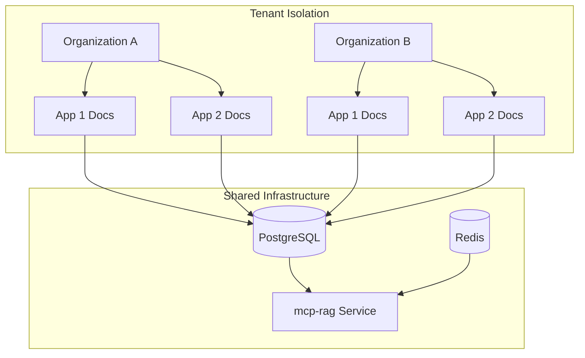

# Design Document

## Overview

The Documentation Management System (MCP-docs) is a comprehensive SaaS solution designed to centralize project and subproject documentation within the Zamaz Debate MCP Services ecosystem. The system provides multi-tenant support, hierarchical organization, AI-powered content management through MCP-rag integration, and full MCP protocol compliance for external integrations.

### Key Design Principles

- **Multi-tenancy**: Complete tenant isolation with support for multiple applications per organization
- **Scalability**: Horizontal scaling with proper data partitioning and caching strategies
- **Integration**: Deep integration with MCP-rag for AI-powered content management
- **Security**: Role-based access control with comprehensive audit logging
- **Extensibility**: MCP protocol compliance for external tool integration

## Architecture

### Service Architecture

The system follows the established microservice pattern used throughout the MCP ecosystem:

```
mcp-docs (Port 5007)
├── Spring Boot 3.3.5 Application
├── PostgreSQL Database (Multi-tenant schema)
├── Redis Cache (Session & Content Caching)
├── Integration with mcp-rag (Vector Search & AI)
├── MCP Protocol Support (Tools & Resources)
└── RESTful API with OpenAPI Documentation
```

### Multi-Tenant Data Architecture



### Integration with MCP-rag

The documentation system leverages MCP-rag for:

- **Vector Indexing**: Automatic embedding generation for semantic search
- **Content Generation**: AI-powered documentation summaries and suggestions
- **Similarity Search**: Related content recommendations
- **Content Analysis**: Automated tagging and categorization

## Components and Interfaces

### Core Domain Entities

#### Document Entity

```java
@Entity
@Table(name = "documents", indexes = {
    @Index(name = "idx_doc_org_app", columnList = "organization_id, application_id"),
    @Index(name = "idx_doc_project", columnList = "project_id"),
    @Index(name = "idx_doc_status", columnList = "status"),
    @Index(name = "idx_doc_created", columnList = "created_at")
})
public class Document extends BaseEntity {
    private UUID organizationId;
    private UUID applicationId;
    private UUID projectId;
    private String title;
    private String content; // Markdown content
    private String summary; // AI-generated summary
    private DocumentStatus status; // DRAFT, PUBLISHED, ARCHIVED
    private DocumentType type; // README, API_DOC, GUIDE, REFERENCE
    private Map<String, Object> metadata; // JSON metadata
    private List<String> tags;
    private UUID authorId;
    private Integer version;
    private UUID parentDocumentId; // For versioning
}
```

#### Project Entity

```java
@Entity
@Table(name = "projects", indexes = {
    @Index(name = "idx_project_org_app", columnList = "organization_id, application_id"),
    @Index(name = "idx_project_parent", columnList = "parent_project_id")
})
public class Project extends BaseEntity {
    private UUID organizationId;
    private UUID applicationId;
    private String name;
    private String description;
    private UUID parentProjectId; // For hierarchical structure
    private String path; // Computed path for efficient queries
    private Integer level; // Nesting level
    private ProjectStatus status;
    private Map<String, Object> settings; // JSON settings
}
```

#### Application Entity

```java
@Entity
@Table(name = "applications", indexes = {
    @Index(name = "idx_app_org", columnList = "organization_id")
})
public class Application extends BaseEntity {
    private UUID organizationId;
    private String name;
    private String description;
    private String slug; // URL-friendly identifier
    private ApplicationStatus status;
    private Map<String, Object> configuration; // JSON configuration
}
```

### Service Layer Architecture

#### DocumentService

- **Document CRUD Operations**: Create, read, update, delete documents
- **Version Management**: Handle document versioning and history
- **Content Processing**: Markdown processing and validation
- **AI Integration**: Coordinate with MCP-rag for content enhancement

#### ProjectService

- **Hierarchical Management**: Handle project tree operations
- **Path Computation**: Maintain efficient path-based queries
- **Bulk Operations**: Support for moving/copying project trees

#### ApplicationService

- **Multi-Application Support**: Manage multiple apps per tenant
- **Configuration Management**: Handle app-specific settings
- **Resource Isolation**: Ensure proper data separation

#### RagIntegrationService

- **Vector Indexing**: Sync documents with MCP-rag for embedding
- **Semantic Search**: Provide AI-powered search capabilities
- **Content Generation**: Generate summaries and suggestions
- **Similarity Matching**: Find related content

### API Layer

#### REST Controllers

- **DocumentController**: Standard CRUD operations
- **ProjectController**: Project hierarchy management
- **ApplicationController**: Application management
- **SearchController**: Advanced search capabilities

#### MCP Tools Controller

Following the established pattern from MCP-organization:

- **create_document**: Create new documentation
- **update_document**: Update existing documentation
- **get_document**: Retrieve document by ID
- **delete_document**: Remove documentation
- **search_documents**: AI-powered document search
- **list_projects**: Get project hierarchy
- **create_project**: Create new project/subproject

#### MCP Resources Controller

- **documents**: List documents with filtering
- **projects**: Project tree structure
- **applications**: Available applications

## Data Models

### Database Schema Design

#### Multi-Tenant Partitioning Strategy

```sql
-- Row-level security for tenant isolation
CREATE POLICY tenant_isolation ON documents 
    USING (organization_id = current_setting('app.current_organization_id')::uuid);

-- Efficient indexing for multi-tenant queries
CREATE INDEX CONCURRENTLY idx_documents_tenant_app 
    ON documents (organization_id, application_id, created_at DESC);
```

#### Hierarchical Project Structure

```sql
-- Materialized path for efficient tree queries
CREATE INDEX idx_projects_path ON projects USING gin(path gin_trgm_ops);

-- Recursive CTE support for tree operations
WITH RECURSIVE project_tree AS (
    SELECT id, name, parent_project_id, 0 as level, ARRAY[id] as path
    FROM projects WHERE parent_project_id IS NULL
    UNION ALL
    SELECT p.id, p.name, p.parent_project_id, pt.level + 1, pt.path || p.id
    FROM projects p
    JOIN project_tree pt ON p.parent_project_id = pt.id
)
```

### Integration Data Models

#### RAG Integration Schema

```java
@Entity
@Table(name = "document_embeddings")
public class DocumentEmbedding {
    private UUID documentId;
    private UUID organizationId;
    private String ragDocumentId; // Reference to mcp-rag
    private Instant lastSynced;
    private EmbeddingStatus status;
}
```

#### Audit and Analytics

```java
@Entity
@Table(name = "document_analytics")
public class DocumentAnalytics {
    private UUID documentId;
    private UUID organizationId;
    private Long viewCount;
    private Long searchCount;
    private Instant lastAccessed;
    private Map<String, Object> metrics; // JSON metrics
}
```

## Error Handling

### Exception Hierarchy

```java
public class DocumentManagementException extends RuntimeException {
    // Base exception for all documentation-related errors
}

public class DocumentNotFoundException extends DocumentManagementException {
    // Document not found or access denied
}

public class ProjectHierarchyException extends DocumentManagementException {
    // Invalid project hierarchy operations
}

public class RagIntegrationException extends DocumentManagementException {
    // mcp-rag integration failures
}

public class TenantIsolationException extends DocumentManagementException {
    // Tenant boundary violations
}
```

### Error Response Format

Following the established MCP error handling pattern:

```java
@Component
public class DocumentErrorHandler extends McpErrorHandler {
    
    public ResponseEntity<McpErrorResponse> handleDocumentError(
            Exception e, String operation, Map<String, Object> context) {
        // Standardized error responses with proper HTTP status codes
        // Security-aware error messages (no sensitive data leakage)
        // Comprehensive logging for debugging
    }
}
```

## Testing Strategy

### Unit Testing

- **Service Layer**: Comprehensive unit tests for all business logic
- **Repository Layer**: JPA repository testing with TestContainers
- **Integration Layer**: Mock-based testing for MCP-rag integration
- **Security**: Role-based access control validation

### Integration Testing

- **Database Integration**: Full PostgreSQL integration tests
- **Redis Integration**: Cache behavior validation
- **MCP Protocol**: Tool and resource endpoint testing
- **Multi-Tenant**: Tenant isolation verification

### End-to-End Testing

- **API Testing**: Complete REST API workflow testing
- **MCP Testing**: Full MCP protocol compliance testing
- **Performance Testing**: Load testing for multi-tenant scenarios
- **Security Testing**: Authentication and authorization validation

### Test Data Management

```java
@TestConfiguration
public class DocumentTestDataBuilder {
    
    public static DocumentTestData.Builder forOrganization(UUID orgId) {
        return DocumentTestData.builder()
            .withOrganization(orgId)
            .withDefaultApplication()
            .withSampleProjects()
            .withSampleDocuments();
    }
}
```

## Security Considerations

### Multi-Tenant Security

- **Row-Level Security**: PostgreSQL RLS for data isolation
- **API Security**: JWT-based authentication with organization context
- **Resource Access**: Granular permissions per document/project
- **Audit Logging**: Comprehensive activity tracking

### Data Protection

- **Encryption**: At-rest encryption for sensitive content
- **Access Control**: Role-based permissions (READ, WRITE, ADMIN)
- **Data Retention**: Configurable retention policies
- **GDPR Compliance**: Data export and deletion capabilities

### Integration Security

- **MCP-rag Security**: Secure service-to-service communication
- **API Rate Limiting**: Per-tenant rate limiting
- **Input Validation**: Comprehensive input sanitization
- **Output Filtering**: Prevent data leakage across tenants

## Performance Optimization

### Caching Strategy

```java
@Service
@CacheConfig(cacheNames = "documents")
public class DocumentService {
    
    @Cacheable(key = "#orgId + ':' + #docId")
    public Document getDocument(UUID orgId, UUID docId) {
        // Cached document retrieval
    }
    
    @CacheEvict(key = "#orgId + ':' + #docId")
    public Document updateDocument(UUID orgId, UUID docId, UpdateRequest request) {
        // Cache invalidation on update
    }
}
```

### Database Optimization

- **Partitioning**: Table partitioning by organization_id
- **Indexing**: Optimized indexes for common query patterns
- **Connection Pooling**: Efficient database connection management
- **Query Optimization**: Efficient queries for hierarchical data

### Scalability Patterns

- **Horizontal Scaling**: Stateless service design
- **Load Balancing**: Support for multiple service instances
- **Async Processing**: Background processing for heavy operations
- **Event-Driven**: Event sourcing for audit and analytics
