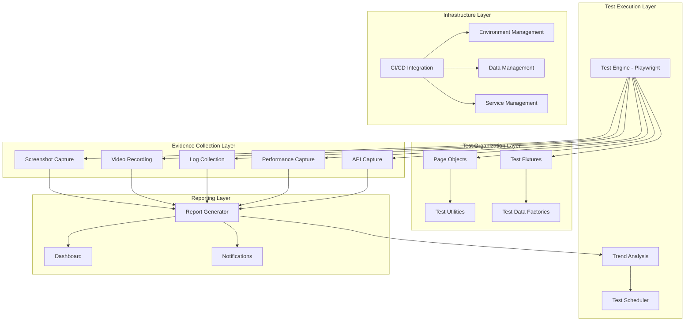

# E2E Testing Improvement Design

## Overview

This design outlines a comprehensive modernization of the E2E testing framework for the Zamaz Debate MCP Services. The solution focuses on creating a robust, maintainable, and scalable testing infrastructure that follows industry best practices while providing excellent developer experience and comprehensive test coverage.

## Architecture

### High-Level Architecture



### Framework Stack

- **Test Framework**: Playwright with TypeScript
- **Test Organization**: Custom page object pattern with fixtures
- **Evidence Collection**: Automated capture with structured storage
- **Reporting**: HTML reports, JSON data, and real-time dashboards
- **CI/CD Integration**: GitHub Actions with parallel execution
- **Performance Testing**: Lighthouse integration with custom metrics

## Components and Interfaces

### 1. Test Framework Core

#### Enhanced Test Base
```typescript
interface TestContext {
  page: Page;
  apiClient: ApiClient;
  wsClient: WebSocketClient;
  testData: TestDataManager;
  evidence: EvidenceCollector;
  performance: PerformanceMonitor;
  accessibility: AccessibilityChecker;
}

interface TestConfiguration {
  browser: 'chromium' | 'firefox' | 'webkit';
  viewport: ViewportSize;
  environment: 'local' | 'staging' | 'production';
  parallel: boolean;
  retries: number;
  timeout: number;
}
```

#### Page Object Pattern
```typescript
abstract class BasePage {
  protected page: Page;
  protected evidence: EvidenceCollector;
  
  abstract readonly url: string;
  abstract readonly selectors: Record<string, string>;
  
  async navigate(): Promise<void>;
  async waitForLoad(): Promise<void>;
  async captureEvidence(name: string): Promise<void>;
}

class DebateCreationPage extends BasePage {
  readonly url = '/debates/create';
  readonly selectors = {
    topicInput: '[data-testid="debate-topic"]',
    descriptionInput: '[data-testid="debate-description"]',
    formatSelect: '[data-testid="debate-format"]',
    createButton: '[data-testid="create-debate-button"]'
  };
  
  async createDebate(data: DebateCreationData): Promise<string>;
  async validateForm(): Promise<ValidationResult>;
}
```

### 2. Evidence Collection System

#### Evidence Collector Interface
```typescript
interface EvidenceCollector {
  captureScreenshot(name: string, options?: ScreenshotOptions): Promise<string>;
  startVideoRecording(): Promise<void>;
  stopVideoRecording(): Promise<string>;
  captureNetworkLogs(): Promise<NetworkLog[]>;
  captureConsoleMessages(): Promise<ConsoleMessage[]>;
  capturePerformanceMetrics(): Promise<PerformanceMetrics>;
  generateReport(): Promise<EvidenceReport>;
}

interface EvidenceReport {
  testId: string;
  timestamp: string;
  screenshots: string[];
  videos: string[];
  logs: LogEntry[];
  performance: PerformanceData;
  apiCalls: ApiCallLog[];
  errors: ErrorLog[];
}
```

#### Structured Evidence Storage
```
test-evidence/
├── runs/
│   └── {timestamp}-{test-suite}/
│       ├── metadata.json
│       ├── screenshots/
│       │   ├── 001-login-page.png
│       │   ├── 002-debate-creation.png
│       │   └── ...
│       ├── videos/
│       │   ├── full-test-flow.webm
│       │   └── error-scenario.webm
│       ├── logs/
│       │   ├── console.log
│       │   ├── network.har
│       │   ├── api-calls.json
│       │   └── websocket-messages.json
│       ├── performance/
│       │   ├── lighthouse-report.html
│       │   ├── metrics.json
│       │   └── traces/
│       └── reports/
│           ├── test-results.html
│           ├── coverage.json
│           └── accessibility.json
```

### 3. Test Data Management

#### Test Data Factory Pattern
```typescript
interface TestDataFactory<T> {
  create(overrides?: Partial<T>): T;
  createMany(count: number, overrides?: Partial<T>): T[];
  cleanup(data: T): Promise<void>;
}

class DebateDataFactory implements TestDataFactory<DebateData> {
  create(overrides?: Partial<DebateData>): DebateData {
    return {
      id: `test-debate-${uuid()}`,
      topic: 'Test Debate Topic',
      description: 'Test debate description',
      format: 'OXFORD',
      organizationId: 'test-org-001',
      ...overrides
    };
  }
  
  async cleanup(data: DebateData): Promise<void> {
    // Clean up created debate data
  }
}

class TestDataManager {
  private factories: Map<string, TestDataFactory<any>>;
  private createdData: Set<any>;
  
  async createDebate(overrides?: Partial<DebateData>): Promise<DebateData>;
  async createOrganization(overrides?: Partial<OrganizationData>): Promise<OrganizationData>;
  async cleanupAll(): Promise<void>;
}
```

### 4. API Testing Integration

#### API Client Wrapper
```typescript
interface ApiClient {
  get<T>(endpoint: string, options?: RequestOptions): Promise<ApiResponse<T>>;
  post<T>(endpoint: string, data: any, options?: RequestOptions): Promise<ApiResponse<T>>;
  put<T>(endpoint: string, data: any, options?: RequestOptions): Promise<ApiResponse<T>>;
  delete<T>(endpoint: string, options?: RequestOptions): Promise<ApiResponse<T>>;
  
  // Enhanced features
  withAuth(token: string): ApiClient;
  withRetry(attempts: number): ApiClient;
  withTimeout(ms: number): ApiClient;
  captureRequests(): RequestCapture;
}

interface ApiResponse<T> {
  status: number;
  data: T;
  headers: Record<string, string>;
  timing: {
    start: number;
    end: number;
    duration: number;
  };
}
```

### 5. Performance Testing Integration

#### Performance Monitor
```typescript
interface PerformanceMonitor {
  startMeasurement(name: string): void;
  endMeasurement(name: string): PerformanceMeasurement;
  measurePageLoad(page: Page): Promise<PageLoadMetrics>;
  measureApiCall(request: Request): Promise<ApiPerformanceMetrics>;
  generateLighthouseReport(page: Page): Promise<LighthouseReport>;
  validatePerformanceBudget(metrics: PerformanceMetrics): ValidationResult;
}

interface PerformanceBudget {
  pageLoadTime: number; // ms
  firstContentfulPaint: number; // ms
  largestContentfulPaint: number; // ms
  cumulativeLayoutShift: number;
  apiResponseTime: number; // ms
  webSocketLatency: number; // ms
}
```

### 6. Cross-Browser Testing

#### Browser Configuration
```typescript
interface BrowserConfig {
  name: 'chromium' | 'firefox' | 'webkit';
  viewport: ViewportSize;
  userAgent?: string;
  permissions?: string[];
  geolocation?: GeolocationOptions;
  colorScheme?: 'light' | 'dark';
  reducedMotion?: 'reduce' | 'no-preference';
}

interface CrossBrowserTestRunner {
  runOnAllBrowsers(testSuite: TestSuite): Promise<CrossBrowserResults>;
  compareResults(results: CrossBrowserResults): ComparisonReport;
  generateCompatibilityReport(): CompatibilityReport;
}
```

### 7. Accessibility Testing

#### Accessibility Checker
```typescript
interface AccessibilityChecker {
  runAxeCheck(page: Page): Promise<AxeResults>;
  checkColorContrast(page: Page): Promise<ContrastResults>;
  checkKeyboardNavigation(page: Page): Promise<KeyboardResults>;
  checkScreenReaderCompatibility(page: Page): Promise<ScreenReaderResults>;
  generateAccessibilityReport(): Promise<AccessibilityReport>;
}

interface AccessibilityReport {
  violations: AxeViolation[];
  passes: AxePass[];
  incomplete: AxeIncomplete[];
  wcagLevel: 'A' | 'AA' | 'AAA';
  score: number;
  recommendations: string[];
}
```

## Data Models

### Test Execution Models
```typescript
interface TestRun {
  id: string;
  timestamp: string;
  environment: string;
  browser: string;
  testSuite: string;
  status: 'running' | 'passed' | 'failed' | 'skipped';
  duration: number;
  evidence: EvidenceMetadata;
}

interface TestResult {
  testId: string;
  name: string;
  status: 'passed' | 'failed' | 'skipped';
  duration: number;
  error?: TestError;
  steps: TestStep[];
  assertions: AssertionResult[];
  evidence: string[];
}

interface TestStep {
  name: string;
  status: 'passed' | 'failed' | 'skipped';
  duration: number;
  screenshot?: string;
  logs: LogEntry[];
}
```

### Performance Models
```typescript
interface PerformanceMetrics {
  pageLoadTime: number;
  firstContentfulPaint: number;
  largestContentfulPaint: number;
  cumulativeLayoutShift: number;
  timeToInteractive: number;
  totalBlockingTime: number;
  speedIndex: number;
}

interface ApiPerformanceMetrics {
  endpoint: string;
  method: string;
  responseTime: number;
  statusCode: number;
  payloadSize: number;
  timestamp: string;
}
```

## Error Handling

### Retry Strategy
```typescript
interface RetryConfig {
  maxAttempts: number;
  backoffStrategy: 'linear' | 'exponential';
  baseDelay: number;
  maxDelay: number;
  retryableErrors: string[];
}

class RetryHandler {
  async executeWithRetry<T>(
    operation: () => Promise<T>,
    config: RetryConfig
  ): Promise<T> {
    // Implementation with exponential backoff
  }
}
```

### Error Classification
```typescript
enum ErrorType {
  NETWORK_ERROR = 'network',
  TIMEOUT_ERROR = 'timeout',
  ELEMENT_NOT_FOUND = 'element_not_found',
  ASSERTION_FAILED = 'assertion_failed',
  API_ERROR = 'api_error',
  PERFORMANCE_BUDGET_EXCEEDED = 'performance_budget_exceeded'
}

interface TestError {
  type: ErrorType;
  message: string;
  stack: string;
  screenshot?: string;
  context: Record<string, any>;
  retryable: boolean;
}
```

## Testing Strategy

### Test Organization
```
tests/
├── e2e/
│   ├── auth/
│   │   ├── login.spec.ts
│   │   ├── logout.spec.ts
│   │   └── session-management.spec.ts
│   ├── debates/
│   │   ├── creation.spec.ts
│   │   ├── participation.spec.ts
│   │   ├── real-time.spec.ts
│   │   └── completion.spec.ts
│   ├── organization/
│   │   ├── management.spec.ts
│   │   ├── user-roles.spec.ts
│   │   └── settings.spec.ts
│   └── agentic-flows/
│       ├── configuration.spec.ts
│       ├── execution.spec.ts
│       └── analytics.spec.ts
├── api/
│   ├── debates.api.spec.ts
│   ├── organization.api.spec.ts
│   └── auth.api.spec.ts
├── performance/
│   ├── page-load.perf.spec.ts
│   ├── api-response.perf.spec.ts
│   └── websocket.perf.spec.ts
└── accessibility/
    ├── wcag-compliance.a11y.spec.ts
    ├── keyboard-navigation.a11y.spec.ts
    └── screen-reader.a11y.spec.ts
```

### Test Execution Strategy
1. **Smoke Tests**: Critical path validation (5-10 minutes)
2. **Regression Tests**: Full feature validation (30-45 minutes)
3. **Performance Tests**: Load and response time validation (15-20 minutes)
4. **Accessibility Tests**: WCAG compliance validation (10-15 minutes)
5. **Cross-Browser Tests**: Multi-browser compatibility (60-90 minutes)

### Parallel Execution
- Tests grouped by feature area for parallel execution
- Shared test data isolation using unique identifiers
- Resource pooling for browser instances
- Load balancing across available workers

## Implementation Phases

### Phase 1: Foundation (Week 1-2)
- Set up enhanced Playwright configuration
- Implement base page object pattern
- Create test data factories
- Set up evidence collection framework

### Phase 2: Core Test Suite (Week 3-4)
- Migrate existing tests to new framework
- Implement comprehensive auth flow tests
- Create debate lifecycle tests
- Add API integration tests

### Phase 3: Advanced Features (Week 5-6)
- Implement performance testing
- Add accessibility testing
- Create cross-browser test suite
- Set up real-time testing for WebSocket features

### Phase 4: Reporting and CI/CD (Week 7-8)
- Implement comprehensive reporting
- Set up CI/CD integration
- Create monitoring dashboards
- Add notification systems

### Phase 5: Optimization and Documentation (Week 9-10)
- Optimize test execution performance
- Create comprehensive documentation
- Train team on new framework
- Establish maintenance procedures