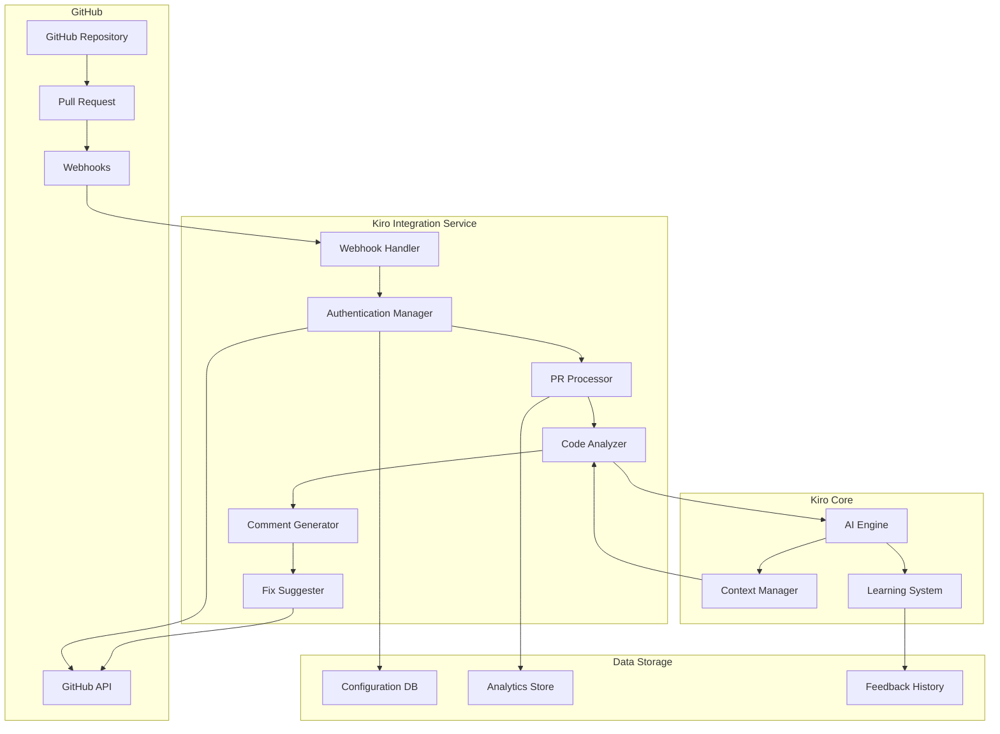

# GitHub Integration Design Document

## Overview

This document outlines the design for integrating Kiro with GitHub, enabling automated code reviews, suggestions, and fixes when pull requests are assigned to Kiro. The integration leverages GitHub's API and webhook system to seamlessly incorporate Kiro's AI capabilities into the development workflow, providing intelligent feedback on code changes directly within the GitHub interface.

The system will be implemented as a GitHub App that can be installed on repositories, with configurable permissions and settings to adapt to different team workflows and requirements.

## Architecture

### High-Level Architecture



### Component Interaction Flow

1. A developer assigns a PR to Kiro on GitHub
2. GitHub sends a webhook event to the Kiro Integration Service
3. The Webhook Handler processes the event and authenticates with GitHub
4. The PR Processor retrieves PR details and code changes
5. The Code Analyzer evaluates the changes using the Kiro AI Engine
6. The Comment Generator creates meaningful feedback
7. The Fix Suggester identifies issues that can be automatically fixed
8. Comments and suggestions are posted back to GitHub via the API
9. Analytics and feedback are stored for future learning

## Components and Interfaces

### 1. GitHub App Configuration

The integration will be implemented as a GitHub App with the following permissions:

```yaml
permissions:
  pull_requests: write    # Comment on PRs, read PR content
  contents: write         # Read repository code, create fix commits
  issues: read           # Read linked issues for context
  metadata: read         # Access repository metadata
  workflows: read        # Understand CI/CD context
```

Installation flow:
1. Repository admin installs the Kiro GitHub App
2. OAuth authorization for user-specific actions
3. Configuration wizard for repository-specific settings
4. Validation of permissions and access

### 2. Webhook Handler

Endpoints:
- `/webhooks/github`: Receives GitHub events
- `/webhooks/status`: Webhook health check

Event types processed:
- `pull_request.assigned`: When Kiro is assigned as reviewer
- `pull_request.review_requested`: When Kiro is requested as reviewer
- `issue_comment.created`: When Kiro is mentioned in comments
- `pull_request.synchronize`: When new commits are pushed to a PR under review

Security measures:
- Webhook secret validation
- Payload signature verification
- Rate limiting
- IP allowlisting

### 3. Authentication Manager

Authentication methods:
- GitHub App installation tokens
- User OAuth tokens for user-context actions
- JWT for service-to-service communication

Token management:
- Secure storage with encryption
- Automatic token rotation
- Permission scoping
- Audit logging

### 4. PR Processor

Responsibilities:
- Retrieve PR metadata and context
- Extract code diffs for analysis
- Identify linked issues and documentation
- Determine review scope and priority
- Queue and manage review workloads

Performance optimizations:
- Incremental processing for large PRs
- Prioritization based on PR size and importance
- Caching of repository structure and context

### 5. Code Analyzer

Analysis capabilities:
- Syntax and semantic code analysis
- Style and convention checking
- Security vulnerability detection
- Performance issue identification
- Documentation quality assessment

Integration points:
- Language-specific linters and analyzers
- Custom rule engines
- Team-specific style guides
- Project documentation

### 6. Comment Generator

Comment types:
- Issue identification
- Explanation and educational content
- Code suggestions
- References to documentation or best practices
- Severity indicators

Comment formatting:
- Markdown-formatted explanations
- Code blocks with syntax highlighting
- Diff suggestions
- Collapsible details for verbose explanations
- Links to relevant resources

### 7. Fix Suggester

Fix capabilities:
- Automated fixes for simple issues
- Suggested code changes for complex issues
- Multi-file fixes when necessary
- Refactoring suggestions

Implementation approach:
- Generate patch files for changes
- Create suggestion blocks in comments
- Provide "Apply suggestion" buttons
- Create fix commits when authorized

### 8. Analytics System

Metrics collected:
- Review response times
- Issues found by category
- Fix acceptance rates
- Developer feedback sentiment
- Common patterns across repositories

Reporting interfaces:
- Dashboard for team leads
- Trend analysis over time
- Repository comparison views
- Developer-specific insights

## Data Models

### Configuration Model

```json
{
  "repository_id": "string",
  "settings": {
    "review_depth": "enum(basic, standard, thorough)",
    "focus_areas": ["security", "performance", "style", "documentation"],
    "auto_fix_enabled": boolean,
    "comment_style": "enum(concise, educational, detailed)",
    "severity_thresholds": {
      "critical": number,
      "major": number,
      "minor": number
    }
  },
  "rules": {
    "custom_rules_enabled": boolean,
    "rule_sets": [
      {
        "name": "string",
        "enabled": boolean,
        "rules": [
          {
            "id": "string",
            "severity": "enum(critical, major, minor, suggestion)",
            "description": "string"
          }
        ]
      }
    ]
  },
  "notifications": {
    "channels": ["slack", "email", "github"],
    "events": ["review_complete", "critical_issue", "fix_applied"]
  }
}
```

### Review Request Model

```json
{
  "id": "string",
  "repository": {
    "id": "string",
    "name": "string",
    "owner": "string"
  },
  "pull_request": {
    "id": number,
    "number": number,
    "title": "string",
    "description": "string",
    "author": "string",
    "base_branch": "string",
    "head_branch": "string",
    "linked_issues": ["string"]
  },
  "review": {
    "status": "enum(pending, in_progress, completed, failed)",
    "requested_at": "datetime",
    "started_at": "datetime",
    "completed_at": "datetime",
    "reviewer": "string"
  }
}
```

### Review Result Model

```json
{
  "review_id": "string",
  "summary": {
    "files_reviewed": number,
    "lines_reviewed": number,
    "issues_found": {
      "critical": number,
      "major": number,
      "minor": number,
      "suggestions": number
    },
    "auto_fixable": number
  },
  "issues": [
    {
      "id": "string",
      "file": "string",
      "line_start": number,
      "line_end": number,
      "code": "string",
      "issue_type": "string",
      "severity": "enum(critical, major, minor, suggestion)",
      "description": "string",
      "suggestion": "string",
      "auto_fixable": boolean,
      "fix_description": "string"
    }
  ],
  "comments": [
    {
      "id": "string",
      "file": "string",
      "line": number,
      "content": "string",
      "created_at": "datetime"
    }
  ]
}
```

### Analytics Model

```json
{
  "repository_id": "string",
  "time_period": {
    "start": "datetime",
    "end": "datetime"
  },
  "reviews": {
    "total": number,
    "average_response_time_seconds": number,
    "average_review_time_seconds": number
  },
  "issues": {
    "total_found": number,
    "by_severity": {
      "critical": number,
      "major": number,
      "minor": number,
      "suggestions": number
    },
    "by_category": {
      "security": number,
      "performance": number,
      "style": number,
      "documentation": number,
      "other": number
    },
    "most_common": [
      {
        "issue_type": "string",
        "count": number,
        "example": "string"
      }
    ]
  },
  "fixes": {
    "suggested": number,
    "applied": number,
    "rejected": number,
    "acceptance_rate": number
  }
}
```

## Error Handling

### GitHub API Errors

- Rate limiting: Implement exponential backoff and request queuing
- Authentication failures: Automatic token refresh and notification
- Permission issues: Clear error messages with remediation steps
- Network failures: Retry mechanism with circuit breaker pattern

### Processing Errors

- Large PR handling: Chunking and incremental processing
- Timeout management: Background processing with status updates
- Resource constraints: Queue prioritization and resource allocation
- Parsing failures: Graceful degradation to partial analysis

### User Feedback Errors

- Comment posting failures: Local caching and retry
- Suggestion application errors: Detailed error reporting
- Configuration validation: Immediate feedback on invalid settings
- Integration failures: Self-diagnostic tools and logs

## Security Considerations

### Data Protection

- Code content: Processed in secure environments with encryption
- Credentials: Encrypted storage with access controls
- User data: Minimal collection with proper retention policies
- Analytics: Anonymization for aggregate reporting

### Access Control

- Repository-level permissions: Granular access based on GitHub roles
- User authentication: OAuth flow with limited scopes
- Admin functions: Role-based access control
- API security: Token-based authentication with short lifetimes

### Compliance

- Audit logging: Comprehensive activity tracking
- Data residency: Configurable processing locations
- Retention policies: Configurable data retention periods
- Transparency: Clear documentation of data usage

## Testing Strategy

### Unit Testing

- Component isolation: Mock external dependencies
- Behavior verification: Test expected outputs for known inputs
- Error handling: Verify graceful handling of failure cases
- Security validation: Test permission boundaries

### Integration Testing

- API interaction: Test GitHub API integration points
- Webhook processing: Verify correct handling of GitHub events
- Authentication flow: Test token acquisition and usage
- Cross-component communication: Verify data flow between components

### End-to-End Testing

- Complete workflow: Test PR assignment through to comment posting
- Real-world scenarios: Test with various PR sizes and content types
- Performance testing: Verify response times under load
- Security testing: Penetration testing of exposed endpoints

### User Acceptance Testing

- Developer experience: Test usability of PR review flow
- Configuration interface: Verify ease of setup and configuration
- Feedback mechanisms: Test user feedback collection
- Analytics dashboard: Verify usefulness of insights

## Performance Considerations

### Scalability

- Horizontal scaling: Stateless components for easy replication
- Queue-based processing: Decouple event reception from processing
- Caching strategy: Repository structure and context caching
- Resource allocation: Dynamic resource allocation based on workload

### Optimization

- Large repository handling: Incremental analysis and caching
- PR size management: Chunking of large PRs for parallel processing
- Response time targets: < 5 minutes for small PRs, < 15 minutes for medium PRs
- Background processing: Non-blocking operations with status updates

### Monitoring

- System metrics: CPU, memory, and network utilization
- Application metrics: Queue depths, processing times, error rates
- User experience metrics: End-to-end response times
- GitHub API usage: Rate limit monitoring and optimization

## Deployment Strategy

### Infrastructure

- Containerized deployment: Docker containers for all components
- Kubernetes orchestration: Scalable and resilient deployment
- Cloud-agnostic design: Deployable to any major cloud provider
- On-premises option: Self-hosted deployment capability

### CI/CD Pipeline

- Automated testing: Unit and integration tests in CI
- Deployment automation: Continuous deployment to staging
- Canary releases: Gradual rollout of new versions
- Rollback capability: Immediate rollback on detection of issues

### Configuration Management

- Environment-specific configuration: Dev, staging, production environments
- Secret management: Secure handling of credentials and tokens
- Feature flags: Controlled rollout of new capabilities
- Dynamic configuration: Runtime configuration updates without restart

## Integration Points

### GitHub Integration

- GitHub API v3/v4: REST and GraphQL API usage
- Webhook events: Event-driven architecture
- GitHub Apps: Installation-based authentication
- GitHub Actions: Optional integration with CI/CD workflows

### Kiro Core Integration

- AI Engine API: Code analysis and suggestion generation
- Context Manager: Repository and project context handling
- Learning System: Feedback incorporation and improvement
- Configuration System: User and repository preferences

### External Integrations

- Notification systems: Slack, email, and custom webhooks
- Issue trackers: JIRA, Linear, and other project management tools
- Documentation systems: Integration with knowledge bases
- Team collaboration tools: Microsoft Teams, Discord integration

## User Experience Design

### Developer Flow

1. Create a pull request in GitHub
2. Assign Kiro as a reviewer or mention Kiro in a comment
3. Receive notification when review is complete
4. Review comments and suggestions in GitHub interface
5. Apply suggested fixes with a single click when appropriate
6. Provide feedback on Kiro's suggestions for continuous improvement

### Administrator Flow

1. Install Kiro GitHub App on repositories
2. Configure review depth and focus areas
3. Set up custom rules and style guides
4. Monitor analytics dashboard for insights
5. Adjust configuration based on team feedback and metrics

### Feedback Loop

1. Developers can react to Kiro's comments (helpful/not helpful)
2. Explicit feedback can be provided via comments
3. Acceptance or rejection of suggestions is tracked
4. Periodic surveys for qualitative feedback
5. Continuous improvement based on usage patterns and feedback