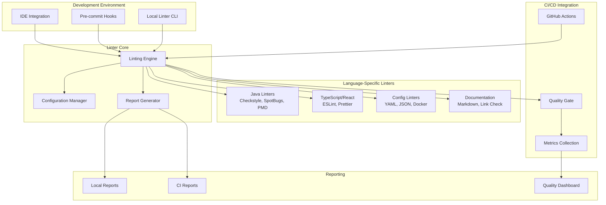

# Design Document

## Overview

The Project Linter system provides comprehensive code quality enforcement across the entire Zamaz Debate MCP Services ecosystem. It integrates multiple linting tools and standards to ensure consistent code quality, security, and maintainability across Java microservices, React frontend, configuration files, and documentation.

The system builds upon existing code quality infrastructure (Checkstyle, SpotBugs, JaCoCo) and extends it with additional tools for comprehensive coverage. It provides both local development feedback and CI/CD integration with detailed reporting and metrics.

## Architecture

### High-Level Architecture



### Service Integration

The linter integrates with existing project structure:

- **Maven Multi-module**: Leverages existing parent POM and module structure
- **Docker Compose**: Adds linting service for CI/CD environments
- **Makefile**: Extends existing commands with linting targets
- **GitHub Actions**: Integrates with existing CI/CD workflows

## Components and Interfaces

### 1. Linting Engine Core

**Purpose**: Central orchestrator for all linting operations

**Key Classes**:
- `LintingEngine`: Main orchestrator
- `LintingContext`: Execution context and configuration
- `LintingResult`: Aggregated results from all linters

**Interfaces**:
```java
public interface LintingEngine {
    LintingResult lintProject(LintingContext context);
    LintingResult lintService(String serviceName, LintingContext context);
    LintingResult lintFiles(List<Path> files, LintingContext context);
}

public interface LintingResult {
    boolean hasErrors();
    boolean hasWarnings();
    List<LintingIssue> getIssues();
    Map<String, Object> getMetrics();
    String generateReport(ReportFormat format);
}
```

### 2. Configuration Manager

**Purpose**: Manages linting configurations across different project types

**Configuration Hierarchy**:
```
.linting/
├── global.yml              # Global rules for all projects
├── java/
│   ├── checkstyle.xml      # Enhanced Checkstyle rules
│   ├── spotbugs-exclude.xml # SpotBugs exclusions
│   └── pmd.xml             # PMD rules
├── frontend/
│   ├── .eslintrc.js        # ESLint configuration
│   ├── .prettierrc         # Prettier configuration
│   └── tsconfig.lint.json  # TypeScript linting config
├── config/
│   ├── yaml-lint.yml       # YAML linting rules
│   ├── json-schema.json    # JSON validation schemas
│   └── dockerfile-rules.yml # Dockerfile linting
└── docs/
    ├── markdownlint.json    # Markdown linting rules
    └── link-check.json      # Link validation config
```

### 3. Language-Specific Linters

#### Java Linting Module
- **Checkstyle**: Code style and formatting
- **SpotBugs**: Bug pattern detection
- **PMD**: Code quality and best practices
- **ArchUnit**: Architecture compliance testing
- **OWASP Dependency Check**: Security vulnerability scanning

#### Frontend Linting Module
- **ESLint**: JavaScript/TypeScript code quality
- **Prettier**: Code formatting
- **Stylelint**: CSS/SCSS linting
- **TypeScript Compiler**: Type checking
- **React-specific rules**: React best practices

#### Configuration Linting Module
- **YAML Lint**: YAML syntax and formatting
- **JSON Schema Validation**: JSON structure validation
- **Dockerfile Linting**: Docker best practices
- **Kubernetes Manifest Validation**: K8s resource validation

#### Documentation Linting Module
- **Markdownlint**: Markdown formatting and style
- **Link Checker**: Broken link detection
- **Spell Checker**: Documentation spelling
- **API Documentation Validation**: OpenAPI spec validation

### 4. IDE Integration

**VS Code Extension Configuration**:
```json
{
  "recommendations": [
    "ms-vscode.vscode-java-pack",
    "esbenp.prettier-vscode",
    "dbaeumer.vscode-eslint",
    "davidanson.vscode-markdownlint"
  ],
  "settings": {
    "java.checkstyle.configuration": ".linting/java/checkstyle.xml",
    "eslint.workingDirectories": ["debate-ui"],
    "prettier.configPath": ".linting/frontend/.prettierrc",
    "markdownlint.config": ".linting/docs/markdownlint.json"
  }
}
```

### 5. CI/CD Integration

**GitHub Actions Workflow**:
```yaml
name: Code Quality
on: [push, pull_request]

jobs:
  lint:
    runs-on: ubuntu-latest
    steps:
      - uses: actions/checkout@v4
      - name: Setup Linting Environment
        run: make setup-linting
      - name: Run Java Linting
        run: make lint-java
      - name: Run Frontend Linting
        run: make lint-frontend
      - name: Run Config Linting
        run: make lint-config
      - name: Run Documentation Linting
        run: make lint-docs
      - name: Generate Quality Report
        run: make lint-report
      - name: Upload Results
        uses: actions/upload-artifact@v4
        with:
          name: linting-results
          path: .linting/reports/
```

## Data Models

### Linting Issue Model
```java
public class LintingIssue {
    private String id;
    private LintingSeverity severity;
    private String message;
    private String file;
    private int line;
    private int column;
    private String rule;
    private String linter;
    private boolean autoFixable;
    private String suggestion;
    private Map<String, Object> metadata;
}

public enum LintingSeverity {
    ERROR, WARNING, INFO, SUGGESTION
}
```

### Configuration Model
```java
public class LintingConfiguration {
    private Map<String, LinterConfig> linters;
    private List<String> excludePatterns;
    private Map<String, Object> globalSettings;
    private QualityThresholds thresholds;
}

public class QualityThresholds {
    private int maxErrors = 0;
    private int maxWarnings = 10;
    private double minCoverage = 0.80;
    private int maxComplexity = 10;
}
```

### Report Model
```java
public class LintingReport {
    private String projectName;
    private LocalDateTime timestamp;
    private LintingSummary summary;
    private List<LintingIssue> issues;
    private Map<String, ServiceReport> serviceReports;
    private QualityMetrics metrics;
}

public class QualityMetrics {
    private int totalFiles;
    private int linesOfCode;
    private double codeQualityScore;
    private Map<String, Integer> issuesByType;
    private Map<String, Double> coverageByModule;
}
```

## Error Handling

### Error Categories
1. **Configuration Errors**: Invalid linting configurations
2. **Tool Execution Errors**: Linter tool failures
3. **File Access Errors**: Permission or file system issues
4. **Network Errors**: Remote resource access failures

### Error Handling Strategy
```java
public class LintingErrorHandler {
    public LintingResult handleError(LintingException e, LintingContext context) {
        switch (e.getCategory()) {
            case CONFIGURATION_ERROR:
                return createConfigurationErrorResult(e);
            case TOOL_EXECUTION_ERROR:
                return retryWithFallback(e, context);
            case FILE_ACCESS_ERROR:
                return skipFileAndContinue(e, context);
            default:
                return createFailureResult(e);
        }
    }
}
```

### Graceful Degradation
- Continue linting other files if one file fails
- Use fallback configurations if primary config is invalid
- Provide partial results when some linters fail
- Cache successful results to avoid re-processing

## Testing Strategy

### Unit Testing
- Test each linter module independently
- Mock file system interactions
- Test configuration parsing and validation
- Test error handling scenarios

### Integration Testing
- Test linter combinations on sample projects
- Test CI/CD integration with test repositories
- Test IDE integration with sample workspaces
- Test performance with large codebases

### End-to-End Testing
- Test complete linting workflow on real projects
- Test quality gate enforcement in CI/CD
- Test developer workflow with pre-commit hooks
- Test reporting and metrics collection

### Performance Testing
- Benchmark linting speed on large codebases
- Test parallel execution efficiency
- Test memory usage with multiple linters
- Test incremental linting performance

## Implementation Phases

### Phase 1: Core Infrastructure
- Implement linting engine core
- Set up configuration management
- Create basic Java linting integration
- Add Makefile targets

### Phase 2: Multi-Language Support
- Add frontend linting (ESLint, Prettier)
- Add configuration file linting
- Add documentation linting
- Implement parallel execution

### Phase 3: IDE and Developer Experience
- Create VS Code workspace configuration
- Implement pre-commit hooks
- Add auto-fix capabilities
- Create developer documentation

### Phase 4: CI/CD Integration
- Implement GitHub Actions integration
- Add quality gate enforcement
- Create reporting dashboard
- Add metrics collection

### Phase 5: Advanced Features
- Add custom rule development
- Implement incremental linting
- Add performance optimizations
- Create quality trend analysis