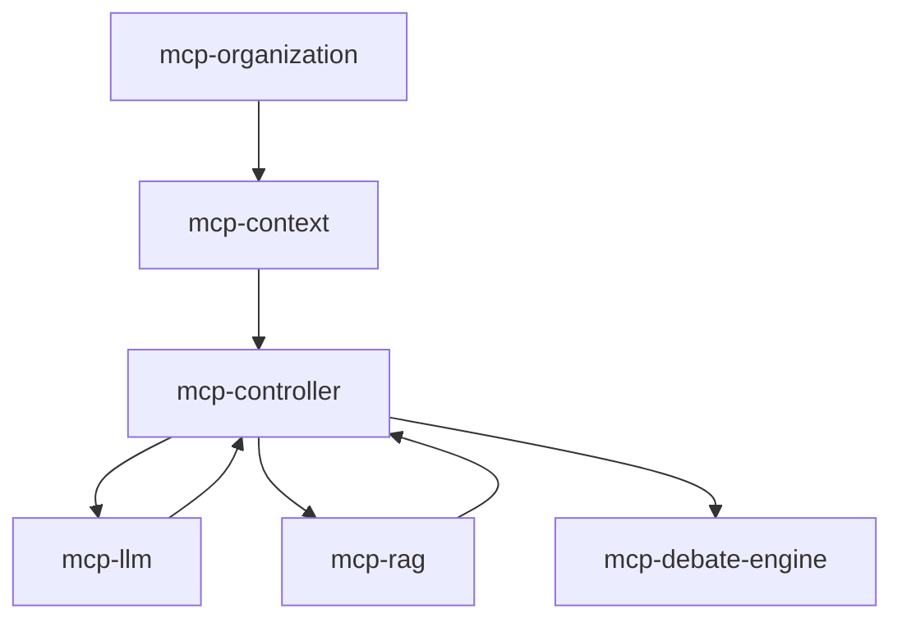

# Hexagonal Architecture Migration Plan

**Date**: 2025-07-17  
**Objective**: Migrate 5 remaining services to hexagonal architecture  
**Target Compliance**: 100% (7 out of 7 services)

## Migration Strategy Analysis

### Option 1: Big Bang Migration
**Approach**: Convert all services simultaneously  
**Timeline**: 2-3 weeks  
**Risk**: ⚠️ HIGH  
**Pros**:
- Fastest overall completion
- Consistent architecture immediately
- Single testing phase

**Cons**:
- High risk of breaking existing functionality
- Difficult to rollback
- Requires large team effort
- No learning curve benefit

**Verdict**: ❌ Too risky for production system

### Option 2: Sequential Service Migration
**Approach**: Migrate one service at a time in priority order  
**Timeline**: 4-6 weeks  
**Risk**: ✅ LOW  
**Pros**:
- Learn from each migration
- Isolated risk per service
- Can maintain system stability
- Allows for incremental improvements

**Cons**:
- Takes longer
- Temporary architectural inconsistency

**Verdict**: ✅ Good balance of risk and reward

### Option 3: Parallel Track Development
**Approach**: Build new hexagonal versions alongside existing  
**Timeline**: 6-8 weeks  
**Risk**: ⚠️ MEDIUM  
**Pros**:
- Zero downtime
- Can switch when ready
- Full testing before switch

**Cons**:
- Resource intensive
- Code duplication
- Complex deployment strategy

**Verdict**: ❌ Too resource intensive

### Option 4: Hybrid Strangler Fig Pattern
**Approach**: Gradually replace components within each service  
**Timeline**: 8-10 weeks  
**Risk**: ✅ VERY LOW  
**Pros**:
- Minimal disruption
- Continuous delivery
- Can pause/resume anytime

**Cons**:
- Longest timeline
- Complex refactoring

**Verdict**: ⚠️ Too slow for current needs

## Selected Strategy: Enhanced Sequential Migration

**Chosen Approach**: Sequential service migration with accelerated timeline using:
1. Automated code generation for boilerplate
2. Parallel domain modeling while current service operates
3. Feature flag switching for gradual rollout
4. Comprehensive test suite before switching

## Service Dependencies Analysis



## Migration Priority Order

### 1. mcp-context (Week 1)
**Why First**: Core multi-tenant context management used by all services
**Complexity**: MEDIUM
**Key Challenges**:
- Redis caching integration
- Multi-tenant data isolation
- Message versioning

**Domain Concepts**:
- Context (Aggregate Root)
- Message (Entity)
- ContextWindow (Value Object)
- OrganizationId (Value Object)
- SharedContext (Entity)

### 2. mcp-llm (Week 2)
**Why Second**: Clear boundaries, provider pattern fits hexagonal well
**Complexity**: LOW
**Key Challenges**:
- Multiple provider adapters
- Caching strategy
- Rate limiting

**Domain Concepts**:
- LLMRequest (Value Object)
- LLMResponse (Value Object)
- Provider (Aggregate Root)
- Model (Entity)
- TokenUsage (Value Object)

### 3. mcp-controller (Weeks 3-4)
**Why Third**: Central orchestrator, most complex
**Complexity**: HIGH
**Key Challenges**:
- WebSocket management
- State machine integration
- Multiple client dependencies

**Domain Concepts**:
- Debate (Aggregate Root)
- Participant (Entity)
- Turn (Entity)
- DebateState (Value Object)
- Vote (Value Object)

### 4. mcp-rag (Week 5)
**Why Fourth**: Clear retrieval responsibilities
**Complexity**: MEDIUM
**Key Challenges**:
- Vector database integration
- Document processing pipeline

**Domain Concepts**:
- Document (Aggregate Root)
- Chunk (Entity)
- Embedding (Value Object)
- SearchQuery (Value Object)
- SearchResult (Value Object)

### 5. mcp-debate-engine (Week 6)
**Why Last**: Minimal existing code, can build correctly from start
**Complexity**: LOW
**Key Challenges**:
- Greenfield implementation
- Integration with other services

**Domain Concepts**:
- DebateEngine (Aggregate Root)
- DebateRules (Value Object)
- ScoringStrategy (Entity)

## Implementation Steps Per Service

### Phase 1: Domain Analysis (1 day)
1. Identify core business concepts
2. Define aggregates, entities, value objects
3. Document business rules and invariants
4. Create domain model diagrams

### Phase 2: Domain Implementation (2 days)
1. Create domain models extending mcp-common base classes
2. Implement business logic in domain layer
3. Define domain events
4. Write domain unit tests

### Phase 3: Application Layer (2 days)
1. Define use case interfaces (inbound ports)
2. Define repository interfaces (outbound ports)
3. Implement use cases with orchestration logic
4. Create commands and queries (CQRS)
5. Write use case tests with mocks

### Phase 4: Adapter Implementation (2 days)
1. Create web adapters (controllers)
2. Implement persistence adapters
3. Create external service adapters
4. Map between layers (DTOs ↔ Domain)
5. Write integration tests

### Phase 5: Migration & Testing (1 day)
1. Run parallel with existing service
2. Migrate data if needed
3. Switch traffic using feature flags
4. Monitor and validate
5. Remove old implementation

## Validation Criteria

### Per Service Checklist:
- [ ] Zero framework dependencies in domain layer
- [ ] All business logic in domain or domain services
- [ ] Use cases orchestrate, don't implement business logic
- [ ] Adapters only handle infrastructure concerns
- [ ] Comprehensive test coverage per layer
- [ ] Documentation updated
- [ ] Performance benchmarks pass
- [ ] No regression in functionality

### Architecture Validation:
```bash
# Automated validation script
- Check for Spring annotations in domain layer
- Verify dependency directions
- Ensure interface segregation
- Validate test coverage > 80%
```

## Risk Mitigation

1. **Feature Flags**: Use for gradual rollout
2. **Parallel Running**: Keep old implementation until validated
3. **Automated Testing**: Comprehensive test suite before switch
4. **Rollback Plan**: Quick switch back to old implementation
5. **Monitoring**: Enhanced metrics during migration

## Success Metrics

1. **Code Quality**: Sonar metrics improve
2. **Test Coverage**: >80% per layer
3. **Performance**: No degradation vs baseline
4. **Maintainability**: Reduced coupling metrics
5. **Team Velocity**: Faster feature development post-migration

## Tooling & Automation

### Code Generation Templates:
1. Domain entity template
2. Use case template
3. Repository adapter template
4. Controller adapter template
5. Test templates per layer

### Migration Scripts:
1. Package restructuring script
2. Import organization script
3. Test generation script
4. Documentation generator

## Timeline Summary

| Week | Service | Status |
|------|---------|---------|
| 1 | mcp-context | Domain & Application |
| 2 | mcp-llm | Full migration |
| 3-4 | mcp-controller | Full migration |
| 5 | mcp-rag | Full migration |
| 6 | mcp-debate-engine | Full implementation |
| 7 | Integration testing | Final validation |

**Total Timeline**: 7 weeks to 100% compliance

## Next Steps

1. Begin with mcp-context domain analysis
2. Set up automated validation tools
3. Create code generation templates
4. Establish monitoring dashboards
5. Start Week 1 implementation