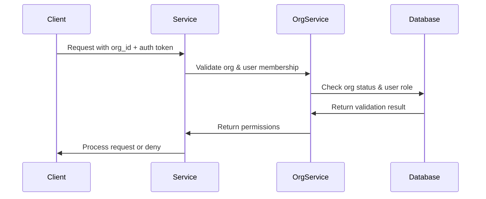
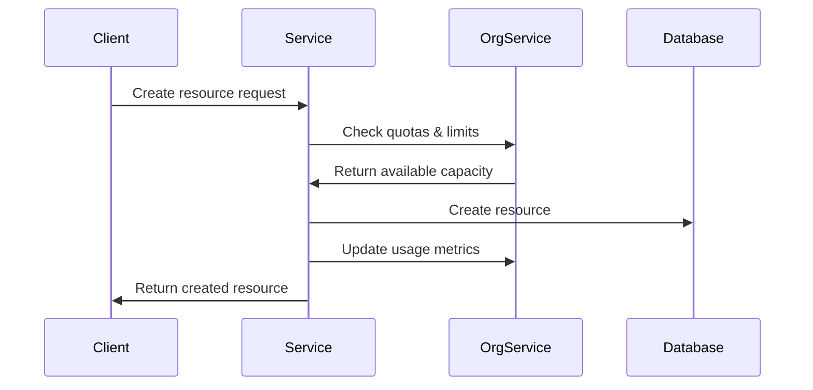
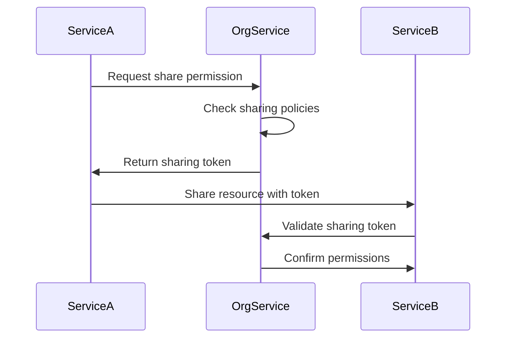

# MCP Services Integration with Organization Service

## Overview

The Organization MCP Service acts as the central authority for multi-tenancy and access control across all other MCP services in the debate system. This document details how each service integrates with the Organization service to ensure proper data isolation, access control, and organizational context.

## Architecture Principles

1. **Organization-First Design**: Every operation across all services must be scoped to an organization
2. **Service Autonomy**: Services maintain their own data but validate organization context
3. **Cascading Permissions**: Organization-level permissions flow down to all services
4. **Audit Trail**: All inter-service calls include organization context for auditing

## Service Integration Patterns

### 1. MCP Context Service Integration

The Context Service manages conversation contexts and must ensure contexts are isolated by organization.

```python
# Integration Points:

1. Context Creation:
   - Validates organization_id with Organization Service
   - Stores organization_id with each context
   - Enforces organization-based quotas

2. Context Retrieval:
   - Filters contexts by organization_id
   - Validates requesting user belongs to organization
   - Applies organization-specific retention policies

3. Context Sharing:
   - Checks organization settings for sharing permissions
   - Validates cross-organization sharing rules
   - Maintains audit log of shared contexts

# Example Integration Flow:
context_service.create_context({
    "organization_id": "org-123",  # Validated against Organization Service
    "user_id": "user-456",
    "context_data": {...}
})
```

**Key Integration Features:**
- Organization-based context isolation
- Quota enforcement per organization
- Cross-organization context sharing (if enabled)
- Organization-specific retention policies

### 2. MCP LLM Service Integration

The LLM Service manages model access and usage, with organization-specific configurations and quotas.

```python
# Integration Points:

1. Model Access Control:
   - Organization Service defines which models are available
   - Per-organization rate limits and quotas
   - Custom model configurations per organization

2. Usage Tracking:
   - Reports token usage back to Organization Service
   - Enforces organization-specific spending limits
   - Maintains usage history per organization

3. Model Configuration:
   - Organization-specific system prompts
   - Custom temperature and parameter settings
   - Model preference hierarchies

# Example Integration:
llm_service.generate({
    "organization_id": "org-123",
    "model": "gpt-4",  # Checked against org's allowed models
    "prompt": "...",
    "org_config": {  # Fetched from Organization Service
        "max_tokens": 4000,
        "temperature": 0.7,
        "rate_limit": "100/hour"
    }
})
```

**Key Integration Features:**
- Model whitelist/blacklist per organization
- Usage-based billing integration
- Organization-specific model configurations
- Hierarchical quota management

### 3. MCP Debate Service Integration

The Debate Service orchestrates debates and heavily relies on organization context for all operations.

```python
# Integration Points:

1. Debate Creation:
   - Validates organization exists and is active
   - Applies organization-specific debate rules
   - Enforces participant limits per organization

2. Participant Management:
   - Validates participants belong to organization
   - Applies organization role-based permissions
   - Manages guest participant policies

3. Debate History:
   - Stores debates under organization umbrella
   - Applies organization retention policies
   - Enables organization-wide analytics

# Example Integration:
debate_service.create_debate({
    "organization_id": "org-123",
    "created_by": "user-456",  # Validated as org member
    "rules": {  # Merged with org defaults
        "max_participants": org_config.max_participants,
        "time_limits": org_config.default_time_limits
    }
})
```

**Key Integration Features:**
- Organization-based debate templates
- Hierarchical permission system
- Organization-wide debate analytics
- Guest participant policies

### 4. MCP RAG Service Integration

The RAG Service manages document collections and knowledge bases scoped to organizations.

```python
# Integration Points:

1. Document Management:
   - Documents stored under organization namespace
   - Organization-based access control
   - Shared knowledge base management

2. Embedding Quotas:
   - Tracks embedding generation per organization
   - Enforces storage limits
   - Manages compute resource allocation

3. Search and Retrieval:
   - Scopes searches to organization documents
   - Applies organization-specific relevance tuning
   - Manages cross-organization document sharing

# Example Integration:
rag_service.add_document({
    "organization_id": "org-123",
    "document": {...},
    "permissions": {  # From Organization Service
        "share_with_sub_orgs": true,
        "public_access": false
    }
})
```

**Key Integration Features:**
- Organization-based document isolation
- Hierarchical knowledge base access
- Compute and storage quota management
- Cross-organization knowledge sharing

### 5. MCP Template Service Integration

The Template Service provides debate templates with organization-specific customizations.

```python
# Integration Points:

1. Template Management:
   - Organization-specific template libraries
   - Template inheritance from parent organizations
   - Access control for template creation/editing

2. Template Usage:
   - Tracks template usage per organization
   - Applies organization branding/customization
   - Manages template versioning

3. Template Sharing:
   - Public template marketplace
   - Organization-to-organization sharing
   - Template approval workflows

# Example Integration:
template_service.create_template({
    "organization_id": "org-123",
    "template": {
        "name": "Formal Debate",
        "rules": {...}
    },
    "visibility": "organization",  # org-only, public, shared
    "requires_approval": org_config.template_approval_required
})
```

**Key Integration Features:**
- Hierarchical template inheritance
- Organization branding in templates
- Template marketplace integration
- Usage analytics and popularity tracking

## Cross-Service Communication Patterns

### 1. Authentication & Authorization Flow



### 2. Resource Creation Flow



### 3. Cross-Organization Sharing Flow



## Implementation Guidelines

### 1. Service Registration

Each service must register with the Organization Service on startup:

```python
async def register_service():
    await org_service.register({
        "service_name": "mcp-debate",
        "version": "1.0.0",
        "capabilities": ["debate_management", "turn_orchestration"],
        "endpoints": {
            "health": "/health",
            "metrics": "/metrics"
        }
    })
```

### 2. Organization Context Propagation

Every service call must include organization context:

```python
class OrganizationContext:
    organization_id: str
    user_id: str
    roles: List[str]
    permissions: Dict[str, bool]
    quotas: Dict[str, int]
```

### 3. Error Handling

Services must handle organization-related errors gracefully:

```python
class OrganizationError(Exception):
    pass

class OrganizationNotFoundError(OrganizationError):
    pass

class OrganizationQuotaExceededError(OrganizationError):
    pass

class OrganizationPermissionDeniedError(OrganizationError):
    pass
```

### 4. Metrics and Monitoring

Each service reports organization-scoped metrics:

```python
# Metrics to track per organization:
- Request count
- Error rate
- Resource usage
- Active users
- Feature utilization
```

## Security Considerations

1. **Organization ID Validation**: Never trust client-provided organization IDs
2. **Token Scoping**: All auth tokens must be scoped to organizations
3. **Data Isolation**: Implement database-level isolation where possible
4. **Audit Logging**: Log all cross-organization operations
5. **Rate Limiting**: Implement per-organization rate limits

## Migration Strategy

For services not yet integrated with the Organization Service:

1. **Phase 1**: Add organization_id field to all entities
2. **Phase 2**: Implement organization validation on all endpoints
3. **Phase 3**: Migrate existing data to default organization
4. **Phase 4**: Enable full organization-based access control
5. **Phase 5**: Implement cross-organization features

## Best Practices

1. **Always Validate**: Check organization status before any operation
2. **Cache Wisely**: Cache organization data with appropriate TTLs
3. **Fail Securely**: Default to denying access on any validation failure
4. **Monitor Usage**: Track per-organization metrics for capacity planning
5. **Document Limits**: Clearly document all organization-based limits

## Configuration Example

Each service should support organization-aware configuration:

```yaml
# service-config.yml
organization_integration:
  enabled: true
  validation_mode: strict  # strict, permissive, bypass
  cache_ttl: 300  # seconds
  fallback_org_id: "default-org"
  require_org_header: true
  
quotas:
  default:
    requests_per_hour: 1000
    storage_gb: 10
    concurrent_operations: 50
  
  premium:
    requests_per_hour: 10000
    storage_gb: 100
    concurrent_operations: 500
```

## Testing Strategy

1. **Unit Tests**: Mock Organization Service responses
2. **Integration Tests**: Test actual service communication
3. **Load Tests**: Verify per-organization isolation under load
4. **Security Tests**: Attempt cross-organization access
5. **Quota Tests**: Verify limit enforcement

## Monitoring and Alerts

Key metrics to monitor:

1. Organization validation failures
2. Quota exceeded events
3. Cross-organization access attempts
4. Service registration failures
5. Cache hit rates for organization data

## Conclusion

The Organization MCP Service serves as the backbone for multi-tenancy across the entire debate system. Proper integration ensures:

- Data isolation and security
- Flexible quota and limit management
- Centralized access control
- Comprehensive audit trails
- Scalable multi-tenant architecture

Each service must treat organization context as a first-class citizen in all operations to maintain system integrity and security.