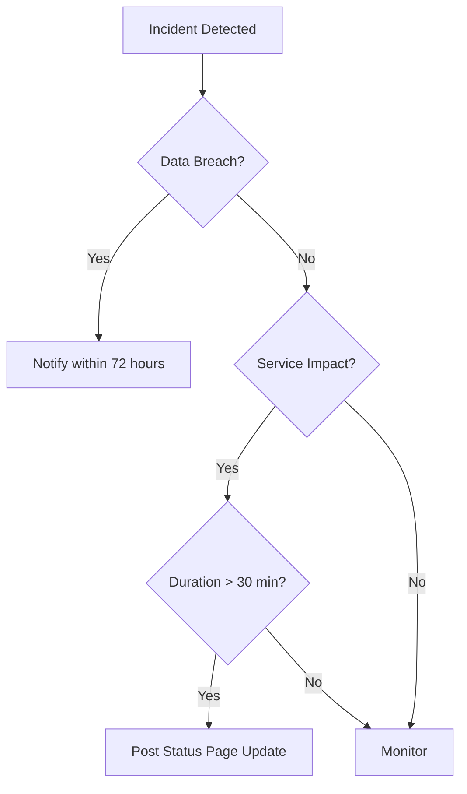

# Security Incident Response Procedures

**Project**: zamaz-debate-mcp  
**Document Type**: Incident Response Plan  
**Classification**: CONFIDENTIAL  
**Version**: 1.0  
**Last Updated**: 2025-07-16  
**Next Review**: Quarterly

---

## 📋 Table of Contents

1. [Overview](#overview)
2. [Incident Response Team](#incident-response-team)
3. [Incident Classification](#incident-classification)
4. [Response Procedures](#response-procedures)
5. [Communication Protocols](#communication-protocols)
6. [Evidence Collection](#evidence-collection)
7. [Containment Strategies](#containment-strategies)
8. [Eradication & Recovery](#eradication--recovery)
9. [Post-Incident Activities](#post-incident-activities)
10. [Appendices](#appendices)

---

## 🎯 Overview

### Purpose
This document provides standardized procedures for responding to security incidents in the zamaz-debate-mcp system. It ensures consistent, effective, and legally compliant incident response.

### Scope
- All security incidents affecting zamaz-debate-mcp infrastructure
- Data breaches, system compromises, and service disruptions
- Internal and external threat actors
- Cloud and on-premise infrastructure

### Objectives
1. **Minimize Impact**: Reduce damage and service disruption
2. **Preserve Evidence**: Maintain forensic integrity
3. **Rapid Recovery**: Restore normal operations quickly
4. **Learn & Improve**: Prevent future incidents
5. **Legal Compliance**: Meet regulatory requirements

---

## 👥 Incident Response Team

### Core Team Structure

| Role | Primary Responsibilities | Contact |
|------|-------------------------|---------|
| **Incident Commander** | Overall incident coordination | ic@yourdomain.com |
| **Security Lead** | Technical response and analysis | security-lead@yourdomain.com |
| **Engineering Lead** | System recovery and patches | eng-lead@yourdomain.com |
| **Legal Counsel** | Legal and compliance guidance | legal@yourdomain.com |
| **Communications Lead** | Internal/external communications | comms@yourdomain.com |
| **HR Representative** | Employee-related incidents | hr-security@yourdomain.com |

### Extended Team

| Role | When Engaged | Responsibilities |
|------|--------------|------------------|
| **Executive Sponsor** | Severity 1 incidents | Strategic decisions, resources |
| **Customer Success** | Customer impact | Customer communications |
| **Finance** | Financial impact | Cost tracking, insurance |
| **External Forensics** | Complex incidents | Advanced investigation |
| **Law Enforcement** | Criminal activity | Legal investigation |

### On-Call Rotation
```bash
# Current on-call schedule
Primary: Check PagerDuty or call +1-XXX-XXX-XXXX
Secondary: +1-XXX-XXX-XXXX
Manager: +1-XXX-XXX-XXXX

# Escalation times
L1 to L2: 15 minutes
L2 to Manager: 30 minutes
Manager to Executive: 1 hour
```

---

## 🔍 Incident Classification

### Severity Levels

| Severity | Definition | Response Time | Team Activation |
|----------|------------|---------------|-----------------|
| **SEV-1** | Critical business impact, data breach, system-wide outage | < 15 min | All hands |
| **SEV-2** | Major functionality impaired, potential data exposure | < 30 min | Core team |
| **SEV-3** | Limited impact, single service affected | < 2 hours | On-call + Lead |
| **SEV-4** | Minor issue, no immediate impact | < 4 hours | On-call only |

### Incident Types

#### 1. Data Breach
- Unauthorized data access or exfiltration
- PII/PHI/PCI exposure
- Intellectual property theft
- **Initial Severity**: SEV-1

#### 2. System Compromise
- Malware infection
- Unauthorized system access
- Backdoor installation
- **Initial Severity**: SEV-1 or SEV-2

#### 3. Denial of Service
- DDoS attacks
- Resource exhaustion
- Service unavailability
- **Initial Severity**: SEV-2 or SEV-3

#### 4. Insider Threat
- Malicious insider activity
- Privilege abuse
- Data theft by employee
- **Initial Severity**: SEV-1 or SEV-2

#### 5. Security Vulnerability
- Zero-day discovery
- Critical patch required
- Exploit in the wild
- **Initial Severity**: Based on CVSS score

---

## 📋 Response Procedures

### Phase 1: Detection & Initial Response (0-15 minutes)

#### Step 1: Incident Identification
```bash
# Automated detection sources
- Security monitoring alerts
- SIEM correlation events
- Anomaly detection systems
- User reports
- Third-party notifications

# Verification checklist
□ Confirm incident is real (not false positive)
□ Identify affected systems/data
□ Determine incident type
□ Assign initial severity
□ Create incident ticket
```

#### Step 2: Initial Notification
```bash
# Notify incident commander
./scripts/notify-incident-commander.sh \
  --severity $SEVERITY \
  --type "$INCIDENT_TYPE" \
  --summary "$BRIEF_DESCRIPTION"

# Create incident channel
slack-cli create-channel "#incident-$(date +%Y%m%d-%H%M)"

# Send initial alert
curl -X POST $SLACK_WEBHOOK \
  -H "Content-Type: application/json" \
  -d '{
    "text": "🚨 SECURITY INCIDENT DETECTED",
    "blocks": [{
      "type": "section",
      "text": {
        "type": "mrkdwn",
        "text": "*Severity*: '$SEVERITY'\n*Type*: '$INCIDENT_TYPE'\n*Time*: '$(date)'\n*Channel*: #incident-'$(date +%Y%m%d-%H%M)'"
      }
    }]
  }'
```

#### Step 3: Incident Logging
```bash
# Create incident record
curl -X POST "https://api.yourdomain.com/api/v1/security/incidents" \
  -H "Authorization: Bearer $ADMIN_TOKEN" \
  -H "Content-Type: application/json" \
  -d '{
    "incidentId": "'$(uuidgen)'",
    "severity": "'$SEVERITY'",
    "type": "'$INCIDENT_TYPE'",
    "detectionTime": "'$(date -u +%Y-%m-%dT%H:%M:%SZ)'",
    "status": "ACTIVE",
    "affectedSystems": ["'$SYSTEM1'", "'$SYSTEM2'"]
  }'
```

### Phase 2: Assessment & Triage (15-60 minutes)

#### Scope Determination
```bash
# System inventory
./scripts/incident-system-scan.sh \
  --incident-id $INCIDENT_ID \
  --output incident-scope.json

# Data classification
./scripts/data-impact-assessment.sh \
  --systems $AFFECTED_SYSTEMS \
  --time-range "$START_TIME" "$END_TIME"

# User impact analysis
curl -X GET "https://api.yourdomain.com/api/v1/incidents/$INCIDENT_ID/impact" \
  -H "Authorization: Bearer $ADMIN_TOKEN" | jq '{
    affectedUsers: .users.count,
    affectedOrganizations: .organizations,
    dataTypes: .data.types,
    estimatedRecords: .data.recordCount
  }'
```

#### Risk Assessment Matrix
| Factor | Low Risk | Medium Risk | High Risk | Critical Risk |
|--------|----------|-------------|-----------|---------------|
| **Data Sensitivity** | Public | Internal | Confidential | PII/PHI/PCI |
| **System Criticality** | Dev/Test | Staging | Production | Core Infrastructure |
| **Exposure Duration** | <1 hour | 1-24 hours | 1-7 days | >7 days |
| **Threat Actor** | Script kiddie | Opportunistic | Targeted | APT/Nation State |
| **Business Impact** | <$10K | $10K-$100K | $100K-$1M | >$1M |

### Phase 3: Containment (Immediate)

#### Quick Containment Actions
```bash
# 1. Isolate affected systems
kubectl cordon $AFFECTED_NODE
kubectl drain $AFFECTED_NODE --ignore-daemonsets --delete-emptydir-data

# 2. Block malicious IPs
for ip in $(cat malicious-ips.txt); do
  curl -X POST "https://api.yourdomain.com/api/v1/security/block-ip" \
    -H "Authorization: Bearer $ADMIN_TOKEN" \
    -d '{"ip":"'$ip'","duration":"permanent","reason":"Incident '$INCIDENT_ID'"}'
done

# 3. Disable compromised accounts
curl -X POST "https://api.yourdomain.com/api/v1/security/disable-accounts" \
  -H "Authorization: Bearer $ADMIN_TOKEN" \
  -d '{"accounts":["user1","user2"],"reason":"Security incident"}'

# 4. Revoke compromised credentials
./scripts/mass-credential-reset.sh \
  --scope affected-users \
  --incident $INCIDENT_ID
```

#### System Isolation
```bash
# Network isolation
iptables -I INPUT -s $COMPROMISED_IP -j DROP
iptables -I OUTPUT -d $COMPROMISED_IP -j DROP

# Application isolation
kubectl patch deployment $DEPLOYMENT \
  -p '{"spec":{"replicas":0}}' \
  --namespace production

# Database isolation
psql -h $DB_HOST -U $DB_USER -c "REVOKE CONNECT ON DATABASE $DB_NAME FROM PUBLIC;"
```

### Phase 4: Evidence Collection

#### Forensic Data Collection
```bash
# 1. Create forensic workspace
mkdir -p /forensics/$INCIDENT_ID/{logs,memory,disk,network}
cd /forensics/$INCIDENT_ID

# 2. Collect system logs
./scripts/collect-logs.sh \
  --incident $INCIDENT_ID \
  --systems "$AFFECTED_SYSTEMS" \
  --timerange "$START_TIME:$END_TIME" \
  --output logs/

# 3. Memory dump (if applicable)
ssh $AFFECTED_HOST "sudo dd if=/dev/mem of=/tmp/memory.dump"
scp $AFFECTED_HOST:/tmp/memory.dump memory/

# 4. Disk imaging
ssh $AFFECTED_HOST "sudo dd if=/dev/sda of=/tmp/disk.img bs=4M"
scp $AFFECTED_HOST:/tmp/disk.img disk/

# 5. Network capture
tcpdump -i any -w network/capture.pcap \
  host $SUSPICIOUS_IP or host $AFFECTED_IP

# 6. Container forensics
docker commit $CONTAINER_ID incident-$INCIDENT_ID
docker save incident-$INCIDENT_ID > container-image.tar
```

#### Chain of Custody
```bash
# Generate hash for evidence
sha256sum * > evidence-hashes.txt

# Create custody log
cat > chain-of-custody.log <<EOF
Incident ID: $INCIDENT_ID
Date: $(date)
Collected By: $USER
Evidence Items:
$(ls -la)

Hash Verification:
$(cat evidence-hashes.txt)
EOF

# Encrypt evidence
tar czf - * | gpg --encrypt --recipient security-team@yourdomain.com > evidence.tar.gz.gpg
```

### Phase 5: Eradication

#### Threat Removal
```bash
# 1. Remove malware/backdoors
./scripts/malware-scan.sh --deep --remove --quarantine

# 2. Patch vulnerabilities
kubectl set image deployment/$DEPLOYMENT \
  $CONTAINER=$IMAGE:$PATCHED_VERSION \
  --record

# 3. Reset all credentials
./scripts/credential-rotation.sh --all --force

# 4. Remove persistence mechanisms
find / -name "*.ssh/authorized_keys" -exec grep -l "$ATTACKER_KEY" {} \; -delete
crontab -l | grep -v "$MALICIOUS_CRON" | crontab -

# 5. Clean affected data
psql -h $DB_HOST -U $DB_USER -d $DB_NAME \
  -c "DELETE FROM audit_logs WHERE user_id IN (SELECT id FROM compromised_users);"
```

### Phase 6: Recovery

#### System Restoration
```bash
# 1. Restore from clean backups
./scripts/restore-from-backup.sh \
  --backup-id $CLEAN_BACKUP_ID \
  --target-systems "$AFFECTED_SYSTEMS"

# 2. Redeploy applications
kubectl rollout restart deployment --namespace production

# 3. Verify system integrity
./scripts/integrity-check.sh --full --report

# 4. Re-enable services
kubectl uncordon $NODE
kubectl scale deployment $DEPLOYMENT --replicas=$ORIGINAL_REPLICAS

# 5. Monitor for anomalies
./scripts/enhanced-monitoring.sh \
  --duration 7d \
  --alert-threshold low
```

#### Validation Checklist
```bash
□ All malware removed
□ Vulnerabilities patched
□ Credentials rotated
□ Access controls verified
□ Monitoring enhanced
□ Backups tested
□ Performance normal
□ Security scans clean
```

---

## 📢 Communication Protocols

### Internal Communications

#### Incident Channel Structure
```
#incident-YYYYMMDD-HHMM
├── Pinned: Incident summary and status
├── Threads:
│   ├── Technical investigation
│   ├── Customer impact
│   ├── Legal/compliance
│   └── External communications
└── Updates: Every 30 minutes
```

#### Status Update Template
```
🚨 INCIDENT UPDATE - [TIME]

**Status**: Active/Contained/Resolved
**Severity**: SEV-1/2/3/4
**Impact**: [Current impact description]
**Actions Taken**: 
- [Action 1]
- [Action 2]
**Next Steps**: [Planned actions]
**ETA**: [Estimated resolution time]
```

### External Communications

#### Customer Notification Decision Tree


#### Notification Templates

##### Initial Customer Notification
```
Subject: [URGENT] Security Incident Notification

Dear [Customer Name],

We are writing to inform you of a security incident that may have affected your account.

What Happened:
[Brief, factual description without speculation]

When:
[Date and time of incident]

Information Involved:
[Specific data types affected]

What We Are Doing:
- Incident has been contained
- Full investigation underway
- Additional security measures implemented

What You Should Do:
- Change your password immediately
- Review your account for suspicious activity
- Enable two-factor authentication

We take the security of your data extremely seriously and apologize for any inconvenience.

For questions: security@yourdomain.com or [phone number]

Sincerely,
[Name]
Chief Security Officer
```

##### Regulatory Notification
```
Subject: Data Breach Notification per [Regulation]

Date: [Date]
Organization: [Your Company]
Incident Date: [Date of Breach]
Discovery Date: [Date Discovered]

Description of Incident:
[Detailed description of what occurred]

Types of Information:
[List all data types involved]

Number of Affected Individuals: [Number]

Measures Taken:
[List all remediation steps]

Contact Information:
[Designated contact for questions]

[Include any regulation-specific requirements]
```

---

## 🔬 Evidence Collection

### Evidence Types Priority

| Priority | Evidence Type | Collection Method | Volatility |
|----------|--------------|-------------------|------------|
| **1** | Memory dump | Live imaging | Highest |
| **2** | Network connections | netstat, ss | High |
| **3** | Process list | ps, top | High |
| **4** | System logs | rsyslog, journald | Medium |
| **5** | Application logs | App specific | Medium |
| **6** | Database logs | DB audit logs | Medium |
| **7** | Disk images | dd, forensic tools | Low |
| **8** | Configuration files | File system | Low |

### Collection Procedures

#### Memory Forensics
```bash
# Linux memory acquisition
sudo insmod /path/to/lime.ko "path=/forensics/memory.lime format=lime"

# Process memory dump
gcore -o /forensics/process $PID

# Analyze with Volatility
volatility -f memory.lime --profile=LinuxUbuntu20_04x64 linux_pslist
```

#### Network Forensics
```bash
# Capture ongoing traffic
tcpdump -i eth0 -w /forensics/capture.pcap -C 100 -W 50

# Export connection state
ss -tanp > /forensics/connections.txt
netstat -lantp >> /forensics/connections.txt

# DNS cache
rndc dumpdb -all
```

#### Log Collection
```bash
# Centralize logs
rsync -avz /var/log/ /forensics/logs/varlog/
journalctl --since="$START_TIME" --until="$END_TIME" > /forensics/logs/journal.log

# Application logs
docker logs $CONTAINER > /forensics/logs/$CONTAINER.log
kubectl logs $POD -n $NAMESPACE --since-time=$START_TIME > /forensics/logs/$POD.log
```

---

## 🛡️ Containment Strategies

### Containment Decision Matrix

| Scenario | Strategy | Impact | Implementation |
|----------|----------|--------|----------------|
| **Active data exfiltration** | Immediate isolation | High - Service outage | Block all egress |
| **Compromised credentials** | Selective disable | Medium - User impact | Disable affected accounts |
| **Malware spreading** | Network segmentation | Medium - Limited access | VLAN isolation |
| **Insider threat** | Covert monitoring | Low - Normal operations | Silent audit mode |
| **DDoS attack** | Traffic filtering | Low - Some users affected | Rate limiting |

### Containment Playbooks

#### Network-Level Containment
```bash
# BGP blackhole (ISP coordination required)
ip route add blackhole $ATTACKER_NETWORK/24

# Firewall rules
iptables -I INPUT -s $ATTACKER_IP -j DROP
iptables -I FORWARD -s $ATTACKER_IP -j DROP
iptables -I OUTPUT -d $ATTACKER_IP -j DROP

# Cloud provider (AWS example)
aws ec2 create-network-acl-entry \
  --network-acl-id $ACL_ID \
  --rule-number 1 \
  --protocol -1 \
  --cidr-block $ATTACKER_CIDR \
  --egress \
  --rule-action DENY
```

#### Application-Level Containment
```bash
# Disable features
curl -X PUT "https://api.yourdomain.com/api/v1/features/disable" \
  -H "Authorization: Bearer $ADMIN_TOKEN" \
  -d '{"features":["data_export","api_access"]}'

# Enable read-only mode
kubectl set env deployment/api-gateway READ_ONLY_MODE=true

# Revoke API keys
./scripts/revoke-api-keys.sh --suspicious-activity --since "$INCIDENT_START"
```

---

## 🔄 Eradication & Recovery

### Eradication Checklist

```bash
□ Malware removed from all systems
□ Backdoors and persistence mechanisms eliminated
□ Vulnerabilities patched
□ Compromised accounts reset
□ Unauthorized changes reverted
□ System hardening applied
□ Security tools updated
□ Threat intelligence updated
```

### Recovery Procedures

#### Phased Recovery Approach
```bash
# Phase 1: Core Services (0-2 hours)
- Authentication service
- Database primary
- Load balancers
- Monitoring systems

# Phase 2: Application Services (2-4 hours)
- API gateway
- Business logic services
- Cache layer
- Message queues

# Phase 3: Supporting Services (4-8 hours)
- Batch processing
- Reporting services
- Development environments
- Backup systems

# Phase 4: Full Operations (8-24 hours)
- All features enabled
- Performance optimization
- Enhanced monitoring
- Increased alerting
```

#### Validation Steps
```bash
# 1. Security validation
./scripts/security-scan.sh --comprehensive --report

# 2. Functionality testing
./scripts/integration-tests.sh --full-suite

# 3. Performance validation
./scripts/load-test.sh --baseline-comparison

# 4. Data integrity
./scripts/data-integrity-check.sh --deep-scan

# 5. Monitoring verification
curl -X GET "https://monitoring.yourdomain.com/api/v1/health/all"
```

---

## 📝 Post-Incident Activities

### Immediate (Within 48 hours)

#### Incident Report
```markdown
# Incident Report - [INCIDENT_ID]

## Executive Summary
- Incident Type: [Type]
- Severity: [SEV-X]
- Duration: [Start] to [End]
- Impact: [Business impact summary]
- Root Cause: [Brief description]

## Timeline
| Time | Event | Action Taken |
|------|-------|--------------|
| T+0 | Detection | Alert triggered |
| T+X | Response | Team activated |
| ... | ... | ... |

## Technical Details
[Detailed technical description]

## Impact Assessment
- Users Affected: [Number]
- Data Exposed: [Types and volume]
- Service Downtime: [Duration]
- Financial Impact: [Estimate]

## Response Effectiveness
- Time to Detect: [Duration]
- Time to Respond: [Duration]
- Time to Contain: [Duration]
- Time to Resolve: [Duration]

## Lessons Learned
1. What went well
2. What needs improvement
3. Action items

## Recommendations
[Specific improvement recommendations]
```

### Short-term (Within 1 week)

#### Retrospective Meeting
```
Agenda:
1. Timeline review (30 min)
2. Response effectiveness (20 min)
3. Technical deep-dive (30 min)
4. Process improvements (20 min)
5. Action items (20 min)

Participants:
- Incident response team
- Affected service owners
- Security leadership
- Engineering leadership
```

#### Action Items Tracking
```bash
# Create improvement tickets
for item in "${ACTION_ITEMS[@]}"; do
  curl -X POST "https://jira.yourdomain.com/rest/api/2/issue" \
    -H "Authorization: Bearer $JIRA_TOKEN" \
    -H "Content-Type: application/json" \
    -d '{
      "fields": {
        "project": {"key": "SEC"},
        "summary": "Post-incident: '$item'",
        "description": "From incident '$INCIDENT_ID'",
        "issuetype": {"name": "Security Task"},
        "priority": {"name": "High"},
        "labels": ["incident-followup", "'$INCIDENT_ID'"]
      }
    }'
done
```

### Long-term (Within 1 month)

#### Process Improvements
- Update incident response procedures
- Enhance detection capabilities
- Improve automation
- Conduct training exercises
- Update security architecture

#### Metrics and Reporting
```bash
# Generate incident metrics
curl -X POST "https://api.yourdomain.com/api/v1/security/reports/incident-metrics" \
  -H "Authorization: Bearer $ADMIN_TOKEN" \
  -d '{
    "incidentId": "'$INCIDENT_ID'",
    "includeMetrics": [
      "detection_time",
      "response_time",
      "containment_time",
      "resolution_time",
      "impact_scope",
      "cost_estimate"
    ]
  }'
```

---

## 📎 Appendices

### Appendix A: Contact Information

#### Internal Contacts
```yaml
Security Team:
  Email: security@yourdomain.com
  Phone: +1-XXX-XXX-XXXX
  Slack: #security-team

Legal Team:
  Email: legal@yourdomain.com
  Phone: +1-XXX-XXX-XXXX
  
Communications:
  Email: pr@yourdomain.com
  Phone: +1-XXX-XXX-XXXX

Executive Team:
  CISO: ciso@yourdomain.com
  CTO: cto@yourdomain.com
  CEO: (Through CISO)
```

#### External Contacts
```yaml
Incident Response Firm:
  Company: [IR Firm Name]
  Phone: +1-XXX-XXX-XXXX
  Email: incident@irfirm.com
  Contract #: XXXX

Law Enforcement:
  FBI Cyber: +1-XXX-XXX-XXXX
  Local PD: +1-XXX-XXX-XXXX

Cyber Insurance:
  Provider: [Insurance Company]
  Policy #: XXXXX
  Claims: +1-XXX-XXX-XXXX

Regulatory Bodies:
  DPA (GDPR): [Contact Info]
  State AG: [Contact Info]
  HHS (HIPAA): [Contact Info]
```

### Appendix B: Tools and Scripts

#### Essential Scripts
```bash
/scripts/
├── incident-response/
│   ├── notify-incident-commander.sh
│   ├── incident-system-scan.sh
│   ├── collect-evidence.sh
│   ├── contain-threat.sh
│   └── validate-recovery.sh
├── forensics/
│   ├── memory-capture.sh
│   ├── disk-image.sh
│   ├── log-collection.sh
│   └── network-capture.sh
└── communication/
    ├── generate-incident-report.sh
    ├── customer-notification.sh
    └── regulatory-filing.sh
```

### Appendix C: Regulatory Requirements

#### Notification Timelines
| Regulation | Notification Deadline | Threshold |
|------------|---------------------|-----------|
| GDPR | 72 hours | Any personal data |
| CCPA | Without undue delay | California residents |
| HIPAA | 60 days | 500+ individuals |
| PCI DSS | Immediately | Any card data |
| SOX | 4 business days | Material impact |

### Appendix D: Incident Severity Examples

#### SEV-1 Examples
- Customer database compromised
- Ransomware encryption of production
- Complete authentication bypass discovered
- Nation-state attack confirmed

#### SEV-2 Examples
- Single service compromise
- Limited data exposure (<1000 records)
- Critical vulnerability being exploited
- Sustained DDoS attack

#### SEV-3 Examples
- Failed attack attempts
- Minor data exposure (non-sensitive)
- Single user account compromise
- Non-critical service affected

#### SEV-4 Examples
- Vulnerability scan detected
- Policy violation (unintentional)
- False positive requiring investigation
- Security tool malfunction

---

## 🔄 Document Maintenance

- **Review Frequency**: Quarterly
- **Update Triggers**: Major incidents, regulatory changes, infrastructure changes
- **Approval Required**: CISO and Legal
- **Distribution**: Security team, incident commanders, executive team

**Next Review Date**: 2025-10-16  
**Document Owner**: security-governance@yourdomain.com  
**Questions**: Contact Security Operations Team

---

**Remember**: In an incident, speed matters but accuracy matters more. When in doubt, escalate.