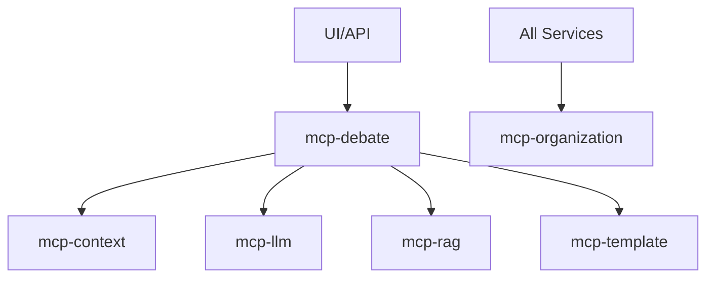

# MCP Services - Claude Development Documentation

This directory contains detailed development guides for each MCP (Model Context Protocol) service in the debate system. These guides are specifically designed to help Claude (or other AI assistants) understand and work with the codebase effectively.

## Service Overview

| Service | Port | Database | Status | Priority |
|---------|------|----------|---------|----------|
| [mcp-context](./mcp-context.md) | 5001 | PostgreSQL | ✅ Active | High |
| [mcp-llm](./mcp-llm.md) | 5002 | Redis | ✅ Active | High |
| [mcp-debate](./mcp-debate.md) | 5003 | In-memory | ✅ Active | High |
| [mcp-rag](./mcp-rag.md) | 5004 | Qdrant + PostgreSQL | ⚠️ Partial | Medium |
| [mcp-organization](./mcp-organization.md) | 5005 | PostgreSQL | ⚠️ Partial | High |
| [mcp-template](./mcp-template.md) | 5006 | PostgreSQL | ✅ Active | Medium |

## Quick Start for Development

### 1. Understanding the Architecture
```
┌─────────────┐     ┌─────────────┐     ┌─────────────┐
│   Next.js   │────▶│  API Routes │────▶│ MCP Services│
│     UI      │     │  (Next.js)  │     │   (Python)  │
└─────────────┘     └─────────────┘     └─────────────┘
                           │
                           ▼
                    ┌─────────────┐
                    │  Databases  │
                    │ PG/Redis/   │
                    │   Qdrant    │
                    └─────────────┘
```

### 2. Service Communication Pattern
```python
# All services follow this pattern:
1. Receive MCP request
2. Validate with Organization service (future)
3. Process request
4. Return MCP response

# Example flow:
UI → API Route → MCP Service → Database
                     ↓
              Other MCP Services
```

### 3. Common Development Tasks

#### Adding a New Feature
1. Check the service's `.md` file for current status
2. Update `models.py` with new data structures
3. Add tool/resource in `mcp_server.py`
4. Test with provided quick commands
5. Update the service documentation

#### Debugging a Service
1. Check logs: `docker logs <service-name> -f`
2. Verify health: `curl http://localhost:<port>/health`
3. Test with MCP commands in documentation
4. Check database state if applicable

#### Integrating Services
1. Use the client pattern from `mcp_client.py`
2. Always include organization context
3. Handle service failures gracefully
4. Document integration in both services

## Key Files in Each Service

```
service-name/
├── src/
│   ├── mcp_server.py      # Always start here
│   ├── models.py          # Data structures
│   ├── managers/          # Business logic
│   ├── clients/           # Other service clients
│   └── db/                # Database layer
├── requirements.txt       # Python dependencies
└── Dockerfile            # Container setup
```

## Development Guidelines

### 1. Code Standards
- Use type hints everywhere
- Follow async/await patterns
- Handle errors explicitly
- Log important operations
- Write self-documenting code

### 2. Testing Approach
- Unit test business logic
- Integration test service calls
- Load test with concurrent requests
- Test error scenarios

### 3. Documentation Updates
- Update service `.md` when adding features
- Include example requests/responses
- Document environment variables
- Add troubleshooting guides

## Common Patterns Across Services

### MCP Tool Definition
```python
@server.list_tools()
async def list_tools() -> List[Tool]:
    return [
        Tool(
            name="tool_name",
            description="What this tool does",
            inputSchema={
                "type": "object",
                "properties": {...},
                "required": [...]
            }
        )
    ]
```

### Database Access
```python
# PostgreSQL (SQLAlchemy)
async with get_db_session() as session:
    result = await session.execute(query)

# Redis
await redis_client.get(key)

# Qdrant
await qdrant_client.search(collection, vector)
```

### Error Handling
```python
try:
    result = await operation()
except SpecificError as e:
    logger.error(f"Operation failed: {e}")
    return error_response(str(e))
```

## Service Dependencies



## Getting Help

1. **Service Won't Start**: Check logs and dependencies
2. **Database Issues**: Verify connection strings
3. **Integration Failures**: Check service health endpoints
4. **Performance Issues**: Review service documentation

## Contributing

When adding new features:
1. Update the relevant service `.md` file
2. Add examples and common issues
3. Document any new patterns
4. Update this README if adding new services

Remember: These docs are for AI assistants, so be explicit about context and provide plenty of examples!