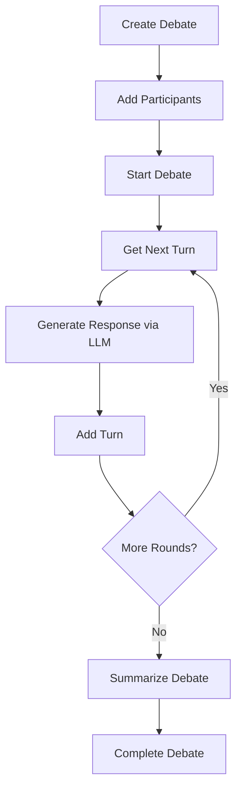

# MCP Debate Service - Claude Development Guide

## Quick Reference
- **Port**: 5003
- **Database**: In-memory (debate_store.py)
- **Primary Purpose**: Orchestrate debates between AI participants
- **Dependencies**: Context, LLM, RAG (optional), Template services

## Key Files to Check
```
mcp-debate/
├── src/
│   ├── mcp_server.py                    # MCP interface - START HERE
│   ├── models.py                        # Debate data models
│   ├── orchestrators/
│   │   └── debate_orchestrator.py       # Core debate logic
│   ├── clients/
│   │   └── mcp_client.py               # Calls other services
│   ├── db/
│   │   └── debate_store.py             # In-memory storage
│   └── concurrency.py                   # Rate limiting, locks
```

## Current Implementation Status
✅ **Implemented**:
- Debate creation and management
- Turn-based orchestration
- Participant management
- Real-time status updates
- Concurrency control
- Service client integration
- WebSocket support (partial)

❌ **Not Implemented**:
- Persistent storage (using in-memory)
- Organization integration
- Template integration for prompts
- Debate history/replay
- Voting/evaluation system
- Time limit enforcement

## Debate Flow



## Common Development Tasks

### 1. Creating a Debate
```python
# Full debate creation flow:
{
    "name": "create_debate",
    "arguments": {
        "name": "AI Ethics Debate",
        "topic": "Should AI development be regulated?",
        "rules": {
            "max_rounds": 5,
            "turn_time_limit": 300,
            "response_format": "structured"
        },
        "participants": [
            {
                "name": "AI Optimist",
                "role": "debater",
                "position": "Against regulation",
                "llm_config": {
                    "provider": "openai",
                    "model": "gpt-4",
                    "temperature": 0.7
                }
            }
        ]
    }
}
```

### 2. Managing Debate State
```python
# Debate states:
class DebateStatus(str, Enum):
    DRAFT = "draft"           # Created but not started
    ACTIVE = "active"         # Ongoing debate
    PAUSED = "paused"        # Temporarily stopped
    COMPLETED = "completed"   # Finished normally
    CANCELLED = "cancelled"   # Aborted

# State transitions:
# DRAFT -> ACTIVE (start_debate)
# ACTIVE -> PAUSED (pause_debate)
# PAUSED -> ACTIVE (resume_debate)
# ACTIVE -> COMPLETED (complete_debate)
# ANY -> CANCELLED (cancel_debate)
```

### 3. Turn Management
```python
# Turn flow:
1. get_next_turn() -> determines speaker
2. context_service.get_context() -> retrieves history
3. llm_service.generate() -> creates response
4. add_turn() -> stores response
5. context_service.add_message() -> updates context
```

## Service Integration Patterns

### Context Service Integration
```python
# Storing debate context:
await self.context_client.create_context({
    "context_id": f"debate_{debate_id}",
    "metadata": {"debate_id": debate_id}
})

# Adding messages:
await self.context_client.add_message({
    "context_id": f"debate_{debate_id}",
    "role": participant.name,
    "content": turn.content
})
```

### LLM Service Integration
```python
# Generating responses:
response = await self.llm_client.generate({
    "provider": participant.llm_config.provider,
    "model": participant.llm_config.model,
    "messages": context_messages,
    "temperature": participant.llm_config.temperature,
    "system_prompt": self._build_participant_prompt(participant)
})
```

### Template Service Integration (TODO)
```python
# Should integrate for prompt generation:
prompt_template = await self.template_client.render({
    "template_id": "participant_prompt",
    "variables": {
        "participant_name": participant.name,
        "position": participant.position,
        "topic": debate.topic
    }
})
```

## Concurrency Control

### Debate Locks
```python
# Prevents concurrent modifications:
@with_debate_lock
async def add_turn(self, debate_id: str, ...):
    # Only one turn can be added at a time
```

### Rate Limiting
```python
# Per-participant rate limits:
@with_rate_limit(key_func=lambda r: r.participant_id)
async def generate_turn(self, ...):
    # Prevents participant from overwhelming system
```

## WebSocket Events (Partial Implementation)
```python
# Events that should be emitted:
- debate_created
- debate_started
- turn_added
- debate_paused
- debate_resumed
- debate_completed
- participant_joined
- participant_left
```

## Testing Scenarios

### Quick Test Debate
```python
# Minimal debate for testing:
{
    "name": "Test Debate",
    "topic": "Test topic",
    "participants": [{
        "name": "Tester",
        "role": "debater",
        "llm_config": {
            "provider": "openai",
            "model": "gpt-3.5-turbo"
        }
    }]
}
```

### Concurrency Test
```python
# Test simultaneous operations:
- Multiple participants adding turns
- Concurrent debate creation
- Parallel turn generation
```

## Common Issues & Solutions

### Issue: "No eligible participants"
```python
# Check: participant.is_active = True
# Check: participant.role in eligible_roles
# Check: Turn order logic in get_next_turn()
```

### Issue: "Context not found"
```python
# Context service might be down
# Check: Context was created for debate
# Solution: Implement context recovery
```

### Issue: "LLM timeout"
```python
# Default timeout might be too short
# Check: LLM service health
# Solution: Implement retry logic
```

## Performance Optimization

### Current Bottlenecks
1. **Sequential turn generation**: Could parallelize independent turns
2. **Full context loading**: Could use windowing
3. **In-memory storage**: Limits scalability

### Optimization Opportunities
```python
# Parallel turn generation for different participants:
async def generate_parallel_turns(participants):
    tasks = [generate_turn(p) for p in participants]
    return await asyncio.gather(*tasks)

# Context windowing:
context = await self.context_client.get_context(
    context_id=context_id,
    limit=10  # Last 10 messages only
)
```

## Environment Variables
```bash
CONTEXT_SERVICE_URL=http://mcp-context:5001
LLM_SERVICE_URL=http://mcp-llm:5002
RAG_SERVICE_URL=http://mcp-rag:5004
TEMPLATE_SERVICE_URL=http://mcp-template:5006
MCP_PORT=5003
LOG_LEVEL=INFO
```

## Quick Commands
```bash
# Health check
curl http://localhost:5003/health

# Get all debates
echo '{"method": "resources/read", "params": {"uri": "debate://debates"}}' | nc localhost 5003

# Watch logs
docker logs mcp-debate -f --tail 100
```

## Next Development Priorities
1. Add persistent storage (PostgreSQL)
2. Integrate Template service for prompts
3. Implement debate replay/history
4. Add time limit enforcement
5. Create evaluation/voting system
6. Implement full WebSocket support
7. Add debate branching (what-if scenarios)
8. Create debate analytics