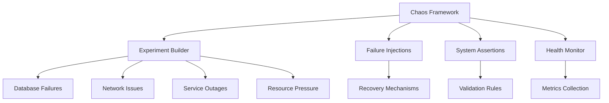

# Chaos Engineering Guide

This document describes the chaos engineering framework implemented for the MCP (Model Context Protocol) services to test system resilience and failure recovery.

## Overview

Chaos engineering is the practice of intentionally introducing failures into a system to test its resilience and identify weaknesses before they cause outages in production. Our implementation provides controlled failure injection and automated validation of system behavior.

## Architecture

### Chaos Engineering Framework



### Core Components

1. **Experiment Builder**: Fluent API for defining chaos experiments
2. **Failure Injections**: Controlled introduction of various failure types
3. **System Assertions**: Automated validation of system behavior
4. **Health Monitor**: Real-time system metrics collection
5. **Recovery Verification**: Automated recovery validation

## Quick Start

### Prerequisites

- Java 21+
- Maven 3.8+
- All MCP services running
- Docker (for infrastructure dependencies)

### Running Chaos Tests

```bash
# Run all chaos experiments
./scripts/chaos-testing.sh

# Run specific experiment
./scripts/chaos-testing.sh experiment database-failure

# Check prerequisites only
./scripts/chaos-testing.sh check

# Generate report only
./scripts/chaos-testing.sh report
```

### Configuration

Set environment variables to control chaos testing:

```bash
export CHAOS_MODE=safe              # safe|aggressive
export EXPERIMENT_DURATION=5m       # Duration per experiment
export CONCURRENCY=3                # Concurrent experiments
export SAFETY_MODE=true             # Enable safety checks
export REPORT_DIR=chaos-reports      # Report output directory
```

## Failure Injection Types

### Network Failures

#### Latency Injection
```java
new NetworkLatencyInjection("mcp-llm", Duration.ofSeconds(2), 0.5)
```
- **Service**: Target service name
- **Latency**: Additional delay to inject
- **Probability**: Percentage of requests affected (0.0-1.0)

#### Service Unavailability
```java
new ServiceUnavailabilityInjection("anthropic-api", Duration.ofMinutes(1))
```
- **Service**: Service to make unavailable
- **Duration**: How long to keep service down

### Database Failures

#### Connection Issues
```java
new DatabaseFailureInjection("postgres", FailureType.CONNECTION_TIMEOUT)
```

Supported failure types:
- `CONNECTION_TIMEOUT`: Database connection timeouts
- `SLOW_QUERIES`: Inject query delays
- `CONNECTION_POOL_EXHAUSTION`: Exhaust connection pools
- `DEADLOCKS`: Create deadlock scenarios

### Resource Pressure

#### Memory Pressure
```java
new MemoryPressureInjection(512 * 1024 * 1024) // 512MB
```
- Consumes specified amount of memory
- Tests garbage collection and memory management
- Automatically recoverable

## System Assertions

### Response Time Assertions
```java
new ResponseTimeAssertion("debate-creation", Duration.ofSeconds(30),
    () -> measureDebateCreationTime())
```
- **Endpoint**: What operation is being measured
- **Max Time**: Maximum acceptable response time
- **Supplier**: Function that measures actual time

### Service Availability
```java
new ServiceAvailabilityAssertion("mcp-controller", 
    () -> checkServiceHealth("http://localhost:8082/health"))
```
- **Service**: Service name for reporting
- **Supplier**: Function that checks availability

### Data Consistency
```java
new DataConsistencyAssertion("debate-state",
    this::verifyDebateStateConsistency)
```
- **Description**: What consistency is being checked
- **Supplier**: Function that validates consistency

## Pre-defined Experiments

### Database Failure Resilience
Tests system behavior when database becomes unavailable:
- **Duration**: 3 minutes
- **Failures**: Database connection timeouts
- **Validations**: Service availability, response times, data consistency

### LLM Provider Failure
Tests debate continuation when LLM providers fail:
- **Duration**: 2 minutes
- **Failures**: Anthropic API and OpenAI API unavailability
- **Validations**: Service health, completion times, debate state

### Network Partition
Tests service mesh resilience during network issues:
- **Duration**: 4 minutes
- **Failures**: High latency between services
- **Validations**: Cross-service communication, data consistency

### Memory Pressure
Tests system behavior under resource constraints:
- **Duration**: 3 minutes
- **Failures**: High memory consumption
- **Validations**: Service stability, response times, memory integrity

### Cascading Failure
Tests resilience to multiple simultaneous failures:
- **Duration**: 5 minutes
- **Failures**: Multiple service outages and database issues
- **Validations**: Core service functionality, system state consistency

### Multi-tenant Isolation Stress
Tests tenant isolation under stress conditions:
- **Duration**: 4 minutes
- **Failures**: Network latency and memory pressure
- **Validations**: Tenant data isolation, operation performance

## Creating Custom Experiments

### Basic Experiment Structure

```java
ChaosExperiment experiment = framework.experiment()
    .named("Custom Experiment")
    .describedAs("Tests custom failure scenario")
    .runningFor(Duration.ofMinutes(3))
    .withFailure(new CustomFailureInjection())
    .withAssertion(new CustomAssertion())
    .withMetadata("category", "custom")
    .withMetadata("severity", "medium")
    .build();
```

### Custom Failure Injection

```java
public class CustomFailureInjection implements FailureInjection {
    @Override
    public String getName() {
        return "Custom Failure Description";
    }

    @Override
    public void inject() throws Exception {
        // Implement failure injection logic
    }

    @Override
    public void recover() throws Exception {
        // Implement recovery logic
    }

    @Override
    public boolean isRecoverable() {
        return true;
    }
}
```

### Custom Assertion

```java
public class CustomAssertion implements SystemAssertion {
    @Override
    public String getName() {
        return "Custom System Check";
    }

    @Override
    public boolean verify() throws Exception {
        // Implement verification logic
        return true;
    }

    @Override
    public String getFailureMessage() {
        return "Custom verification failed";
    }
}
```

## Debate-Specific Experiments

### Debate Creation Resilience

Tests debate creation under various failure conditions:

```java
@Test
void testDebateCreationWithLlmFailure() throws Exception {
    ChaosExperiment experiment = chaosFramework.experiment()
        .named("Debate Creation LLM Failure")
        .runningFor(Duration.ofMinutes(2))
        .withFailure(new ServiceUnavailabilityInjection("anthropic-api", Duration.ofMinutes(1)))
        .withAssertion(new ServiceAvailabilityAssertion("mcp-controller",
            () -> checkDebateServiceHealth()))
        .withAssertion(new ResponseTimeAssertion("debate-creation", Duration.ofSeconds(30),
            () -> measureDebateCreationTime()))
        .build();

    ExperimentResult result = chaosFramework.runExperiment(experiment).get();
    assertThat(result.isSuccessful()).isTrue();
}
```

### Multi-participant Coordination

Tests participant coordination during failures:

```java
@Test
void testMultiParticipantDebateResilience() throws Exception {
    ChaosExperiment experiment = chaosFramework.experiment()
        .named("Multi-Participant Debate Resilience")
        .runningFor(Duration.ofMinutes(4))
        .withFailure(new ServiceUnavailabilityInjection("openai-api", Duration.ofSeconds(45)))
        .withFailure(new NetworkLatencyInjection("mcp-llm", Duration.ofMillis(800), 0.6))
        .withAssertion(new DataConsistencyAssertion("participant-coordination",
            this::verifyParticipantCoordination))
        .withAssertion(new DataConsistencyAssertion("turn-ordering",
            this::verifyTurnOrdering))
        .build();

    ExperimentResult result = chaosFramework.runExperiment(experiment).get();
    // Multi-participant debates should maintain coordination
    assertThat(result.getAssertionResults())
        .filteredOn(ar -> ar.getAssertionName().contains("coordination"))
        .allMatch(AssertionResult::isPassed);
}
```

### Real-time Updates Resilience

Tests WebSocket and SSE resilience:

```java
@Test
void testRealTimeUpdatesWithNetworkPartition() throws Exception {
    ChaosExperiment experiment = chaosFramework.experiment()
        .named("Real-Time Updates Network Partition")
        .runningFor(Duration.ofMinutes(3))
        .withFailure(new NetworkLatencyInjection("mcp-gateway", Duration.ofSeconds(3), 0.8))
        .withAssertion(new DataConsistencyAssertion("websocket-recovery",
            this::verifyWebSocketRecovery))
        .withAssertion(new DataConsistencyAssertion("sse-recovery",
            this::verifyServerSentEventRecovery))
        .build();

    ExperimentResult result = chaosFramework.runExperiment(experiment).get();
    assertThat(result.isSuccessful()).isTrue();
}
```

## Safety Measures

### Safety Mode

When `SAFETY_MODE=true` (default):
- All services must be healthy before starting
- Experiments have shorter durations
- More conservative failure injection
- Automatic recovery verification
- Immediate halt on critical failures

### Excluded Services

Configure services to exclude from chaos testing:

```java
ChaosConfiguration config = new ChaosConfiguration();
config.excludeService("critical-service");
config.setSafetyMode(true);
```

### Emergency Recovery

The framework includes automatic recovery mechanisms:

1. **Timeout Protection**: All experiments have maximum duration limits
2. **Automatic Cleanup**: Failure injections are automatically reversed
3. **Health Monitoring**: Continuous system health checks
4. **Emergency Stop**: Manual experiment termination capability

## Monitoring and Metrics

### Health Metrics Collection

The framework automatically collects:
- Response times for all endpoints
- Service availability status
- Resource utilization metrics
- Error rates and patterns

### Real-time Monitoring

```java
SystemHealthMonitor monitor = framework.getHealthMonitor();
monitor.recordMetric("response_time", responseTime);
monitor.recordMetric("memory_usage", memoryUsage);

HealthMetric metric = monitor.getMetric("response_time");
double avgResponseTime = metric.getAverage();
```

### Experiment Results

Each experiment produces detailed results:

```java
ExperimentResult result = experiment.getResult();
System.out.println("Success: " + result.isSuccessful());
System.out.println("Duration: " + result.getDuration().toSeconds() + "s");

result.getAssertionResults().forEach(assertion -> {
    System.out.println(assertion.getAssertionName() + ": " + 
                      (assertion.isPassed() ? "PASS" : "FAIL"));
});
```

## Reporting

### Automated Reports

The framework generates comprehensive HTML reports:

```bash
# Generate report after experiments
./scripts/chaos-testing.sh report
```

Report includes:
- Executive summary with success rates
- Individual experiment results
- System health status
- Failure analysis and recommendations

### Report Structure

```
chaos-reports/
├── chaos-test-report.html          # Main report
├── baseline/                       # Pre-experiment baselines
│   ├── mcp-organization-baseline.json
│   └── mcp-llm-baseline.json
└── experiments/                    # Individual experiment results
    ├── database-failure/
    │   ├── experiment.log
    │   └── report.json
    └── llm-provider-failure/
        ├── experiment.log
        └── report.json
```

### Metrics Dashboard Integration

Export metrics to monitoring systems:

```java
// Export to Prometheus
PrometheusMetricsExporter exporter = new PrometheusMetricsExporter();
exporter.export(experiment.getResult().getHealthMetrics());

// Export to custom dashboard
CustomDashboard dashboard = new CustomDashboard();
dashboard.updateExperimentResults(experiment.getResult());
```

## CI/CD Integration

### Pipeline Configuration

```yaml
# .github/workflows/chaos-tests.yml
name: Chaos Engineering Tests

on:
  schedule:
    - cron: '0 2 * * 1'  # Weekly on Monday 2 AM
  workflow_dispatch:     # Manual trigger

jobs:
  chaos-tests:
    runs-on: ubuntu-latest
    
    steps:
    - uses: actions/checkout@v3
    
    - name: Set up Java
      uses: actions/setup-java@v3
      with:
        java-version: '21'
        
    - name: Start Services
      run: docker-compose up -d
      
    - name: Wait for Services
      run: ./scripts/wait-for-services.sh
      
    - name: Run Chaos Tests
      run: ./scripts/chaos-testing.sh
      env:
        CHAOS_MODE: safe
        EXPERIMENT_DURATION: 3m
        SAFETY_MODE: true
        
    - name: Upload Reports
      uses: actions/upload-artifact@v3
      with:
        name: chaos-reports
        path: chaos-reports/
        
    - name: Notify on Failure
      if: failure()
      uses: slackapi/slack-github-action@v1
      with:
        payload: |
          {
            "text": "Chaos engineering tests failed!",
            "attachments": [
              {
                "color": "danger",
                "fields": [
                  {
                    "title": "Repository",
                    "value": "${{ github.repository }}",
                    "short": true
                  },
                  {
                    "title": "Branch",
                    "value": "${{ github.ref }}",
                    "short": true
                  }
                ]
              }
            ]
          }
```

### Automated Analysis

```bash
# Add to pipeline for automated analysis
./scripts/analyze-chaos-results.sh chaos-reports/

# Check if resilience meets standards
if [ $(grep -c '"status": "SUCCESS"' chaos-reports/experiments/*/report.json) -lt 6 ]; then
    echo "System resilience below threshold"
    exit 1
fi
```

## Best Practices

### Experiment Design

1. **Start Small**: Begin with low-impact failures
2. **Gradual Escalation**: Increase failure severity over time
3. **Realistic Scenarios**: Base experiments on actual production issues
4. **Clear Hypotheses**: Define expected system behavior before testing

### Safety Guidelines

1. **Always Use Baselines**: Establish system health before testing
2. **Monitor Continuously**: Watch system metrics during experiments
3. **Have Recovery Plans**: Know how to quickly restore services
4. **Test in Stages**: Non-production → staging → production

### Frequency Recommendations

- **Development**: Daily smoke tests with basic failures
- **Staging**: Weekly comprehensive chaos testing
- **Production**: Monthly targeted experiments during maintenance windows

### Failure Categories

1. **Infrastructure**: Network, database, resource failures
2. **Dependencies**: External service outages
3. **Application**: Code-level failures and edge cases
4. **Human Error**: Configuration mistakes, deployment issues

## Troubleshooting

### Common Issues

1. **Experiments Don't Start**
   - Check service availability
   - Verify prerequisites
   - Review safety mode settings

2. **Inconsistent Results**
   - Ensure clean baseline between tests
   - Check for interfering processes
   - Verify experiment isolation

3. **Recovery Failures**
   - Review cleanup procedures
   - Check for resource leaks
   - Validate recovery timeouts

### Debug Mode

Enable detailed logging:

```bash
export CHAOS_DEBUG=true
export JAVA_OPTS="-Dlogging.level.chaos=DEBUG"
./scripts/chaos-testing.sh experiment database-failure
```

### Manual Recovery

If automated recovery fails:

```bash
# Stop all chaos processes
pkill -f chaos

# Restart services
docker-compose restart

# Verify health
./scripts/health-check.sh
```

## Advanced Topics

### Custom Failure Providers

Implement provider-specific failures:

```java
public class AnthropicApiFailure implements FailureInjection {
    @Override
    public void inject() throws Exception {
        // Mock Anthropic API responses with errors
        mockServer.when(request()
            .withPath("/v1/messages"))
            .respond(response()
            .withStatusCode(429)
            .withBody("{\"error\": \"rate_limit_exceeded\"}"));
    }
}
```

### Metric Correlation

Correlate chaos events with system metrics:

```java
public class MetricCorrelationAnalyzer {
    public void analyzeImpact(ExperimentResult result) {
        // Correlate experiment timeline with system metrics
        // Identify which failures caused which performance degradations
        // Generate insights for system improvements
    }
}
```

### Automated Hypothesis Testing

```java
public class HypothesisTest {
    @Test
    void testHypothesis_SystemSurvivesLlmProviderFailure() {
        // Hypothesis: System maintains 90% functionality when LLM provider fails
        ChaosExperiment experiment = createLlmFailureExperiment();
        ExperimentResult result = runExperiment(experiment);
        
        double functionalityScore = calculateFunctionalityScore(result);
        assertThat(functionalityScore).isGreaterThanOrEqualTo(0.9);
    }
}
```

This chaos engineering framework provides comprehensive testing of system resilience while maintaining safety and providing actionable insights for improving the MCP services' fault tolerance.