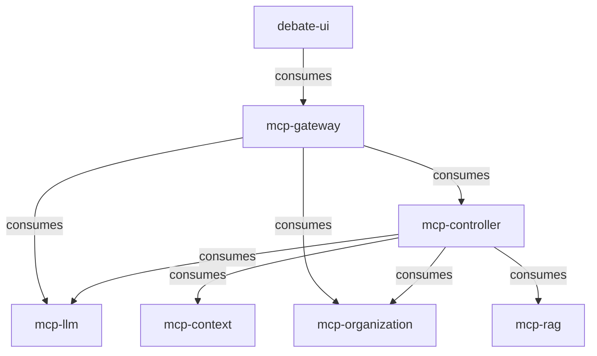

# Contract Testing Guide

This document describes the contract testing framework implemented for the MCP (Model Context Protocol) services using Pact.

## Overview

Contract testing ensures that services can communicate with each other by verifying the contracts between consumers and providers. Our implementation uses [Pact](https://pact.io/) to define, verify, and maintain contracts across all MCP services.

## Architecture

### Services and Contracts



### Contract Types

1. **HTTP API Contracts**: RESTful service interactions
2. **Multi-tenant Contracts**: Organization-scoped data access
3. **Real-time Contracts**: WebSocket and SSE communications
4. **LLM Provider Contracts**: External AI service integrations

## Quick Start

### Prerequisites

- Java 21+
- Maven 3.8+
- Docker (for Pact Broker)
- All MCP services built and available

### Running Contract Tests

```bash
# Run complete contract testing pipeline
./scripts/contract-testing.sh

# Run only consumer tests
./scripts/contract-testing.sh consumer

# Run only provider verification
./scripts/contract-testing.sh provider

# Publish contracts to broker
./scripts/contract-testing.sh publish
```

## Consumer Contract Tests

Consumer tests define the expected interactions with provider services.

### Example: LLM Service Contract

```java
@Pact(consumer = "mcp-controller", provider = "mcp-llm")
RequestResponsePact llmServiceContract() {
    return new ConsumerContractBuilder("mcp-controller", "mcp-llm")
        .addInteraction("Generate debate response")
            .post()
            .path("/llm/completion")
            .withAuth("valid-token")
            .withOrganization("test-org")
            .withJsonContent()
            .body(new PactDslJsonBody()
                .stringType("model", "claude-3-sonnet")
                .stringType("prompt")
                .numberType("maxTokens", 500)
            )
            .willRespondWith()
            .status(200)
            .responseJsonBody(body -> body
                .stringType("id")
                .stringType("content")
                .numberType("tokens")
            )
        .build();
}
```

### Multi-tenant Contract Example

```java
@Pact(consumer = "mcp-controller", provider = "mcp-organization")
RequestResponsePact organizationServiceContract() {
    return MultiTenantContracts.forTenant("mcp-controller", "mcp-organization", "test-org")
        .addInteraction("Validate user permissions")
            .get()
            .path("/organizations/test-org/users/test-user/permissions")
            .withAuth("valid-token")
            .withOrganization("test-org")
            .willRespondWith()
            .status(200)
            .responseJsonBody(body -> body
                .array("permissions", perms -> perms
                    .stringType("DEBATE_CREATE")
                    .stringType("DEBATE_VIEW")
                )
            )
        .build();
}
```

## Provider Verification Tests

Provider tests verify that services fulfill the contracts established by consumers.

### Example: Organization Provider Test

```java
@Provider("mcp-organization")
@PactFolder("pacts")
class OrganizationProviderTest {

    @State("organization exists")
    void organizationExists(Map<String, Object> params) {
        String orgId = (String) params.getOrDefault("organizationId", "test-org");
        
        Organization org = fixtures.createOrganization()
            .withId(orgId)
            .withName("Test Organization")
            .withStatus(Organization.Status.ACTIVE)
            .build();
            
        setupOrganization(org);
    }

    @TestTemplate
    @ExtendWith(PactVerificationInvocationContextProvider.class)
    void pactVerificationTestTemplate(PactVerificationContext context) {
        context.verifyInteraction();
    }
}
```

## Contract Patterns

### Standard Health Check

```java
public static InteractionBuilder healthCheck() {
    return new InteractionBuilder("health check")
        .get()
        .path("/health")
        .willRespondWith()
        .status(200)
        .responseJsonBody(body -> body
            .stringType("status", "UP")
            .stringType("timestamp")
        );
}
```

### Authentication Contract

```java
public static InteractionBuilder authenticate(String validToken) {
    return new InteractionBuilder("authenticate user")
        .post()
        .path("/auth/validate")
        .withAuth(validToken)
        .willRespondWith()
        .status(200)
        .responseJsonBody(body -> body
            .stringType("userId")
            .stringType("organizationId")
            .array("roles", roles -> roles.stringType())
        );
}
```

### CRUD Operations

```java
public static List<InteractionBuilder> crudOperations(String resourcePath, String resourceName) {
    List<InteractionBuilder> interactions = new ArrayList<>();

    // Create
    interactions.add(new InteractionBuilder("create " + resourceName)
        .post()
        .path(resourcePath)
        .withJsonContent()
        .expectStatus(201)
    );

    // Read
    interactions.add(new InteractionBuilder("get " + resourceName)
        .get()
        .path(resourcePath + "/1")
        .expectStatus(200)
    );

    // Update, Delete...
    return interactions;
}
```

## LLM Provider Contracts

### Claude/Anthropic Contract

```java
@Pact(consumer = "mcp-llm", provider = "anthropic-api")
RequestResponsePact claudeCompletionContract() {
    return new ConsumerContractBuilder("mcp-llm", "anthropic-api")
        .addInteraction("Claude completion request")
            .post()
            .path("/v1/messages")
            .header("x-api-key", "test-api-key")
            .header("anthropic-version", "2023-06-01")
            .body(new PactDslJsonBody()
                .stringType("model", "claude-3-sonnet-20240229")
                .numberType("max_tokens", 1000)
                .array("messages", messages -> messages
                    .object(msg -> msg
                        .stringType("role", "user")
                        .stringType("content", "Hello, Claude!")
                    )
                )
            )
            .willRespondWith()
            .status(200)
            .responseJsonBody(body -> body
                .stringType("id")
                .array("content", content -> content
                    .object(c -> c
                        .stringType("type", "text")
                        .stringType("text")
                    )
                )
            )
        .build();
}
```

### OpenAI Contract

```java
@Pact(consumer = "mcp-llm", provider = "openai-api")
RequestResponsePact openaiCompletionContract() {
    return new ConsumerContractBuilder("mcp-llm", "openai-api")
        .addInteraction("OpenAI completion request")
            .post()
            .path("/v1/chat/completions")
            .header("Authorization", "Bearer test-api-key")
            .body(new PactDslJsonBody()
                .stringType("model", "gpt-4")
                .array("messages", messages -> messages
                    .object(msg -> msg
                        .stringType("role", "user")
                        .stringType("content", "Hello, GPT!")
                    )
                )
            )
            .willRespondWith()
            .status(200)
            .responseJsonBody(body -> body
                .stringType("id")
                .array("choices", choices -> choices
                    .object(choice -> choice
                        .object("message", message -> message
                            .stringType("role", "assistant")
                            .stringType("content")
                        )
                    )
                )
            )
        .build();
}
```

## Multi-tenant Testing

### Tenant Isolation Contracts

```java
public static List<InteractionBuilder> tenantIsolationTests(String basePath) {
    List<InteractionBuilder> interactions = new ArrayList<>();

    // Tenant A can access their data
    interactions.add(new InteractionBuilder("tenant A accesses their data")
        .get()
        .path(basePath + "/tenant-data")
        .withOrganization("tenant-a")
        .willRespondWith()
        .status(200)
        .responseJsonBody(body -> body
            .stringType("tenantId", "tenant-a")
            .array("data", data -> data.stringType())
        )
    );

    // Tenant A cannot access tenant B's data
    interactions.add(new InteractionBuilder("tenant A cannot access tenant B data")
        .get()
        .path(basePath + "/tenant-data")
        .withOrganization("tenant-a")
        .header("X-Target-Tenant", "tenant-b")
        .willRespondWith()
        .status(403)
        .responseJsonBody(body -> body
            .stringType("error", "Access denied")
            .stringType("code", "TENANT_ACCESS_DENIED")
        )
    );

    return interactions;
}
```

## Pact Broker Integration

### Publishing Contracts

```bash
mvn pact:publish \
    -Dpact.broker.url=http://localhost:9292 \
    -Dpact.broker.username=admin \
    -Dpact.broker.password=admin \
    -Dpact.consumer.version=1.0.0 \
    -Dpact.consumer.tags=test
```

### Provider Verification

```bash
mvn test -Dtest=OrganizationProviderTest \
    -Dpact.verifier.publishResults=true \
    -Dpact.provider.version=1.0.0 \
    -Dpact.provider.tag=test \
    -Dpact.broker.url=http://localhost:9292
```

## CI/CD Integration

### Pipeline Configuration

```yaml
# .github/workflows/contract-tests.yml
name: Contract Tests

on: [push, pull_request]

jobs:
  contract-tests:
    runs-on: ubuntu-latest
    
    steps:
    - uses: actions/checkout@v3
    
    - name: Set up Java
      uses: actions/setup-java@v3
      with:
        java-version: '21'
        
    - name: Start Pact Broker
      run: |
        docker run -d --name pact-broker \
          -p 9292:9292 \
          -e PACT_BROKER_DATABASE_URL=sqlite:///tmp/pact_broker.sqlite \
          pactfoundation/pact-broker:latest
    
    - name: Run Contract Tests
      run: ./scripts/contract-testing.sh full
      env:
        PACT_BROKER_URL: http://localhost:9292
        VERSION: ${{ github.sha }}
        ENVIRONMENT: ${{ github.ref_name }}
```

## Best Practices

### Contract Design

1. **Keep contracts simple**: Focus on the essential data structure
2. **Use matchers**: Don't hard-code specific values, use type matchers
3. **Version carefully**: Ensure backward compatibility
4. **Document states**: Clearly describe provider states

### Consumer Tests

1. **Test edge cases**: Include error scenarios and rate limiting
2. **Use realistic data**: Make test data representative of production
3. **Minimal mocking**: Keep mocks simple and focused
4. **Fast execution**: Ensure tests run quickly

### Provider Tests

1. **Accurate states**: Provider states should match real scenarios
2. **Clean setup/teardown**: Ensure consistent test environments
3. **Comprehensive verification**: Test all consumer expectations
4. **Performance testing**: Include response time validations

### Multi-tenant Considerations

1. **Isolation testing**: Verify tenant data separation
2. **Permission validation**: Test authorization rules
3. **Context switching**: Verify tenant context handling
4. **Resource limits**: Test tenant-specific quotas

## Troubleshooting

### Common Issues

1. **Contract mismatches**: Check for breaking changes in APIs
2. **State setup failures**: Verify provider state implementations
3. **Authentication issues**: Ensure test tokens are valid
4. **Network timeouts**: Increase timeouts for slow services

### Debugging Tools

1. **Pact Broker UI**: Visual contract inspection
2. **Service logs**: Check application logs during verification
3. **Contract diffs**: Compare contract versions
4. **Test reports**: Review detailed test output

### Performance Optimization

1. **Parallel execution**: Run tests concurrently where possible
2. **Service reuse**: Keep services running between tests
3. **Database optimization**: Use in-memory databases for testing
4. **Contract caching**: Cache contract downloads

## Monitoring and Metrics

### Contract Health Dashboard

The Pact Broker provides a dashboard showing:

- Contract verification status
- Breaking change detection
- Service dependency graphs
- Historical test results

### Key Metrics

- Contract verification success rate
- Time to detect breaking changes
- Number of consumer-provider pairs
- Test execution duration

### Alerting

Set up alerts for:

- Contract verification failures
- New breaking changes
- Provider state setup failures
- Performance degradation

## Example Workflows

### Adding a New Contract

1. **Consumer Side**:
   ```bash
   # Write consumer test
   # Run test to generate contract
   mvn test -Dtest=NewFeatureContractTest
   
   # Publish contract
   mvn pact:publish
   ```

2. **Provider Side**:
   ```bash
   # Implement provider states
   # Run verification
   mvn test -Dtest=ProviderVerificationTest
   ```

### Breaking Change Workflow

1. **Detection**: Pact Broker detects breaking change
2. **Analysis**: Review contract differences
3. **Coordination**: Work with consumer teams
4. **Migration**: Implement versioning strategy
5. **Verification**: Ensure all contracts pass

### Release Process

1. **Pre-release**: Run full contract test suite
2. **Staging**: Verify contracts in staging environment
3. **Production**: Monitor contract compliance
4. **Post-release**: Update contract versions

This contract testing framework ensures reliable service communication across the entire MCP ecosystem while maintaining development velocity and catching integration issues early.