# End-to-End Validation Guide

This document describes the comprehensive End-to-End (E2E) validation suite that orchestrates all testing frameworks to provide complete system validation for the MCP services.

## Overview

The E2E validation suite provides a unified approach to testing the entire MCP system by coordinating multiple testing frameworks and validation phases. It ensures that all components work together correctly and that the system meets quality, performance, and reliability requirements.

## Architecture

### Validation Framework

```mermaid
graph TD
    A[E2E Validation Suite] --> B[Prerequisites Check]
    A --> C[Unit & Integration Tests]
    A --> D[Contract Tests]
    A --> E[Functional E2E Tests]
    A --> F[Performance Tests]
    A --> G[Chaos Engineering]
    A --> H[Security Tests]
    A --> I[Cleanup & Reporting]
    
    B --> B1[Service Health]
    B --> B2[Dependencies]
    B --> B3[Resources]
    
    C --> C1[Unit Tests]
    C --> C2[Integration Tests]
    C --> C3[Component Tests]
    
    D --> D1[Consumer Contracts]
    D --> D2[Provider Verification]
    D --> D3[Compatibility]
    
    E --> E1[User Journeys]
    E --> E2[Debate Scenarios]
    E --> E3[Multi-tenant Tests]
    
    F --> F1[Load Tests]
    F --> F2[Stress Tests]
    F --> F3[Scalability]
    
    G --> G1[Failure Injection]
    G --> G2[Recovery Testing]
    G --> G3[Resilience Validation]
    
    H --> H1[Authentication]
    H --> H2[Authorization]
    H --> H3[Data Protection]
```



### Validation Phases

The E2E validation follows a structured approach with eight distinct phases:

1. **Prerequisites**: System health and dependency checks
2. **Unit & Integration**: Individual component and service integration testing
3. **Contract**: Service contract verification and compatibility
4. **Functional**: Complete user journey and feature testing
5. **Performance**: Load, stress, and scalability testing
6. **Resilience**: Chaos engineering and failure recovery
7. **Security**: Authentication, authorization, and data protection
8. **Cleanup**: Test data cleanup and final reporting

## Quick Start

### Prerequisites

- Java 21+
- Maven 3.8+
- Docker and Docker Compose
- All MCP services running
- At least 8GB RAM and 5GB disk space

### Running E2E Validation

```bash
# Complete validation (all phases)
./scripts/e2e-validation.sh

# Critical validation only
./scripts/e2e-validation.sh critical

# Performance validation
./scripts/e2e-validation.sh performance

# Security validation
./scripts/e2e-validation.sh security

# Check prerequisites only
./scripts/e2e-validation.sh check
```

### Configuration

Configure validation behavior with environment variables:

```bash
export E2E_MODE=complete           # complete|critical|performance|resilience|security
export VALIDATION_TIMEOUT=2h      # Maximum validation time
export CONCURRENCY=4               # Concurrent test execution
export FAIL_FAST=false            # Stop on first failure
export GENERATE_REPORTS=true      # Generate HTML reports
export REPORT_DIR=e2e-reports     # Report output directory
export ENVIRONMENT=test           # Environment name
```

## Validation Modes

### Complete Validation

Runs all validation phases for comprehensive system testing:

```bash
./scripts/e2e-validation.sh complete
```

**Duration**: 1-2 hours  
**Use Case**: Release validation, major feature testing  
**Phases**: All phases (Prerequisites → Cleanup)

### Critical Validation

Focuses on essential functionality validation:

```bash
./scripts/e2e-validation.sh critical
```

**Duration**: 30-45 minutes  
**Use Case**: Pre-deployment checks, CI/CD pipelines  
**Phases**: Prerequisites, Unit & Integration, Functional, Cleanup

### Performance Validation

Validates system performance characteristics:

```bash
./scripts/e2e-validation.sh performance
```

**Duration**: 20-30 minutes  
**Use Case**: Performance regression testing, capacity planning  
**Phases**: Prerequisites, Performance, Cleanup

### Resilience Validation

Tests system resilience and failure recovery:

```bash
./scripts/e2e-validation.sh resilience
```

**Duration**: 25-35 minutes  
**Use Case**: Disaster recovery testing, reliability validation  
**Phases**: Prerequisites, Resilience (Chaos Engineering), Cleanup

### Security Validation

Comprehensive security testing:

```bash
./scripts/e2e-validation.sh security
```

**Duration**: 15-25 minutes  
**Use Case**: Security audits, compliance validation  
**Phases**: Prerequisites, Security, Cleanup

## Framework Integration

### Unit and Integration Testing

The E2E suite integrates with existing unit and integration test frameworks:

```java
// Unit test execution
mvn test -Dtest=*Test

// Integration test execution  
mvn test -Dtest=*IntegrationTest

// Component test execution
mvn test -Dtest=*ComponentTest
```

**Metrics Collected**:
- Test count and pass rate
- Code coverage percentage
- Test execution time
- Failure details and stack traces

### Contract Testing

Integrates with the Pact contract testing framework:

```bash
# Consumer contract tests
./scripts/contract-testing.sh consumer

# Provider verification
./scripts/contract-testing.sh provider

# Complete contract validation
./scripts/contract-testing.sh full
```

**Metrics Collected**:
- Contract compatibility score
- Consumer/provider verification status
- Breaking change detection
- Contract evolution tracking

### Chaos Engineering

Incorporates chaos engineering tests for resilience validation:

```bash
# Safe chaos testing
CHAOS_MODE=safe ./scripts/chaos-testing.sh

# Aggressive chaos testing
CHAOS_MODE=aggressive ./scripts/chaos-testing.sh
```

**Metrics Collected**:
- System recovery time
- Resilience score
- Failure impact assessment
- Service degradation analysis

### Performance Testing

Includes comprehensive performance validation:

```java
@Test
void performanceValidation() {
    // Load testing
    LoadTestResult loadResult = loadTester.executeLoad(500_users, Duration.ofMinutes(10));
    
    // Stress testing
    StressTestResult stressResult = stressTester.executeStress(1000_users, Duration.ofMinutes(5));
    
    // Validate SLAs
    assertThat(loadResult.getAverageResponseTime()).isLessThan(Duration.ofMillis(500));
    assertThat(stressResult.getErrorRate()).isLessThan(0.01);
}
```

**Metrics Collected**:
- Response time percentiles (P50, P95, P99)
- Throughput (requests per second)
- Error rate and failure patterns
- Resource utilization
- Scalability characteristics

## Custom Test Modules

### Creating Custom Modules

Implement the `TestModule` interface to create custom validation modules:

```java
public class CustomValidationModule implements TestModule {
    @Override
    public String getName() {
        return "Custom Business Logic Validation";
    }

    @Override
    public ValidationPhase getPhase() {
        return ValidationPhase.FUNCTIONAL;
    }

    @Override
    public Duration getEstimatedDuration() {
        return Duration.ofMinutes(15);
    }

    @Override
    public CompletableFuture<ModuleResult> execute(E2EContext context) {
        return CompletableFuture.supplyAsync(() -> {
            // Custom validation logic
            List<String> details = new ArrayList<>();
            Map<String, Object> metrics = new HashMap<>();
            boolean success = true;

            try {
                // Perform custom validations
                details.add("Running custom business logic tests...");
                
                // Collect metrics
                metrics.put("custom_tests_run", 25);
                metrics.put("custom_tests_passed", 24);
                
                details.add("Custom validation completed");
                
            } catch (Exception e) {
                success = false;
                details.add("Custom validation failed: " + e.getMessage());
            }

            return new ModuleResult(getName(), getPhase(), success, 
                                   Duration.ofMinutes(10), details, metrics, null);
        });
    }

    @Override
    public boolean isEnabled() {
        return true;
    }

    @Override
    public Set<String> getDependencies() {
        return Set.of("functional-tests");
    }
}
```

### Module Dependencies

Define dependencies between test modules:

```java
@Override
public Set<String> getDependencies() {
    return Set.of("prerequisites", "unit-tests");
}
```

Dependencies ensure proper execution order and can be used for conditional execution.

## Debate-Specific Validations

### Complete Debate Journey

The E2E suite includes comprehensive debate scenario testing:

```java
@Test
void completeDebateJourney() {
    // 1. User authentication
    authScenarios.loginSuccessfully();
    
    // 2. Organization setup
    orgScenarios.switchOrganization("test-org");
    
    // 3. Debate creation
    DebateResult debate = debateScenarios.createDebate(DebateConfig.builder()
        .title("E2E Test Debate")
        .participants(List.of("Claude", "GPT-4"))
        .rounds(3)
        .build());
    
    // 4. Debate execution
    debateScenarios.startDebate(debate.getDebateId());
    
    // 5. Real-time monitoring
    realTimeScenarios.monitorDebateProgress(debate.getDebateId());
    
    // 6. Debate completion
    debateScenarios.waitForCompletion(debate.getDebateId(), Duration.ofMinutes(10));
    
    // 7. Results validation
    DebateResults results = debateScenarios.getResults(debate.getDebateId());
    assertThat(results.isCompleted()).isTrue();
    assertThat(results.getTurns()).hasSize(6); // 3 rounds * 2 participants
}
```

### Multi-tenant Scenarios

Validates tenant isolation and data security:

```java
@Test
void multiTenantIsolation() {
    // Create debates in different tenants
    String tenant1DebateId = createDebateInTenant("tenant-1", "Tenant 1 Debate");
    String tenant2DebateId = createDebateInTenant("tenant-2", "Tenant 2 Debate");
    
    // Verify tenant 1 cannot access tenant 2's debate
    switchToTenant("tenant-1");
    assertThatThrownBy(() -> debateService.getDebate(tenant2DebateId))
        .isInstanceOf(DebateNotFoundException.class);
    
    // Verify tenant 2 cannot access tenant 1's debate
    switchToTenant("tenant-2");
    assertThatThrownBy(() -> debateService.getDebate(tenant1DebateId))
        .isInstanceOf(DebateNotFoundException.class);
}
```

### Performance Scenarios

Tests debate system performance under load:

```java
@Test
void debatePerformanceUnderLoad() {
    // Create multiple concurrent debates
    List<CompletableFuture<DebateResult>> debateFutures = IntStream.range(0, 50)
        .mapToObj(i -> CompletableFuture.supplyAsync(() -> 
            createAndExecuteDebate("Load Test Debate " + i)))
        .collect(Collectors.toList());
    
    // Wait for all debates to complete
    List<DebateResult> results = debateFutures.stream()
        .map(CompletableFuture::join)
        .collect(Collectors.toList());
    
    // Validate performance metrics
    assertThat(results).hasSize(50);
    assertThat(results).allMatch(DebateResult::isSuccessful);
    
    double avgExecutionTime = results.stream()
        .mapToDouble(r -> r.getExecutionTime().toMillis())
        .average()
        .orElse(0.0);
    
    assertThat(avgExecutionTime).isLessThan(30_000); // 30 seconds average
}
```

## Reporting and Analytics

### HTML Reports

The E2E suite generates comprehensive HTML reports:

```html
<!DOCTYPE html>
<html>
<head>
    <title>MCP End-to-End Validation Report</title>
</head>
<body>
    <div class="header">
        <h1>MCP End-to-End Validation Report</h1>
        <p><strong>Execution ID:</strong> e2e-20241118-143022</p>
        <p><strong>Overall Result:</strong> SUCCESS</p>
        <p><strong>Success Rate:</strong> 95.8%</p>
    </div>
    
    <div class="summary">
        <h2>Phase Summary</h2>
        <table>
            <tr><th>Phase</th><th>Status</th><th>Duration</th><th>Details</th></tr>
            <tr><td>Prerequisites</td><td>SUCCESS</td><td>2m 15s</td><td>All checks passed</td></tr>
            <tr><td>Unit & Integration</td><td>SUCCESS</td><td>12m 45s</td><td>248/250 tests passed</td></tr>
            <!-- Additional phases -->
        </table>
    </div>
</body>
</html>
```

### JSON Reports

Structured data for automated analysis:

```json
{
  "executionId": "e2e-20241118-143022",
  "startTime": "2024-11-18T14:30:22Z",
  "endTime": "2024-11-18T16:15:33Z",
  "totalDuration": "PT1H45M11S",
  "overallSuccess": true,
  "successRate": 0.958,
  "totalModules": 24,
  "successfulModules": 23,
  "aggregatedMetrics": {
    "total_duration_seconds": 6311,
    "prerequisites_duration_seconds": 135,
    "unit_integration_duration_seconds": 765,
    "contract_duration_seconds": 480,
    "functional_duration_seconds": 1200,
    "performance_duration_seconds": 900,
    "resilience_duration_seconds": 1500,
    "security_duration_seconds": 720,
    "cleanup_duration_seconds": 180
  },
  "phaseResults": {
    "PREREQUISITES": [
      {
        "moduleName": "Prerequisites Check",
        "successful": true,
        "duration": "PT2M15S",
        "details": ["Service health verified", "Dependencies confirmed"]
      }
    ]
  }
}
```

### Metrics Collection

Key metrics collected during validation:

**System Health Metrics**:
- Service availability percentage
- Response time percentiles
- Resource utilization
- Error rates

**Test Execution Metrics**:
- Test count and pass rates
- Code coverage percentage
- Execution duration
- Failure categorization

**Performance Metrics**:
- Throughput (requests/second)
- Latency distribution
- Concurrent user capacity
- Scalability limits

**Resilience Metrics**:
- Recovery time objectives (RTO)
- System resilience score
- Failure impact assessment
- Cascading failure detection

## CI/CD Integration

### Pipeline Configuration

```yaml
# .github/workflows/e2e-validation.yml
name: E2E Validation

on:
  push:
    branches: [main, develop]
  pull_request:
    branches: [main]
  schedule:
    - cron: '0 2 * * *'  # Daily at 2 AM

jobs:
  e2e-validation:
    runs-on: ubuntu-latest
    timeout-minutes: 180
    
    strategy:
      matrix:
        validation-mode: [critical, performance, security]
    
    steps:
    - uses: actions/checkout@v3
    
    - name: Set up Java
      uses: actions/setup-java@v3
      with:
        java-version: '21'
        
    - name: Start Infrastructure
      run: docker-compose up -d --wait
      
    - name: Run E2E Validation
      run: ./scripts/e2e-validation.sh ${{ matrix.validation-mode }}
      env:
        E2E_MODE: ${{ matrix.validation-mode }}
        FAIL_FAST: true
        GENERATE_REPORTS: true
        
    - name: Upload Reports
      if: always()
      uses: actions/upload-artifact@v3
      with:
        name: e2e-reports-${{ matrix.validation-mode }}
        path: e2e-reports/
        
    - name: Publish Test Results
      if: always()
      uses: dorny/test-reporter@v1
      with:
        name: E2E Tests (${{ matrix.validation-mode }})
        path: 'e2e-reports/**/*.xml'
        reporter: java-junit
```

### Quality Gates

Define quality gates based on validation results:

```bash
# Check minimum success rate
SUCCESS_RATE=$(jq -r '.successRate' e2e-reports/validation-summary.json)
if (( $(echo "$SUCCESS_RATE < 0.95" | bc -l) )); then
    echo "Success rate $SUCCESS_RATE below threshold (95%)"
    exit 1
fi

# Check performance SLAs
AVG_RESPONSE_TIME=$(jq -r '.aggregatedMetrics.avg_response_time_ms' e2e-reports/validation-summary.json)
if (( $(echo "$AVG_RESPONSE_TIME > 500" | bc -l) )); then
    echo "Average response time $AVG_RESPONSE_TIME ms exceeds SLA (500ms)"
    exit 1
fi

# Check security requirements
VULNERABILITIES=$(jq -r '.aggregatedMetrics.vulnerabilities_found' e2e-reports/validation-summary.json)
if (( VULNERABILITIES > 0 )); then
    echo "Security vulnerabilities found: $VULNERABILITIES"
    exit 1
fi
```

## Monitoring and Alerting

### Real-time Monitoring

Monitor validation execution in real-time:

```bash
# Monitor validation progress
tail -f e2e-reports/phases/*/phase.log

# Check system health during validation
watch -n 5 './scripts/health-check.sh'

# Monitor resource usage
docker stats --format "table {{.Container}}\t{{.CPUPerc}}\t{{.MemUsage}}"
```

### Alerting Integration

```bash
# Slack notification on failure
if [ "$VALIDATION_SUCCESS" != "true" ]; then
    curl -X POST -H 'Content-type: application/json' \
        --data '{"text":"E2E Validation Failed: '"$FAILED_PHASES"'"}' \
        $SLACK_WEBHOOK_URL
fi

# Email notification on critical failure
if [[ "$FAILED_PHASES" == *"security"* ]] || [[ "$FAILED_PHASES" == *"prerequisites"* ]]; then
    echo "Critical validation failure: $FAILED_PHASES" | \
        mail -s "CRITICAL: E2E Validation Failure" ops-team@company.com
fi
```

## Best Practices

### Validation Strategy

1. **Start Small**: Begin with critical validation, expand gradually
2. **Automate Everything**: All validations should be automated and repeatable
3. **Monitor Continuously**: Track validation metrics over time
4. **Fail Fast**: Configure appropriate fail-fast behavior for different contexts

### Test Data Management

1. **Isolated Test Data**: Use separate test data for each validation run
2. **Cleanup Strategy**: Always clean up test data after validation
3. **Data Privacy**: Ensure test data doesn't contain sensitive information
4. **Reproducibility**: Use deterministic test data for consistent results

### Performance Considerations

1. **Parallel Execution**: Run independent tests in parallel
2. **Resource Management**: Monitor and limit resource usage
3. **Timeout Management**: Set appropriate timeouts for different phases
4. **Cleanup Efficiency**: Optimize cleanup procedures

### Security Considerations

1. **Credential Management**: Use secure credential storage and rotation
2. **Network Security**: Validate in isolated network environments
3. **Access Control**: Implement least-privilege access for test execution
4. **Audit Trail**: Maintain comprehensive logs of all validation activities

## Troubleshooting

### Common Issues

1. **Service Startup Failures**
   ```bash
   # Check service logs
   docker-compose logs service-name
   
   # Verify port availability
   netstat -tulpn | grep :8080
   ```

2. **Memory Issues**
   ```bash
   # Check available memory
   free -h
   
   # Monitor memory usage during tests
   watch -n 2 'ps aux --sort=-%mem | head -10'
   ```

3. **Test Timeouts**
   ```bash
   # Increase timeout values
   export VALIDATION_TIMEOUT=3h
   export MAVEN_OPTS="-Xmx2g"
   ```

4. **Network Issues**
   ```bash
   # Check connectivity
   curl -v http://localhost:8080/health
   
   # Verify DNS resolution
   nslookup service-name
   ```

### Debug Mode

Enable debug mode for detailed logging:

```bash
export E2E_DEBUG=true
export MAVEN_OPTS="-Xdebug -Xrunjdwp:transport=dt_socket,server=y,suspend=n,address=5005"
./scripts/e2e-validation.sh critical
```

### Log Analysis

```bash
# Search for errors across all logs
grep -r "ERROR" e2e-reports/phases/*/phase.log

# Find performance bottlenecks
grep -r "duration.*[0-9][0-9][0-9][0-9]ms" e2e-reports/

# Analyze failure patterns
jq -r '.phaseResults[] | select(.successful == false) | .moduleName' e2e-reports/validation-summary.json
```

This comprehensive E2E validation suite provides complete coverage of the MCP system, ensuring reliability, performance, and security across all components and integration points.